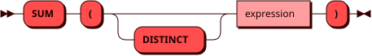

# SUM

Функция `SUM` возвращает сумму значений числового выражения.
Значения `NULL` не учитываются. Если строк нет или все значения
равны `NULL`, результат равен `NULL`.

В обычном агрегатном вызове для аргументов `INTEGER` и `DECIMAL` результат имеет тип
[DECIMAL](../sql_types.md#decimal), для `DOUBLE` —
[DOUBLE](../sql_types.md#double).

Функция [TOTAL](total.md) возвращает `0.0` для пустого набора или набора
только из `NULL`, но всегда использует тип `DOUBLE`, что может приводить
к потере точности.

## Синтаксис {: #syntax }



## Параметры {: #params }

`DISTINCT` позволяет учитывать только
[уникальные значения](groupby.md#aggregate_distinct) выражения.

## Использование в окне {: #window }

Функция также может использоваться [как оконная](window.md#aggregate)
с выражением `OVER` и необязательным `FILTER`.
В оконном вызове `DISTINCT` не поддерживается.

## Примеры {: #examples }

??? example "Подготовка тестового окружения"
    Пример использует [тестовую таблицу](../legend.md) `items`.

```sql
SELECT SUM(stock) FROM items;
```
