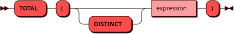

# TOTAL

Функция `TOTAL` возвращает сумму значений числового выражения в виде
[DOUBLE](../sql_types.md#double). Значения `NULL` не учитываются.
Если строк нет или все значения равны `NULL`, результат равен `0.0`.

В отличие от [SUM](sum.md), функция всегда возвращает `DOUBLE`,
в том числе для аргументов `INTEGER` и `DECIMAL`. При суммировании
возможна потеря точности.

## Синтаксис {: #syntax }



## Параметры {: #params }

`DISTINCT` позволяет учитывать только
[уникальные значения](groupby.md#aggregate_distinct) выражения.

## Использование в окне {: #window }

Функция также может использоваться [как оконная](window.md#aggregate)
с выражением `OVER` и необязательным `FILTER`.
В оконном вызове `DISTINCT` не поддерживается.

## Примеры {: #examples }

??? example "Подготовка тестового окружения"
    Пример использует [тестовую таблицу](../legend.md) `items`.

```sql
SELECT TOTAL(stock) FROM items;
```
