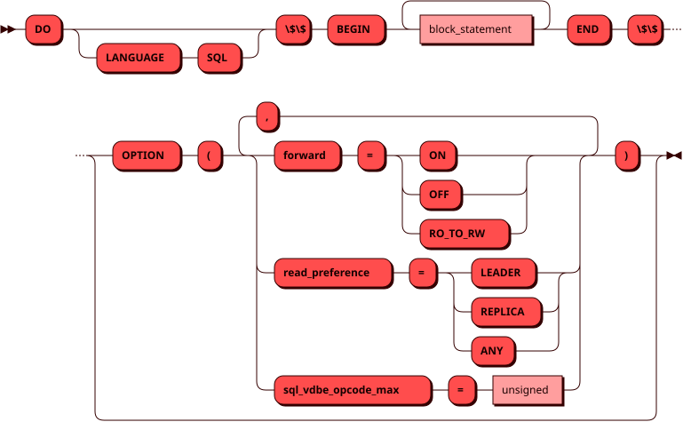
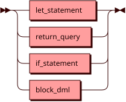
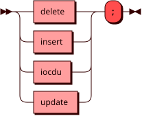
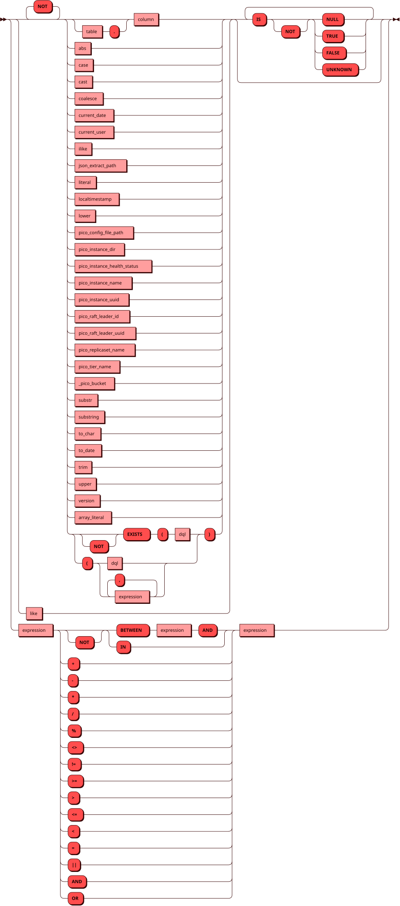
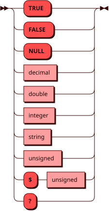
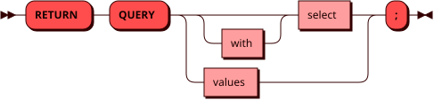
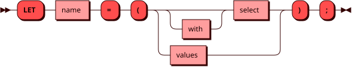
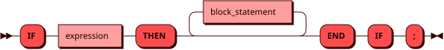

# Транзакции

В Picodata поддерживаются [транзакции] — блоки команд. В рамках
транзакции пользователь может выполнить несколько SQL-запросов атомарно
— так, как если бы это был единый запрос. Для транзакционных запросов
действуют [ограничения](#limitations).

[транзакции]: ../../overview/glossary.md#transactions
[бакет]: ../../overview/glossary.md#bucket

## Структура {: #structure }

Транзакционный блок представляет собой запрос вида `DO $$ BEGIN ... END $$;`,
внутри которого можно поместить набор вложенных запросов. Такой блок
функционально является неименованной процедурой.

Как и в обычных запросах, в транзакционных блоках можно использовать
параметры (например, `$1`). Подробнее о [параметризованных запросах]
можно прочитать в соответствующем разделе.

[параметризованных запросах]: ./parametrization.md

## Синтаксис {: #syntax }



### Команда блока {: #block_statement }

??? note "Диаграмма"
    

### DML-команда {: #block_dml }

??? note "Диаграмма"
    

### Выражение {: #expression }

??? note "Диаграмма"
    

### Литерал {: #literal }

??? note "Диаграмма"
    

## Поддерживаемые команды исполнения {: #supported_statements }

На данный момент для транзакционных блоков поддерживаются следующие
команды исполнения:

- `<DML>;` — выполнить вложенный [DML]-запрос (см. ограничения
  [ниже](#limitations)).
- `RETURN QUERY <DQL>;` — выполнить вложенный запрос и отобразить результат
  выполнения (используется для [DQL]-запросов).
- `LET <name> = (<DQL>);` — выполнить вложенный запрос, возвращающий
  одну колонку, и сохранить результат в переменной `<name>`, доступной
  в последующих командах блока (см. [ниже](#let_statement)).
- `IF <expr> THEN ... [ELSE ...] END IF;` — условно выполнить вложенные
  [DML]-команды, `RETURN QUERY`, `LET` и другие `IF`-блоки: тело `THEN`,
  если выражение `<expr>` истинно, и тело `ELSE` в противном случае
  (см. [ниже](#if_statement)).

## Пример использования {: #usage_example }

??? example "Подготовка тестового окружения"
    Примеры на этой странице используют собственные таблицы:

    ```sql
    DROP TABLE IF EXISTS dataset;
    CREATE TABLE dataset (id INT PRIMARY KEY, n INT);
    INSERT INTO dataset VALUES (1, 354365), (2, 3123);

    DROP TABLE IF EXISTS store;
    CREATE TABLE store (id INT PRIMARY KEY, price DECIMAL);
    INSERT INTO store VALUES (1, 199), (2, 99);

    DROP TABLE IF EXISTS wallet;
    CREATE TABLE wallet (client_id INT PRIMARY KEY, balance DECIMAL);
    INSERT INTO wallet VALUES (1, 0);

    DROP TABLE IF EXISTS client;
    CREATE TABLE client (id INT PRIMARY KEY, first_name TEXT, last_name TEXT);
    INSERT INTO client VALUES (1, 'John', 'Doe');
    ```

    Все таблицы шардированы по колонкам первичного ключа — это поведение
    по умолчанию, см. [CREATE TABLE](create_table.md). Благодаря этому
    команды внутри одного блока, отбирающие строки по одному и тому же
    значению ключа (`id = 2`, `client_id = $1`), попадают в один
    [бакет], что является обязательным условием для транзакционных
    блоков (см. [ограничения](#limitations)).

```sql
DO $$ BEGIN
  LET cur = (SELECT n FROM dataset WHERE id = $1);

  RETURN QUERY SELECT $1 AS id, cur;

  IF cur % 2 != 0 THEN
    UPDATE dataset SET n = 3 * n + 1 WHERE id = $1;
  ELSE
    UPDATE dataset SET n = n / 2 WHERE id = $1;
  END IF;
END $$;
```

## Возврат строк через `RETURN QUERY` {: #return_query }



Команда `RETURN QUERY` позволяет добавить результат исполнения [DQL]-запроса
в множество строк, которое будет возвращено из транзакции в качестве результата.
В отличие от классических императивных языков программирования, в Picodata
**эта команда не прерывает исполнение транзакции**.

Пример:

```sql
DO $$ BEGIN
  RETURN QUERY SELECT 'hello' as message;
  RETURN QUERY SELECT 'world';
END $$;
```

```
┌─────────┐
│ message │
├─────────┤
│ hello   │
│ world   │
└─────────┘
(2 rows)
```

Правила применения `RETURN QUERY`:

- `RETURN QUERY` можно использовать неограниченное количество раз.
- Разрешено указывать [DQL]-запросы, возвращающие любое количество строк.
- Kаждое применение `RETURN QUERY` должно соответствовать единой схеме —
  то есть, каждый [DQL]-запрос должен возвращать одинаковое количество
  колонок с совпадающими типами. Нарушение этого условия приведет
  к ошибке на стадии планирования транзакции.

## `LET`-переменные {: #let_statement }



Команда `LET` связывает c именованной переменной результат запроса.

Пример:

```sql
DO $$ BEGIN
  LET new_price = (SELECT 1000::decimal);
  UPDATE store SET price = new_price WHERE id = 2;
END $$;
```

Правила применения `LET`:

- На `LET`-переменную можно ссылаться в последующих командах блока, в том числе:
    * в условии `IF`-блока,
    * в фильтрах `WHERE`,
    * в запросе `RETURN QUERY`,
    * в определении другой `LET`-переменной,
    * в `SET` команд `UPDATE` и `INSERT ... ON CONFLICT (...) DO UPDATE`.
- `LET` можно использовать и в теле `IF`-блока, но такая переменная
  видна только внутри этого тела и перестает существовать на `END IF`.
- В разных `IF`-блоках можно объявлять переменные с одинаковым именем —
  это разные переменные, их типы могут не совпадать.
- Переменную нельзя объявить в теле `IF`, если снаружи уже объявлена
  переменная с тем же именем. Такое объявление создало бы отдельную
  переменную, значение которой потерялось бы на `END IF`, хотя
  выглядит оно как обновление внешней переменной. Выберите другое имя.
- Имя переменной должно начинаться с буквы или символа подчеркивания и
  состоять только из букв, цифр и подчеркиваний. Это ограничение действует
  и для имен в двойных кавычках: `LET "my var" = ...` приведет к ошибке.
- Запрос в определении `LET`-переменной должен вернуть не более одной строки,
  состоящей из одной колонки; в противном случае транзакция будет
  отменена с ошибкой. Если запрос не вернет ни одной строки,
  переменная получит значение `NULL`.
- В пределах одной области видимости переменная не может быть объявлена
  повторно с другим типом; повторное объявление с тем же типом разрешено.
  Проверка не выполняется, если тип одной из сторон не удалось вывести —
  например, у `LET v = (SELECT $1)` с неограниченным параметром.
- Если в некотором запросе упоминается колонка таблицы, имя которой
  совпадает с именем видимой в этой точке `LET`-переменной, упоминание
  считается неоднозначным и приводит к ошибке на стадии планирования
  транзакции. Переменная, вышедшая из области видимости на `END IF`,
  такой неоднозначности не создает: имя относится к колонке.

## Условные блоки `IF` {: #if_statement }



Команда `IF <expr> THEN ... END IF;` выполняет вложенные [DML]-команды,
`RETURN QUERY`, `LET` и другие `IF`-блоки, если выражение `<expr>`
истинно. Необязательная ветка `ELSE` задает команды, которые выполняются
в противном случае.

Пример:

```sql
DO $$ BEGIN
  LET cur_balance = (SELECT balance FROM wallet WHERE client_id = 1);

  RETURN QUERY
    SELECT first_name, last_name, cur_balance as old_balance
    FROM client WHERE id = 1;

  IF cur_balance < 1e6 THEN
    UPDATE wallet SET balance = cur_balance + 1e6 WHERE client_id = 1;
    UPDATE client SET first_name = 'Richie', last_name = 'Rich' WHERE id = 1;
  END IF;
END $$;
```

```
┌────────────┬───────────┬─────────────┐
│ first_name │ last_name │ old_balance │
├────────────┼───────────┼─────────────┤
│ John       │ Doe       │           0 │
└────────────┴───────────┴─────────────┘
(1 row)
```

Ветка `ELSE` выполняется, если условие оказалось ложным или равным `NULL`.
Ветки исключают друг друга: за одно исполнение блока отрабатывает ровно
одна из них.

```sql
DO $$ BEGIN
  LET cur_balance = (SELECT balance FROM wallet WHERE client_id = 1);
  IF cur_balance > 0 THEN
    UPDATE wallet SET balance = cur_balance * 1.05 WHERE client_id = 1;
  ELSE
    UPDATE wallet SET balance = 100 WHERE client_id = 1;
  END IF;
END $$;
```

Строки можно возвращать из тела `IF` при помощи `RETURN QUERY` — тогда они
попадут в результат транзакции, только если условие оказалось истинным:

```sql
DO $$ BEGIN
  LET cur_balance = (SELECT balance FROM wallet WHERE client_id = 1);
  IF cur_balance > 0 THEN
    LET new_balance = (SELECT cur_balance * 1.05);

    RETURN QUERY
      SELECT first_name || ' ' || last_name AS client,
             (new_balance - cur_balance)::int AS interest
      FROM client WHERE id = 1;

    UPDATE wallet SET balance = new_balance WHERE client_id = 1;
  END IF;
END $$;
```

```
┌─────────────┬──────────┐
│   client    │ interest │
├─────────────┼──────────┤
│ Richie Rich │    50000 │
└─────────────┴──────────┘
(1 row)
```

`LET` в теле `IF` позволяет не вычислять значение, если оно не понадобится:

```sql
DO $$ BEGIN
  LET cur_balance = (SELECT balance FROM wallet WHERE client_id = 1);
  IF cur_balance > 0 THEN
    LET bonus = (SELECT (cur_balance * 0.01)::int);
    UPDATE wallet SET balance = cur_balance + bonus WHERE client_id = 1;
  END IF;
END $$;
```

Область видимости такой переменной ограничена телом `IF`-блока: обращение
к `bonus` после `END IF` приведет к ошибке на стадии планирования. Благодаря
этому не возникает ситуации, когда переменная незаметно оказывается `NULL`
из-за того, что условие не выполнилось.

Тела `THEN` и `ELSE` — две независимые области видимости: переменная,
объявленная в одной ветке, недоступна в другой (и после `END IF`).

Имена в разных `IF`-блоках независимы — это разные переменные, и типы у них
могут различаться (на примере переменной `x`):

```sql
DO $$ BEGIN
  LET first_name = (SELECT first_name FROM client WHERE id = 1);
  IF first_name = 'Richie' THEN
    LET x = (SELECT 'Found ' || first_name || '!');
    RETURN QUERY SELECT x;
  END IF;

  LET last_name = (SELECT last_name FROM client WHERE id = 1);
  IF last_name = 'Rich' THEN
    RETURN QUERY SELECT 'Looks like he will get even richer.';
    LET x = (SELECT 10000);
    UPDATE wallet SET balance = balance + x WHERE client_id = 1;
  END IF;
END $$;
```

```
┌─────────────────────────────────────┐
│                col_1                │
├─────────────────────────────────────┤
│ Found Richie!                       │
│ Looks like he will get even richer. │
└─────────────────────────────────────┘
(2 rows)
```

Правила применения `IF`:

- Условие должно быть скалярным булевым выражением; ссылки на колонки
  таблиц в условии не допускаются — используйте `LET` для подготовки
  значений.
- В транзакции можно использовать несколько `IF`-блоков.
- В теле допускаются [DML]-команды (`UPDATE` / `DELETE` / `INSERT`),
  `RETURN QUERY`, `LET` и вложенные `IF`-блоки. Глубина вложенности не
  ограничена; тело вложенного блока выполняется, только если истинны
  условия всех объемлющих блоков.
- Тело может быть пустым: `IF <expr> THEN END IF;` — корректная команда.
  Условие при этом все равно вычисляется, но никаких действий не
  выполняется. Это же верно и для пустой ветки `ELSE`.
- Ветка `ELSE` необязательна; блок без нее ведет себя так же, как блок
  с пустой веткой `ELSE`. Ветка выполняется, если условие ложно или
  равно `NULL`.
- Каждое из тел `IF`-блока (`THEN` и `ELSE`) образует собственную область
  видимости для `LET`-переменных — подробнее см. [выше](#let_statement).
- Внутри тела действует то же правило порядка команд, что и в блоке
  целиком: `RETURN QUERY` должен быть расположен до [DML]-команд (см.
  [ограничения](#limitations)). Правило проверяется по тексту блока, а не
  по ходу исполнения, поэтому `RETURN QUERY` или `LET` в ветке `ELSE` не
  может следовать за [DML]-командой ветки `THEN` — хотя вместе они
  никогда не выполняются.
- Сам по себе `IF` не считается модифицирующей командой — учитывается
  только содержимое его тела. Если тело лишь читает, после такого
  `IF`-блока по-прежнему можно использовать `LET` и `RETURN QUERY`.
- Тип результата транзакции определяется всеми командами `RETURN QUERY`
  блока, включая вложенные в тело `IF`. Все они должны возвращать
  одинаковый набор типов колонок; имена колонок берутся из первой такой
  команды.

## Ограничения {: #limitations }

Поддержка транзакционного выполнения команд в Picodata имеет
ограничения:

- **Читающие команды ([DQL]) должны быть расположены строго до
  модифицирующих ([DML]).** Иными словами, `RETURN QUERY` и `LET`
  не могут быть использованы после первого [DML]-запроса. Правило
  действует для блока целиком, независимо от вложенности: `RETURN QUERY`
  в теле `IF` не может следовать за [DML]-командой ни из того же тела,
  ни из внешнего блока, ни из соседней ветки того же `IF`.
- **Поддерживаются только запросы, не требующие [перемещения данных].**
  Иными словами, в текущей реализации транзакции должны быть выполнимы
  в рамках одного узла Picodata. Глобальные транзакции, затрагивающие
  данные на нескольких узлах, не поддерживаются.
- **Каждый запрос к [шардированным] таблицам внутри транзакции должен
  затрагивать ровно один [бакет], и этот [бакет] должен быть общим для
  всех таких запросов.** При перебалансировке [бакеты] могут перемещаться
  между репликасетами, поэтому транзакция может перестать быть локальной
  (т.е. потребовать [перемещения данных]). Поэтому при нарушении этого
  условия произойдет ошибка на стадии планирования транзакции.
- В рамках одной транзакции нельзя обращаться к более чем одному
  [движку хранения](../../overview/glossary.md#db_engine).
- Для глобальных таблиц поддерживаются только читающие запросы ([DQL]),
  но не модифицирующие ([DML]).
- `INSERT ... ON CONFLICT (...) DO UPDATE` поддерживается только для
  шардированных таблиц, если запрос затрагивает один бакет и использует
  `VALUES`. Вставка из `SELECT` внутри транзакционного блока не
  поддерживается. Подробнее см. в разделе
  [Вставка с обновлением при конфликте](iocdu.md#transactions).

[перемещения данных]: explain_facets/logical.md#data_motion_types
[шардированным]: ../../overview/glossary.md#sharding
[бакеты]: ../../overview/glossary.md#bucket
[DML]: dml.md
[DQL]: dql.md
