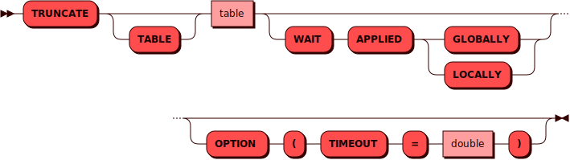

# TRUNCATE TABLE

[DDL](ddl.md)-команда `TRUNCATE TABLE` используется для удаления всех
строк в существующей таблице.

## Синтаксис {: #syntax }



## Параметры {: #params }

* **TABLE** — имя таблицы. Соответствует правилам имен для всех
  [объектов](object.md) в кластере

* **WAIT APPLIED** — при использовании этого параметра контроль
  пользователю будет возвращен только после того как данная операция
  будет применена либо во всем кластере (`GLOBALLY`), либо в рамках
  текущего инстанса (`LOCALLY`)

## Примеры {: #examples }

```sql
TRUNCATE TABLE warehouse
OPTION (TIMEOUT = 3.0);
```

```sql
TRUNCATE TABLE warehouse
WAIT APPLIED GLOBALLY
OPTION (TIMEOUT = 3.0);
```
