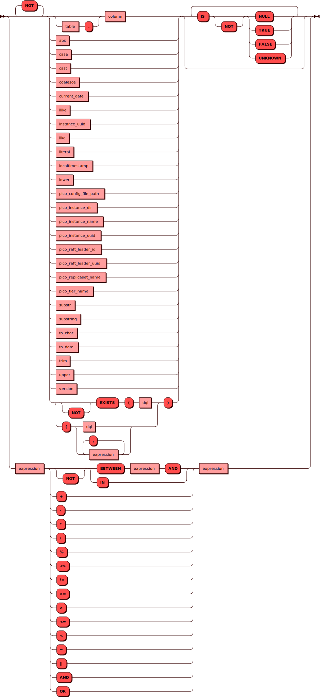

# UPDATE

[DML](dml.md)-команда `UPDATE` используется для обновления данных в
колонках таблицы. При использовании фильтрующего условия (`WHERE`) можно
применять ее только к определенным кортежам таблицы. В то время как для
полной замены кортежей можно использовать команду `INSERT` c параметром
`on conflict do replace`, команда `UPDATE` подойдет для выборочной
замены значений отдельных колонок в нужных кортежах. В качестве
источника данных для `UPDATE` можно использовать как непосредственно
передаваемые значения, так и результат подзапроса в конструкции `FROM
(SELECT ...)`.

## Синтаксис {: #syntax }


### Сканирование {: #scan }

??? note "Диаграмма"
    

### Выражение {: #expression }

??? note "Диаграмма"
    

### Литерал {: #literal }

??? note "Диаграмма"
    

## Параметры {: #params }

* **TABLE** — имя таблицы. Соответствует правилам имен для всех
  [объектов](object.md) в кластере.

* **Псевдоним** — позволяет переопределить названия получаемых столбцов
в запросах. Псевдоним вставляется после опционального слова `AS` и может
содержать произвольный текст со следующими ограничениями: он не должен
начинаться с цифры и не может содержать пробелов и специальных служебных
символов (кроме знака подчеркивания).

## Ограничения {: #restrictions }

При использовании `UPDATE` следует учитывать следующие ограничения:

- нельзя обновить значение первичного ключа (например, `id`)
- нельзя указать одну и ту же колонку дважды (например, `item = 'bricks',
  name = 'piles'`)
- нельзя обновить значение в системной колонке `bucket_id` (оно
  вычисляется автоматически)
- передаваемое новое значение не должно противоречить [типу
  данных](../sql_types.md), присвоенному колонке

## Примеры {: #examples }

??? example "Тестовые таблицы"
    Примеры использования команд включают в себя запросы к [тестовым
    таблицам](../legend.md).

Обновление явно указанных данных в отдельном кортеже с использованием
условия:

```sql
UPDATE warehouse SET item = 'chunks', TYPE = 'light' WHERE id = 1;
```

Обновление всех значений в колонке:

```sql
UPDATE warehouse SET type = 'light';

```

Обновление с помощью ссылки на существующую колонку таблицы (без
необходимости использовать подзапрос):

```sql
UPDATE orders SET amount = amount +100;
```

Обновление значений колонки на основе значений другой колонки (с
подзапросом):

```sql
UPDATE items SET name = item
FROM (SELECT id AS i, item FROM orders)
WHERE id = i;
```

В данном случае использования подзапроса (`FROM (SELECT ...)`),
потребуется указать и фильтр (`WHERE`) для того, чтобы каждому кортежу
первой таблицы соответствовал ровно один кортеж второй таблицы.

В каждом случае результатом успешного выполнения будет сообщение с
количеством обработанных кортежей.
