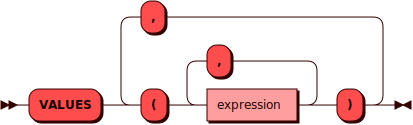
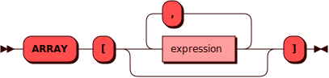

# VALUES

[DQL](dql.md)-команда`VALUES` используется для получения кортежей из
создаваемой на лету временной таблицы.

## Синтаксис {: #syntax }



### Выражение {: #expression }

??? note "Диаграмма"
    

### Литерал {: #literal }

??? note "Диаграмма"
    

### Литерал массива {: #array_literal }

??? note "Диаграмма"
    

## Примеры {: #examples }

Создание таблицы из двух предопределенных кортежей:
```sql
VALUES (1, 'bricks', 'heavy'), (2, 'bars', 'light');
```

Внутри `VALUES` можно использовать литерал массива `ARRAY[...]`. Подробнее
см. [ARRAY](../sql_types.md#array):

```sql
VALUES (1, ARRAY[10, 20, 30]), (2, ARRAY[]);
```
