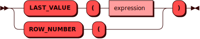

# Встроенные оконные функции {: #builtin }

Встроенные оконные функции могут использоваться только вместе с выражением
`OVER`. На текущий момент поддерживается только `ROW_NUMBER()`.

## Синтаксис {: #syntax }



## ROW_NUMBER {: #row_number }

Функция `row_number()` присваивает каждой строке номер в текущем разделе.
Нумерация начинается с 1 в порядке, определенном выражением `ORDER BY`
в определении окна, либо в произвольном порядке, если `ORDER BY` отсутствует.

### Пример {: #example_row_number }

```sql
CREATE TABLE t0(x INTEGER PRIMARY KEY, y TEXT);
INSERT INTO t0 VALUES (1, 'aaa'), (2, 'ccc'), (3, 'bbb');

SELECT x, y, row_number() OVER (ORDER BY y) FROM t0 ORDER BY x;

 x |  y  | col_1
---+-----+-------
 1 | aaa | 1
 2 | ccc | 3
 3 | bbb | 2
```

Функция `row_number()` присваивает каждой строке номер в порядке,
заданном выражением `ORDER BY` внутри определения окна (в данном случае
`ORDER BY y`). При этом, `ORDER BY` внутри `OVER` влияет только на нумерацию
строк, но не изменяет порядок итогового вывода, который определяется
`ORDER BY` в операторе `SELECT` (в данном случае `ORDER BY x`).
