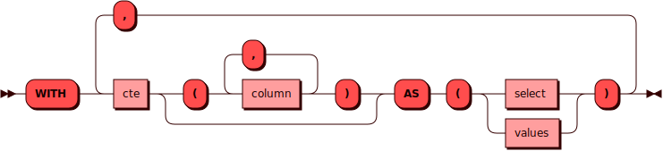

# Общие табличные выражения

Предложение `WITH` добавляется перед [DQL](dql.md)-командой
[`SELECT`](select.md) и позволяет использовать в запросе временные
таблицы.

Такие временные таблицы называются *общими табличными выражениями*
(англ. CTE — common table expressions) и существуют только в контексте
выполнения запроса.

Предложение `WITH` может материализовать результаты, если это требуется
для выполнения распределенного плана. Если поддерево CTE
гарантированно выполняется в пределах одного бакета, планировщик может
оставить его локальным и не добавлять отдельный узел `motion` даже при
повторном использовании этого CTE. В таком случае повторные ссылки на
CTE не обязаны использовать один общий материализованный результат:
`motion` может появиться только в вышестоящих частях плана, где он нужен
для глобального выполнения запроса.

В область видимости общих табличных выражений и команды `SELECT` попадают
результаты выражений, описанных ранее в запросе `WITH`. Например, есть
запрос `WITH` с тремя общими табличными выражениями:

```
WITH
    <cte1>,
    <cte2>,
    <cte3>
SELECT <...>
```

В команде `SELECT` можно использовать результаты выражений `<cte1>`,
`<cte2>`, `<cte3>`. В выражении `<cte3>` — результаты выражений `<cte1>`,
`<cte2>`. В выражении `<cte2>` — результат выражения `<cte1>`. В выражении
`<cte1>` должны использоваться запросы к уже существующим таблицам.

## Синтаксис {: #syntax }



## Параметры {: #params }

* **cte** — имя общего табличного выражения. Соответствует правилам
  имен для всех [объектов](object.md) в кластере
* **column** — имя колонки общего табличного выражения. Соответствует
  правилам имен для всех [объектов](object.md) в кластере

## Примеры {: #examples }

??? example "Тестовые таблицы"
    Примеры использования команд включают в себя запросы к [тестовым
    таблицам](../legend.md).

```sql title="Запрос WITH и CTE с предложением WHERE"
WITH replenish (item, amount)
    AS (SELECT item, amount FROM orders WHERE amount <= 1000)
SELECT item, amount FROM replenish;
```

Результат:

```bash
+-------------+--------+
| item        | amount |
+======================+
| "adhesives" | 350    |
|-------------+--------|
| "moldings"  | 900    |
|-------------+--------|
| "bars"      | 100    |
+-------------+--------+
(3 rows)
```

```sql title="Запрос WITH и CTE с внутренним соединением"
WITH leftovers (item, orders_data, deliveries_data) AS (
    SELECT item, amount, deliveries.quantity
    FROM orders
    JOIN deliveries
    ON item = deliveries.product
    )
SELECT item, orders_data - deliveries_data AS amount FROM leftovers;
```

Результат:

```bash
+-------------+--------+
| item        | amount |
+======================+
| "metalware" | 3000   |
|-------------+--------|
| "adhesives" | 50     |
|-------------+--------|
| "moldings"  | 800    |
|-------------+--------|
| "bars"      | 95     |
|-------------+--------|
| "blocks"    | 5000   |
+-------------+--------+
(5 rows)
```

```sql title="Запрос WITH с двумя независимыми CTE"
WITH
    c (total) AS (SELECT count(*) FROM orders),
    m (earliest_date) AS (SELECT min(since) FROM orders)
SELECT c.total, m.earliest_date FROM c LEFT JOIN m ON true;
```

Результат:

```bash
+-------+------------------------+
| total | earliest_date          |
+================================+
| 5     | "2023-11-11T00:00:00Z" |
+-------+------------------------+
(1 rows)
```

```sql title="Запрос WITH, в котором результат CTE <i>ordered_items</i> используется в CTE <i>total_stock</i>"
WITH
    ordered_items (id, name, stock) AS (
        SELECT items.* FROM items
        JOIN orders
        ON items.name = orders.item
    ),
    total_stock (total) AS (
        SELECT sum(stock) FROM ordered_items
    )
SELECT * FROM total_stock;
```

Результат:

```bash
+-------+
| total |
+=======+
| 90227 |
+-------+
(1 rows)
```

Пример плана, в котором поддерево CTE выполняется без отдельного
`motion`, но внешний запрос остается распределенным:

```sql
EXPLAIN WITH cte AS (SELECT * FROM t WHERE a = 1)
SELECT * FROM cte c1 JOIN cte c2 ON c1.b = c2.b;
```

План:

```sql
projection ("c1"."a" -> "a", "c1"."b" -> "b", "c2"."a" -> "a", "c2"."b" -> "b")
    join on "c1"."b"::int = "c2"."b"::int
        scan cte c1($0)
        motion [policy: full, program: ReshardIfNeeded]
            scan cte c2($0)
subquery $0:
projection ("t"."a" -> "a", "t"."b" -> "b")
    selection "t"."a"::int = 1::int
        scan "t"
buckets <= [1934]
```

В этом примере поддерево `subquery $0` выполняется без отдельного
`motion`, потому что условие `a = 1` задает значение колонки
шардирования. Повторные
ссылки на `cte` при этом не приводят к отдельной материализации самого
`subquery $0`, но весь запрос все равно не становится одноузловым:
`motion` появляется в части плана с `JOIN`, на одной из его веток.
