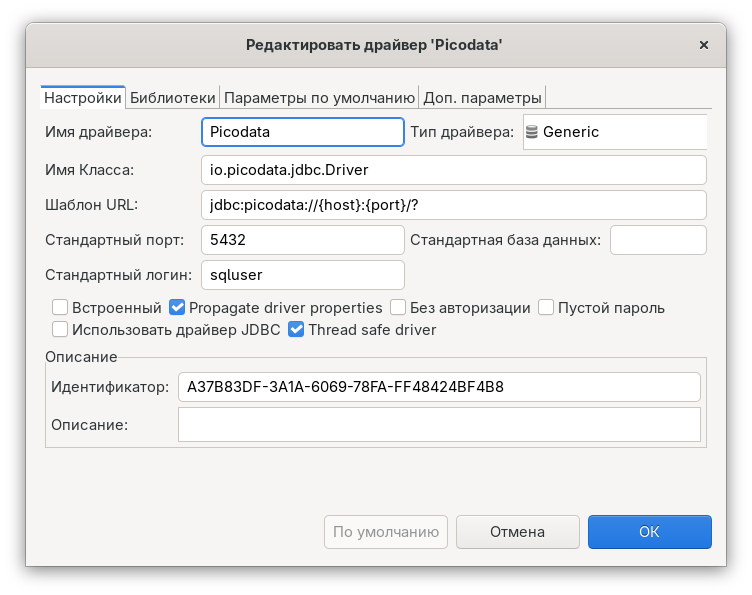
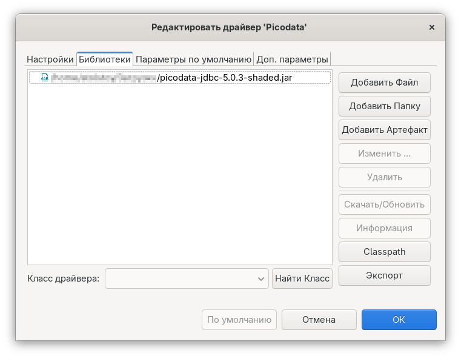
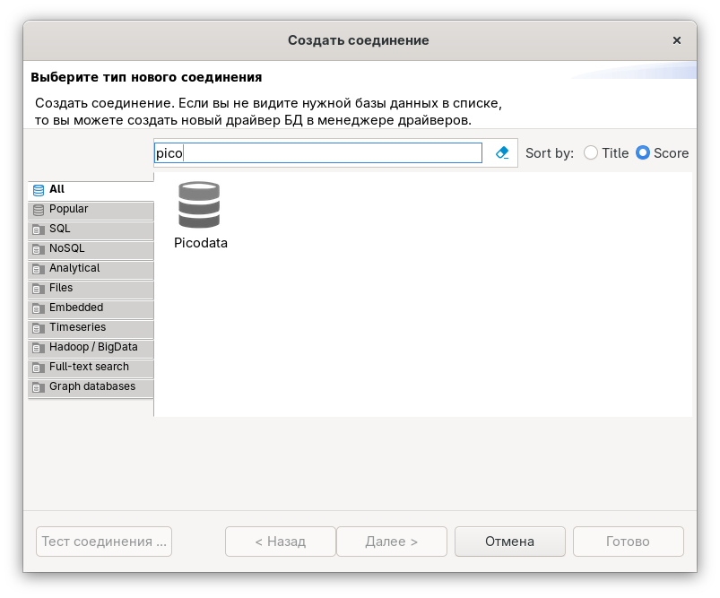
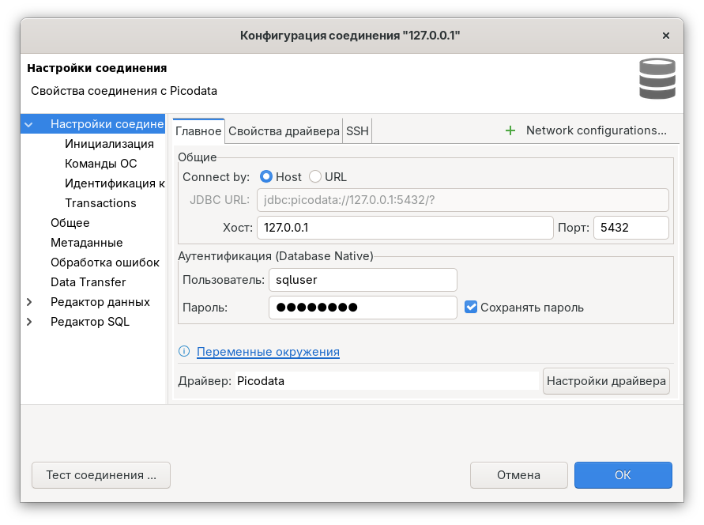
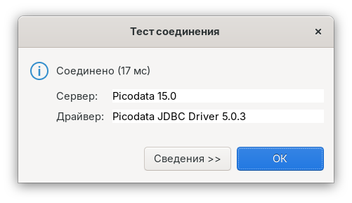
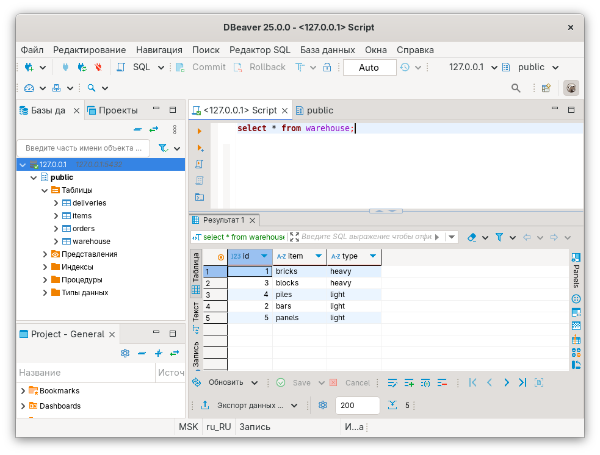

# Подключение через DBeaver

В данном разделе описан способ подключения к Picodata c помощью [DBeaver]
— удобного инструмента для работы с БД при помощи графического интерфейса.

## Общие сведения {: #intro }

DBeaver — универсальный SQL-клиент для администрирования баз данных. Для
подключения к реляционным БД (включая Picodata) он использует
JDBC-драйверы.

Picodata предоставляет обособленный драйвер [picodata-jdbc] для внешних
подключений, разработанный на основе протокола PostgreSQL. Описание
возможностей и структуры драйвера приведено [отдельно].

[DBeaver]: https://dbeaver.io
[picodata-jdbc]: https://git.picodata.io/picodata/picodata/picodata-jdbc
[отдельно]: connectors/jdbc.md

## Требования {: #prerequisites }

Для подключения к Picodata c помощью [DBeaver] требуются:

- установленный DBeaver
- JDBC-драйвер `postgresql-*.jar` (доступен на [сайте PostgreSQL])
- JDBC-драйвер `picodata-jdbc-*.jar` (доступен в [репозитории Picodata])
- доступ к [запущенному инстансу] Picodata, который принимает входящие
  подключения по [протоколу PostgreSQL]

[сайте PostgreSQL]: https://jdbc.postgresql.org/download/
[репозитории Picodata]: https://binary.picodata.io/service/rest/repository/browse/maven-releases/io/picodata/picodata-jdbc/
[запущенному инстансу]: deploy.md
[протоколу PostgreSQL]: ../reference/config.md#instance_pg_listen

## Подключение {: #enabling }

### Добавление драйвера {: #add_driver }

Создайте в DBeaver новый драйвер для Picodata:

_База данных > Управление драйверами > Новый (Database > Driver Manager > New)_

На вкладке **Настройки** введите:

- имя драйвера: `Picodata`
- имя класса: `io.picodata.jdbc.Driver`
- шаблон URL: `jdbc:picodata://{host}:{port}/?`
- стандартный порт: укажите номер порта для подключения по протоколу
  PostgreSQL. По умолчанию в Picodata это `4327`. Порт может быть
  переопределен с помощью параметра конфигурации
  [`instance.pg.listen`](../reference/config.md#instance_pg_listen).
- стандартный логин: укажите, под каким пользователем DBeaver будет предлагать подключиться к Picodata

Также включите параметр `Propagate driver properties`. Остальные настройки оставьте как есть. Пример заполнения показан ниже:

На вкладке **Библиотеки**:

- нажмите `Добавить файл` и выберите два JAR-файла (`postgresql-*.jar` и `picodata-jdbc-*.jar`)
- под списком файлов нажмите `Найти класс` и выберите `io.picodata.jdbc.Driver`

Пример заполнения показан ниже:

Нажмите `ОК`.

### Подключение к Picodata {: #connect_to_picodata }

После того как драйвер добавлен, можно создать новое
соединение к Picodata:

_База данных > Новое соединение (Database > New database connection)_

Выберите ранее созданный драйвер `Picodata` и нажмите **Далее**, после
чего откроется окно с подробностями соединения:

Проверьте правильность настроек на этом экране. Обратите внимание, что в
блоке `Аутентификация (Database native)` должны быть заданы корректные
имя и пароль существующего в Picodata пользователя.

См. также:

- [Создание пользователя](../admin/access_control.md#create_user)

Нажмите кнопку **Тест соединения (Test connection)**. Если данные для
подключения были указаны корректно, появится окно с данными сервера СУБД
и драйвера, задействованного для подключения к нему:

Нажмите `Готово`.

### Проверка работы {: #check }

После того как подключение добавлено, нажмите на имя узла в левой панели
DBeaver. Приложение подключится к Picodata и откроет дерево доступных
элементов (таблицы, представления и т.д.). В основной части окна будет
доступна SQL-консоль для взаимодействия с БД:

На этом настройка DBeaver для работы с Picodata завершена.
