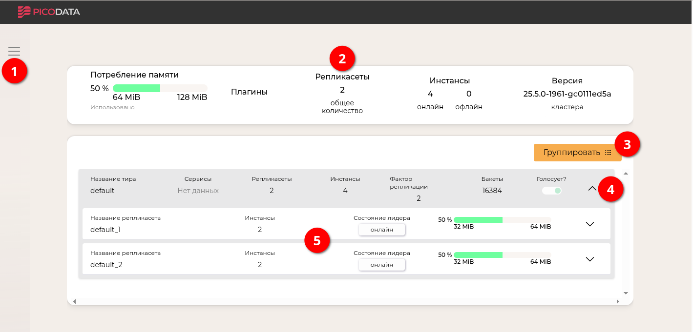
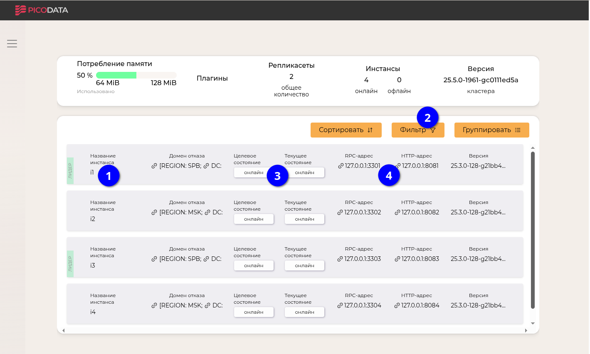

# Работа в веб-интерфейсе

В данном разделе приведены сведения, которые помогут начать работу с
веб-интерфейсом Picodata.

## Подключение функции веб-интерфейса {: #enabling_webui }

Веб-интерфейс представляет собой веб-сервер, запускаемый вместе с
[инстансом](../overview/glossary.md#instance) Picodata. Не имеет значения, на каком
именно инстансе кластера запущен этот веб-сервер; в любом случае
веб-сервер будет отображать данные обо всем кластере.

Для запуска инстанса с веб-сервером следует использовать параметр
[`picodata run --http-listen`]. Пример команды:

```bash
picodata run --http-listen 127.0.0.1:8080
```

[`picodata run --http-listen`]: ../reference/cli.md#run_http_listen

Можно запустить несколько инстансов с таким параметром, но нужно будет
указать разные адреса — таким образом у кластера будет несколько
веб-серверов.

## Доступ к веб-интерфейсу {: #accessing_webui }

В адресной строке веб-браузера введите адрес, указанный в виде значения
параметра `--http-listen`. Откроется страница с информацией о кластере
Picodata:



Данная страница предоставляет следующую полезную информацию о кластере:

<span style="color:red;font-size:150%">❶</span> — боковое меню,
позволяющее вывести список всех инстансов (узлов) кластера;<br>
<span style="color:red;font-size:150%">❷</span> — панель основной
информации о кластере: показателях памяти, количестве [репликасетов],
[инстансов] и их [состояний], версии Picodata;<br>
<span style="color:red;font-size:150%">❸</span> — кнопка выбора
группировки представления (по [тирам], инстансам или репликасетам);<br>
<span style="color:red;font-size:150%">❹</span> — кнопка подробных
сведений о тире или репликасете;<br>
<span style="color:red;font-size:150%">❺</span> — область подробных
сведений о репликасетах в составе тира.

[репликасетов]: ../overview/glossary.md#replicaset
[инстансов]: ../overview/glossary.md#instance
[состояний]: ../overview/glossary.md#state
[тирам]: ../overview/glossary.md#tier

По умолчанию, веб-интерфейс показывает список репликасетов кластера (в
данном примере их два). Если выбрать группировку по инстансам (<span
style="color:red;font-size:150%">❸</span>), то можно сразу увидеть
дополнительную информацию о состоянии инстансов:



Представление в виде списка инстансов содержит следующие элементы:

<span style="color:blue;font-size:150%">❶</span> — имя инстанса и признак лидерства в репликасете;<br>
<span style="color:blue;font-size:150%">❷</span> — кнопку фильтрации по
[домену отказа] (позволяет оставить в списке
только те инстансы, которые удовлетворяют заданному условию);<br>
<span style="color:blue;font-size:150%">❸</span> — текущее и целевое
состояние инстанса);<br>
<span style="color:blue;font-size:150%">❹</span> — публичные адреса
инстанса для работы с ним по RPC и HTTP;<br>

[домену отказа]: ../overview/glossary.md#failure_domain

Подробности о запуске кластера Picodata приведены в разделе [Создание
кластера](deploy.md).
