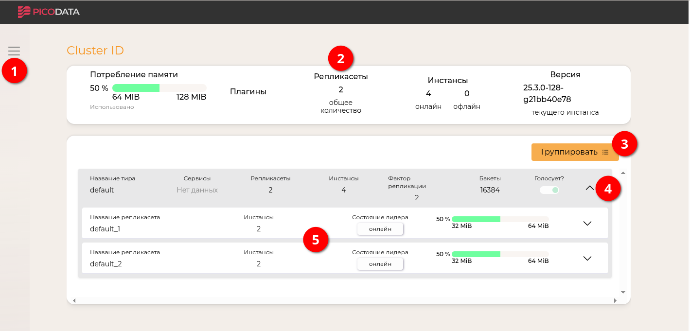

# Работа в веб-интерфейсе

В данном разделе приведены сведения, которые помогут начать работу с
веб-интерфейсом Picodata.

## Подключение функции веб-интерфейса {: #enabling_webui }

Веб-интерфейс представляет собой веб-сервер, запускаемый вместе с
[инстансом](../overview/glossary.md#instance) Picodata. Не имеет значения, на каком
именно инстансе кластера запущен этот веб-сервер; в любом случае
веб-сервер будет отображать данные обо всем кластере.

Для включения функции веб-сервера следует использовать параметр
конфигурации [instance.http_listen]. Его можно установить как в файле
конфигурации, так и через переменную окружения, либо указав в виде
[параметра командной строки]. Например:

```shell
picodata run --http-listen 127.0.0.1:8080
```

[параметра командной строки]: ../reference/cli.md#run_http_listen
[instance.http_listen]: ../reference/config.md#instance_http_listen

Можно запустить несколько инстансов с таким параметром, но нужно будет
указать разные адреса — таким образом у кластера будет несколько
веб-серверов.

## Аутентификация {: #accessing_webui }

В адресной строке веб-браузера введите адрес, указанный в виде значения
параметра [instance.http_listen] (например, [`127.0.0.1:8080`](http://127.0.0.1:8080)). Откроется
страница аутентификации:


Для доступа необходимо указать действующее имя учетной записи в СУБД
Picodata и корректный пароль, и затем нажать кнопку **Войти**. Пройти
аутентификацию могут все внутренние пользователи, у которых есть
привилегия `LOGIN` (выдается автоматически каждому новому пользователю
при его создании).

!!! note "Примечание"
    После 4 неуспешных попыток аутентификации
    пользователь блокируется автоматически. Для восстановления доступа
    попросите [Администратора БД](../admin/access_control.md#db_admin)
    выполнить SQL-команду `ALTER USER user WITH LOGIN;` (заменив
    `user` на имя заблокированного пользователя).

См. также:

- [Управление доступом к веб-интерфейсу](../admin/access_control.md#webui_mgmt)

## Работа в веб-интерфейсе {: #working_with_webui }

После успешной аутентификации откроется страница с информацией о кластере
Picodata:



Данная страница предоставляет следующую полезную информацию о кластере:

<span style="color:red;font-size:150%">❶</span> — боковое меню,
позволяющее вывести список всех инстансов (узлов) кластера;<br>
<span style="color:red;font-size:150%">❷</span> — панель основной
информации о кластере: показателях памяти, количестве [репликасетов],
[инстансов] и их [состояний], версии Picodata;<br>
<span style="color:red;font-size:150%">❸</span> — кнопка выбора
группировки представления (по [тирам], инстансам или репликасетам);<br>
<span style="color:red;font-size:150%">❹</span> — кнопка подробных
сведений о тире или репликасете;<br>
<span style="color:red;font-size:150%">❺</span> — область подробных
сведений о репликасетах в составе тира.

[репликасетов]: ../overview/glossary.md#replicaset
[инстансов]: ../overview/glossary.md#instance
[состояний]: ../overview/glossary.md#state
[тирам]: ../overview/glossary.md#tier

По умолчанию, веб-интерфейс показывает список репликасетов кластера (в
данном примере их два). Если выбрать группировку по инстансам (<span
style="color:red;font-size:150%">❸</span>), то можно сразу увидеть
дополнительную информацию о состоянии инстансов:


Представление в виде списка инстансов содержит следующие элементы:

<span style="color:blue;font-size:150%">❶</span> — имя инстанса и признак лидерства в репликасете;<br>
<span style="color:blue;font-size:150%">❷</span> — кнопку фильтрации по
[домену отказа] (позволяет оставить в списке
только те инстансы, которые удовлетворяют заданному условию);<br>
<span style="color:blue;font-size:150%">❸</span> — текущее и целевое
состояние инстанса);<br>
<span style="color:blue;font-size:150%">❹</span> — публичные адреса
инстанса для работы с ним по RPC и HTTP;<br>

[домену отказа]: ../overview/glossary.md#failure_domain

Подробности о запуске кластера Picodata приведены в разделе [Создание
кластера](deploy.md).

См. также:

- [Получение данных о кластере](../admin/local_monitoring.md)
- [Dashboard для Grafana](../admin/grafana_monitoring.md)
