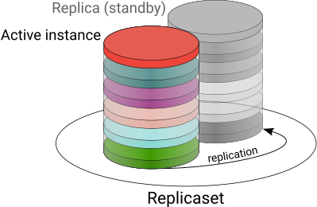
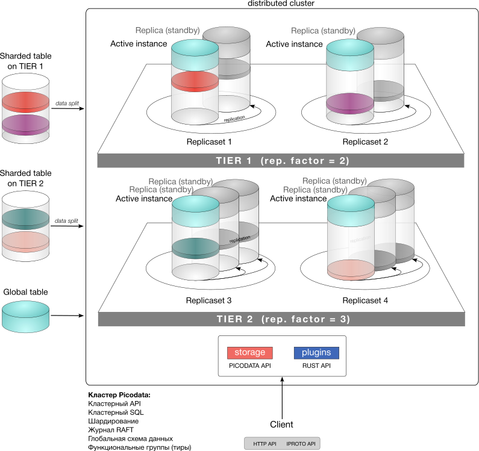
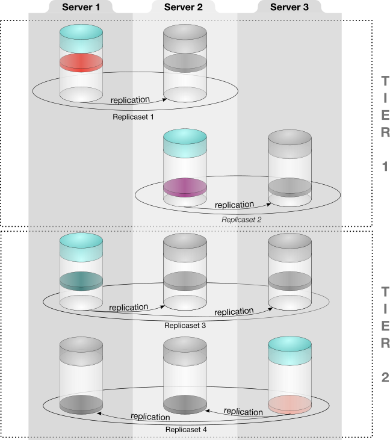
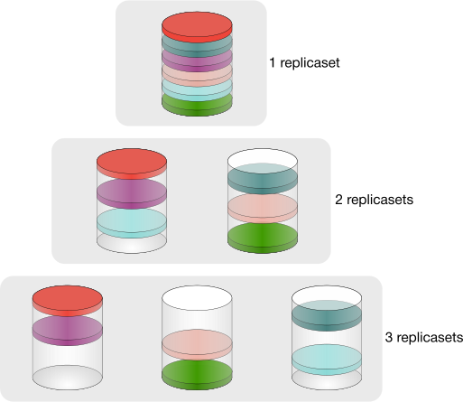

# Общее описание продукта

Данный раздел содержит общие сведения о продукте Picodata, его назначении, области применения и внутреннем устройстве.

## Что такое Picodata? {: #description }

Picodata — это распределенная СУБД с возможностью расширения функциональности за счет плагинов. Исходный код Picodata открыт и
доступен как в нашем [основном репозитории](https://git.picodata.io/core/picodata), так и в [зеркале на
GitHub](https://github.com/picodata/picodata).

Программное обеспечение Picodata реализует хранение структурированных и неструктурированных данных, транзакционное управление данными, язык запросов SQL, а также поддержку плагинов на языке Rust.

## Назначение {: #purpose }

Основным назначением продукта Picodata является горизонтально масштабируемое хранение структурированных и неструктурированных данных, а также управление распределенным кластером из [реплицированных](../overview/glossary.md#replication) отдельных узлов (*[инстансов](../overview/glossary.md#instance)*). Данная комбинация возможностей позволяет эффективно работать с наиболее востребованными, часто изменяющимися, *горячими* данными в высоконагруженной среде.
В традиционных корпоративных архитектурах, где используются классические универсальные СУБД, для ускорения и повышения надежности доступа к данным применяют кэши и шины данных. Цель развития Picodata: заменить три компонента корпоративной архитектуры — кэш, шина и витрина доступа к данным — единым, высокопроизводительным и строго консистентным решением.

## Роль в платформе данных {: #platform }

С точки зрения использования нашего ПО в составе корпоративной платформы, Picodata предоставляет операционный слой управления данными для решений класса In-memory data grid (IMDG). Это резидентная база данных для очень быстрой обработки среднего по объему массива данных. Все данные хранятся в оперативной памяти, но при этом они персистентны за счет периодического обновления снимков БД (snapshots) на диске. Ниже показана условная пирамида управления данными с точки зрения их объема.

Picodata занимает верхнюю часть пирамиды, т.к. оперирует данными ограниченного объема. На изображении показаны примеры прочих СУБД, которые служат для управления более крупными массивами данных и лучше подходят для архивного хранения и построения аналитических отчетов. В то же время такие СУБД хуже справляются с потоком часто меняющихся данных. Это именно та область, где Picodata эффективно решает поставленные задачи.

## Решаемые задачи {: #features }

Программное обеспечение Picodata решает следующие задачи:

* реализация общего [линеаризованного](../overview/glossary.md#linearizability) хранилища конфигурации, схемы данных и топологии кластера, встроенного в распределенную систему управления базами данных;
* предоставление интерфейса командной строки по управлению топологией кластера;
* реализация runtime-библиотек по работе с сетью, файловому вводу-выводу, реализация кооперативной многозадачности и управления потоками, работа со встроенной СУБД средствами языка Rust;
* поддержка языка SQL для работы как с данными отдельного инстанса, так и с данными всего кластера;
* управление кластером;
* поддержка жизненного цикла приложения в кластере, включая версионирование, управление зависимостями, упаковку дистрибутива, развертывание и обновление запущенных приложений.

## Варианты и области применения {: #use_cases }

Мы выделяем для продукта Picodata следующие четыре варианта применения:

* использование непосредственно как БД с хранением данных в оперативной памяти (IMDB);
* распределенное хранилище объектов в памяти с доступом по объектным ключам (IMDG);
* запуск и использование бизнес-логики на сервере приложений Picodata непосредственно рядом с данными;
* возможность использования сервера приложений Picodata как платформы для микросервисов.

## Picodata и ваш бизнес {: #business_cases }

Ключевые преимущества Picodata (скорость, отказоустойчивость, гибкость) позволяют использовать продукт в следующих областях:

* управление телекоммуникационным оборудованием;
* банковские и в целом финансовые услуги, биржевые торги (высокочастотный трейдинг), аукционы;
* формирование персональных маркетинговых предложений с привязкой ко времени и месту;
* обработка больших объемов данных в реальном времени для систем класса "интернет вещей" (IoT);
* игровые рейтинговые таблицы;
* и многое другое!

## Особенности кластера Picodata {: #cluster_features }

Кластер с СУБД Picodata обладает следующими свойствами:

* высокая производительность: от 10000 запросов к данным в секунду;
* объем обрабатываемых данных: 2-100 Тб;
* автоматическое горизонтальное масштабирование кластера;
* простая настройка для запуска шардированного кластера. Не требуется много файлов конфигурации;
* совместимость с любыми инструментами развертывания инстансов (Ansible, Chef, Puppet и др.);
* обеспечение высокой доступности данных без необходимости в кластере Etcd и дополнительных настройках;
* автоматическое определение активного инстанса в [репликасетах](../overview/glossary.md#replicaset) любого размера;
* единая схема данных во всех репликасетах кластера;
* возможность обновлять схему данных и менять топологию работающего кластера, например, добавлять новые инстансы. Picodata автоматически управляет версиями схемы;
* встроенные инструменты для создания и запуска приложений;
* гарантия сохранности и консистентности данных.

## Архитектура кластера {: #architecture }

### Составные части кластера {: #cluster_internals }

Кластер Picodata состоит из отдельных *[инстансов](../overview/glossary.md#instance)* — экземпляров приложения `picodata`, составляющих набор программных узлов кластера. Каждый узел используется для хранения данных и маршрутизации запросов внутри кластера, а при наличии в кластере [плагинов] — также для исполнения их кода. Кластер может состоять как из множества инстансов, так и всего из одного.

Все инстансы работают с единой схемой данных и кодом приложения. Каждый процесс базы данных выполняется на одном процессорном ядре.
Любой отдельный инстанс является частью набора реплик, который также называют *[репликасетом](../overview/glossary.md#replicaset)*.

Репликасет — единица горизонтального масштабирования кластера. Он может состоять из одной или нескольких _реплик_ — инстансов Picodata, содержащих одну и ту же копию данных для обеспечения высокой доступности и отказоустойчивости. Число реплик определяется [фактором репликации].

Внутри репликасета всегда есть *активная* реплика и некоторое число *резервных* реплик, обеспечивающих отказоустойчивость системы в случае выхода из строя или недоступности активной реплики (например, при факторе репликации 2, в репликасете будут 1 активная и 1 резервная реплика). Процесс репликации непрерывно синхронизирует изменения между активной и резервной реликами. Для внешних запросов резервная реплика всегда доступна только для чтения.

На более высоком уровне репликасеты объединяются в [тиры] — функциональные группы, которым явно присваивается нужный фактор репликации. То есть, в кластере с несколькими тирами могут быть группы репликасетов с разными факторами репликации. Привязка инстансов к тирам, вместе с возможностью указать нужный [движок хранения] и тир при создании шардированной таблицы БД, позволяют более гибко использовать вычислительные ресурсы кластера. Например, "горячие" данные с приоритетом скорости доступа можно хранить и обрабатывать на серверах с большим объемом ОЗУ, а "холодные" данные — на серверах с крупными дисковыми массивами.

[движок хранения]: glossary.md#db_engine

### Хранение данных {: #data_storage }

Внутри каждого репликасета есть [сегмент](../overview/glossary.md#segment) — виртуализированная неделимая единица хранения, обеспечивающая локальность данных (например, хранение нескольких связанных с клиентом записей на одном физическом узле сети). Сам по себе сегмент не имеет ограничений по емкости и может содержать любой объем данных. Горизонтальное масштабирование позволяет распределить сегменты по разным шардам, оптимизируя производительность кластера путем добавления новых реплицированных инстансов. Чем больше репликасетов входит в состав кластера, тем меньше нагрузка на каждый из них. Сегмент хранится физически на одном репликасете и является промежуточным звеном между данными и устройством хранения. В каждом репликасете может быть много сегментов (или не быть ни одного). Внутри сегмента данные задублированы по всем инстансам в рамках репликасета в соответствии с фактором репликации. Количество сегментов может быть задано при первоначальной настройке кластера. По умолчанию кластер Picodata использует 3000 сегментов.

Сегментация данных относится только к шардированным таблицам. Глобальные таблицы кластера присутствуют целиком на каждом инстансе кластера.

Ниже показана схема кластера с наглядной демонстрацией принципа шардирования (сегментирования) данных, а также устройства репликасетов, внутри каждого из которых имеется активный инстанс и резервный инстанс (полная копия данных, доступ только на чтение). В составе кластера на схеме есть  инстансы, репликасеты и тиры:

[тиры]: ../overview/glossary.md#tier
[плагинов]: ../overview/glossary.md#plugin
[фактором репликации]: ../overview/glossary.md#replication_factor

### Отказоустойчивость {: #failover }

Наличие нескольких реплик внутри репликасета обеспечивают его [отказоустойчивость](../overview/glossary.md#failsoft). Дополнительно для повышения надежности каждый инстанс кластера внутри репликасета находится на разных физических серверах, а в некоторых случаях — в удаленных друг от друга датацентрах. Таким образом, в случае недоступности датацентра в репликасете происходит переключение на резервную реплику/инстанс без прерывания работы.

Принцип распределения инстансов репликасетов по разным серверам показан на схеме ниже.

### Шардирование {: #sharding }

[Шардирование](../overview/glossary.md#sharding) — это распределение [сегментов](../overview/glossary.md#segment) между различными репликасетами. В Picodata используется основанное на хэшах шардирование с хранением данных в виртуальных сегментах. Каждый репликасет является *шардом*, и чем больше репликасетов имеется в кластере, тем эффективнее данная функция может разделить массив данных на отдельные наборы данных меньшего размера. При добавлении новых инстансов в кластер и/или формировании новых репликасетов Picodata автоматически равномерно распределит сегменты с учетом новой конфигурации.

Принцип автоматического шардирования при добавлении в кластер новых инстансов показан на схеме ниже.

Таким образом, каждый инстанс (экземпляр Picodata) является *частью репликасета*, а каждый репликасет — *шардом*, а шарды распределены между несколькими серверами.

Рассмотрим теперь, как достигается консенсус инстансов в кластере.

### Управление кластером {: #cluster_management }

Основные задачи при управлении кластером — отказоустойчивость и поддержка целостности данных. На практике, в распределенной системе для этого требуется корректная синхронизация узлов и своевременное их информирование о состоянии друг друга. В Picodata это происходит при помощи Raft — алгоритма решения задач консенсуса в сети ненадежных вычислений.

#### Raft: кворумный подход и модель выборов {: #raft_model }

Алгоритм Raft применяется для поддержания кластера в консистентном состоянии: то есть в таком, когда ожидаемое и фактическое состояние каждого узла (online/offline) совпадают. Для этого применяется кворумный подход и модель выборов, в которой несколько узлов кластера наделены правом голоса и выбирают raft-лидера (централизованную сущность), координирующую работу кластера. Голосующих узлов никогда не бывает больше 5: на больших кластерах лишь небольшая часть узлов может голосовать. Такие узлы выбираются с учетом их физического размещения: если в кластере есть несколько локаций, то Picodata автоматически назначит голосующими те узлы, которые расположены в разных местах. В случае, к примеру, аварии в одном из датацентров, это позволит сохранить кворум, т.к. остальные участники голосования не будут затронуты. При нарушении состава голосующих узлов алгоритм Raft автоматически повысит уровень одного из “обычных” узлов, выдав ему статус голосующего. Также, перевыборы raft-лидера происходят при смене терма, т.е. при любом изменении конфигурации кластера:

- _Leader_ — единственный, кто ведет журнал действий и опрашивает другие узлы
- _Follower_ пассивен и не отправляет никаких запросов

#### Консистентность {: #consistency }

Помимо отслеживания состояния узлов, проблема консистентности состоит также и в том, что на каждом узле/инстансе кластера требуется хранить согласованный набор данных. Все изменения в таком наборе данных фиксируются в raft-журнале, который, опять же, хранится в одинаковом виде на каждом из узлов. Соответственно, совпадение журналов на узлах означает, что кластер находится в согласованном состоянии.

#### Синхронизация данных {: #synchronization }

Синхронизация наборов данных между узлами относится к процессу репликации. При этом, в Picodata следует различать два вида репликации:

- синхронизацию _реплик_ внутри репликасета. Это относится к шардированным таблицам и управляется через библиотеку vshard
- синхронизацию _данных_ глобальных таблиц, в которых хранятся, в том числе, данные конфигурации кластера. Это относится к функциям управления кластера.

Наборы данных и экземпляры raft-журнала хранятся в таблицах СУБД, причем ведение журнала для пользователя полностью прозрачно: он взаимодействует с кластером целиком, как с более высокоуровневой абстракцией.

### Компоненты менеджера кластера {: #cluster_manager_components }

Менеджер кластера в Picodata состоит из следующих сущностей:

- **governor** — губернатор, который централизованно управляет конфигурациями инстансов. Губернатор выполняется на raft-лидере и отвечает как за хранение конфигураций, так и за применение runtime-конфигураций к инстансам
- **sentinel** — “дозорный”. Это отдельный процесс, который специализируется на корректном завершении работы инстанса, когда он по той или иной причине более не может поддерживать связь с raft-лидером
- **алгоритм двухфазного управления состоянием инстансов**. В распределенном кластере требуется каким-то образом надежно определять состояние узлов, и данный алгоритм делает это в два этапа. На первом этапе с raft-лидера происходит широковещательная рассылка состояния узла, а на втором — сбор обратной связи. Состояние узла (offline/online) определяется надежно только с учетом оценки от остальных узлов.

### Распределенный SQL {: #distributed_sql }

Picodata поддерживает исполнение SQL-запросов в рамках распределенного кластера так, как если бы эти запросы были локальными и исполнялись на одном узле. Реализации такой возможности потребовала большой и кропотливой работы “под капотом”, и в результате для обработки SQL у нас есть отдельная Rust-библиотека, работающая на каждом узле кластера.

Обработка кластерного SQL-запроса происходит на узле-маршрутизаторе (роутере). Задача роутера состоит в обработке исходного SQL-запроса, нарезании его на части, отправки этих частей через RPC на узлы хранения и сбор результата.

Технически это включает в себя несколько стадий:

- создание абстрактного синтаксического дерева запроса (AST)
- превращение его в план исполнения (IR)
- отправка локальных фрагментов плана на отдельные узлы
- сбор и консолидация результата

Библиотека кластерного SQL в Picodata обходит план исполнения запроса и вычисляет, на каких сегментах нужно выполнить отдельные его части, с учетом того, что запрашиваемые данные шардированы. Если для корректного выполнения отдельных частей запроса не хватает данных (например, часть таблицы находится на другом шарде), то Picodata автоматически подтянет недостающие данные (в план запроса будут добавлены т.н. motion-узлы).

Таким образом для шардированных таблиц поддерживаются все основные SQL-команды, относящиеся к созданию и модификации таблиц, чтению, обновлению, записи данных и т.д.
