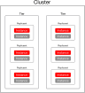

# Глоссарий

## Общие сведения {: #intro }

Данный раздел содержит описание терминов и определений, используемых в Picodata и необходимых для понимания работы распределенной СУБД.

## Подсистемы {: #subsystems }

### Raft {: #raft }

**Raft** является алгоритмом распределенного консенсуса, который нужен, чтобы несколько участников могли совместно решить, произошло ли событие или нет, и что за чем следовало. Raft используется в Picodata для согласования работы узлов и поддержания консистентности в кластере. Концепция распределенного консенсуса предполагает, что в кластере всегда есть только один лидер и некоторое количество голосующих узлов. Эти узлы в нормальном состоянии подтверждают легитимность лидера, а при отказе текущего лидера организуют выборы нового.
См. [подробнее](https://raft.github.io/raft.pdf).

### Терм (term) {: #term }

Период между выборами лидера в raft-группе называется **термом** (term). Каждый терм начинается в момент объявления выборов нового лидера. Обычно это происходит после потери связи с прежним лидером. Терм состоит из двух частей: выборов и периода нормальной работы raft-группы. Исключением служат термы, в течение которых не удалось выбрать лидера группы: у таких термов есть только первая часть (выборы).
Важно помнить, что в одном терме не может существовать более одного лидера raft-группы.

### Состояния узлов в Raft-группе {: #node_states }

В raft-группе любой узел может быть в одном из трех состояний:

**Пассивный узел (follower)** — состояние по умолчанию для каждого инстанса после запуска. Follower — обычный голосующий узел, который лишь отвечает на запросы, но не генерирует их.

**Кандидат в лидеры (candidate)** — состояние инстанса во время выборов лидера. Когда начинается новый терм, инстансы в статусе follower увеличивают значение терма и переходят в статус кандидатов, голосуют сами за себя и затем ждут результатов выбора. Выходов из этого состояния три:

- Кандидат побеждает в выборах и становится лидером.
- Кандидат возвращается в статус follower, так как другой инстанс становится лидером.
- Кандидат остается кандидатом, так как не удается выбрать лидера. Raft увеличивает терм еще раз и организует повторные выборы.

**Лидер raft-группы (leader)** — избранный узел, который отвечает за обработку запросов и репликацию raft-журнала.

### Raft-лидер {: #raft_leader }

**Лидер в raft-группе** — это один из узлов, который несет ответственность за репликацию raft-журнала. Лидер избирается на голосовании и признается таковым всеми участниками голосования. Задача лидера состоит в приеме сообщений от клиентов кластера и отправке сообщений на узлы кластера таким образом, чтобы в любой момент времени все узлы имели консистентную, непротиворечивую версию raft-журнала. Лидерство в Raft предполагает, что все остальные узлы признают приоритет версии журнала, предлагаемую лидером.

Если лидер становится недоступным, то алгоритм Raft организует выборы нового лидера среди оставшихся участников. Если после этих выборов прежний лидер снова присоединится к кластеру, он уже будет иметь права обычного голосующего узла (но не лидера).

### Репликация raft-журнала {: #log_replication }

**Репликация raft-журнала** нужна для того, чтобы на каждом узле кластера (raft-группы) была одинаковая история команд. Когда лидеру группы нужно добавить в журнал новую команду, он сначала отправляет ее всем узлам, ждет подтверждения записи (commit), и лишь затем добавляет эту команду в собственный журнал. В случае, если журнал обычного узла отличается от журнала лидера, то лидер настаивает на приоритете своего журнала и перезаписывает журнал обычного узла, считая его устаревшим.
Для упрощения репликации алгоритм Raft придерживается двух правил при сравнении журналов разных узлов:

- Если записи имеют одинаковые индексы и термы, то они содержат одинаковые команды.
- Если записи имеют одинаковые индексы и термы, то считается, что все предыдущие записи соответствующих журналов одинаковы.

Так как а) записи в журнале не могут менять порядок и б) каждой записи соответствует только один индекс и терм, то указанные выше правила гарантирует консистентность журнала.

### Журнал аудита {: #audit_log }

**Журнал аудита** позволяет вести учет событий безопасности в кластере Picodata. Ведение журнала включается явным образом при запуске инстанса.

См. также:

- [Использование журнала аудита](../tutorial/audit_log.md)
- [Регистрируемые события безопасности](../reference/audit_events.md)

### Web UI {: #webui }

**Веб-консоль** — это вариант графического интерфейса к функциям Picodata. Данная подсистема находится в разработке и будет представлена в следующем релизе Picodata. Веб-консоль в наглядном виде отображает и позволяет менять конфигурацию и состав кластера, параметры отдельных узлов, схему данных и т.д. Веб-консоль является удобным инструментом локального и удаленного администрирования Picodata.

### CLI (Command-line interface) {: #cli }

**CLI** — это интерфейс командной строки для запуска и управления как отдельными инстансами, так и всем кластером Picodata.

### Дискавери (discovery) {: #discovery }

**Discovery** — [алгоритм](../architecture/discovery.md), по которому инстансы обнаруживают друг друга. Этот шаг необходим на старте каждого инстанса для корректной работы кластера.

### Vshard {: #vshard }

**Vshard** — библиотека из экосистемы СУБД Tarantool, используемая в Picodata для горизонтального масштабирования — сегментирования данных по нескольким узлам в кластере. Это становится важным по мере увеличения объема хранимых данных, ввода в строй новых узлов — т.е. роста кластера.
Библиотека Vshard встроена в Picodata и является неотъемлемой ее частью.
В клиентских интерфейсах Vshard желательно прятать за фасадом, но при острой необходимости ничто не помешает им воспользоваться.

## Ролевая модель {: #access_control }

Для управления доступом в Picodata используются дискреционный и ролевой методы. Ниже приведены основные понятия, относящиеся к ролевой модели.

См. [Управление доступом](../tutorial/access_control.md)

### Объекты доступа {: #access_objects }

Объектами доступа являются:

<!-- Keep in sync with tutorial/access_control.md#role_model -->
- `table` – [таблица БД](#table)
- `user` – учетная запись [пользователя СУБД](#user)
- `role` – [роль](#role)
- `procedure` – [процедура](#stored_procedure)

### Пользователь {: #user }

Пользователь является субъектом доступа. Он указывает имя учетной
записи, от имени которой осуществляется подключение к
[инстансу](#instance) Picodata. Действия, которые пользователь может
совершать в системе, определяются доступными ему
[привилегиями](#privilege).

### Привилегия {: #privilege }

Привилегия – это явное разрешение на выполнение указанных действий, см.
[Управление доступом](../tutorial/access_control.md#privileges).

### Роль пользователя {: #role }

Представляет собой именованную группу привилегий, что позволяет
структурировать управление доступом.

## Сущности {: #essentials }

В начале идет общее обозначение термина, затем в скобках указан предпочтительный вариант употребления в коде (без пробелов в “змеином регистре”).

### Инстанс (instance) {: #instance }

**Обозначение единицы кластера СУБД и сервера приложений**
При описании кластера мы различаем программный и логический уровни.

На программном уровне единицей кластера является экземпляр приложения Picodata, также на техническом жаргоне называемый инстансом. Среда выполнения приложения может быть как виртуальной, так и физической. В разрезе операционных систем каждый инстанс порождает два процесса: собственно экземпляр приложения и вспомогательный процесс (supervisor), управляющий жизненным циклом первого.

На логическом уровне единицей кластера является узел. Под узлом, в зависимости от контекста, может пониматься как отдельная вычислительная единица, обладающая пулом ресурсов (физический сервер, виртуальная машина, контейнер), так и программный экземпляр Picodata, уже входящий в состав кластера.

### Тир (tier) {: #tier }

**Тир** — это группа инстансов, объединенных по функциональному назначению.

В части хранения шардированных данных тир представляет собой отдельную
группу хранения. Для каждой шардированной таблицы определена
принадлежность конкретному тиру.

<!--См. также:

- [Создание кластера — Тиры](../tutorial/deploy.md#tiers) -->

### Кластер (cluster) {: #cluster }

**Кластер** — набор логических и программных узлов, составляющих централизованно управляемую группу с общей схемой данных.

**Кластер** является наиболее крупной сущностью в системе хранения, в некотором смысле он и есть система хранения. Внутри кластера находятся инстансы, объединенные в репликасеты, которые, в свою очередь, входят в состав тиров.

Схематичное представление кластера, в составе которого есть некоторое число инстансов, репликасетов и тиров, показано ниже.<a name="cluster_group"></a>



### Репликасет (replicaset) {: #replicaset }

**Репликасет** — буквально «набор реплик», экземпляров приложений, в которых хранится один и тот же набор данных. Реплика в составе репликасета может быть в одном из двух состояний:

- активная (active) — доступная на запись, иногда ее называют мастером или лидером репликасета.
- резервная (standby) — доступная только на чтение, read-only.
В нормальных условиях в репликасете активной является ровно одна реплика, но в отдельных случаях их может быть несколько или не быть вообще.

### Лидер (leader) {: #leader }

В Picodata есть две разновидности лидеров:

- “raft-лидер” — лидер raft-группы,
- и “репликасет-лидер” — лидер репликасета.

Термин _лидер_ часто путают с _мастером_ применительно к репликации Tarantool. В Picodata они хоть и близки, но все же отличаются по смыслу. Под _мастером_ следует понимать инстанс, который выполняет пользовательские DML-операции (insert / update / delete). На практике чаще всего такой инстанс один, и в таком случае оба термина описывают один и тот же инстанс (отсюда и путаница), но в Tarantool архитектурно заложена возможность вести запись на нескольких узлах репликасета одновременно — т.н. режим мультимастера (multi-master). Даже в таком режиме операции DDL (`box.schema.create_space` и т.д.) должен выполнять лишь один инстанс из всех, и здесь становится важно отличать _лидера_ от _мастера_. Несмотря на то, что в Picodata режим мультимастера пока не реализован, документация и код должны использовать эти термины корректно.

### Домен отказа (failure_domain) {: #failure_domain }

**Домен отказа** является признаком физического расположения сервера, на котором запущен инстанс. Указание домена отказа позволяет обозначить наличие единой точки отказа у двух инстансов. Смысл данного параметра состоит в том, чтобы в один репликасет попадали инстансы из разных физических локаций, что повышает отказоустойчивость кластера.

**Домен отказа** представляет собой набор пар “ключ=значение”, которые соответствуют отдельным зонам (географический регион, датацентр, стойка и т.д.). Зоны задаются пользователем исходя из фактической конфигурации оборудования, будь то виртуальные машины в облаке (`“region=eu”`) или физические сервера (`“dc=msk”`). Домен отказа может включать несколько зон (`“dc=msk,srv=msk-1”`).

Можно использовать любые ключи и значения. Picodata не делает предположений об иерархии зон или их физическом смысле и просто сравнивает строки. Тем не менее, чтобы избежать человеческих ошибок, Picodata требует, чтобы набор зон (ключей) на всех инстансах был одинаковым.

Если домены отказа двух инстансов имеют хотя бы одну общую зону (и ключ, и значение), то допускается возможность одновременной потери связи с обоими. Поэтому инстансы, делящие общую зону, не будут объединены в репликасет. Picodata также стремится распределить голосующие raft-узлы таким образом, чтобы их домены отказа имели по минимуму общих зон.

### Фактор репликации (replication_factor) {: #replication_factor }

**Фактор репликации** — число инстансов в репликасете. Задается общим на [тир](#tier).

См. также:

- [Создание кластера — Репликация и зоны доступности](../tutorial/deploy.md#failure_domains)

### Бакет (bucket) {: #bucket }

**Bucket (бакет)** — виртуальная неделимая единица хранения данных, обеспечивающая их локальность (т. е. нахождение на каком-то одном репликасете).

### Таблица {: #table }

**Таблица** — пространство хранения данных. В Picodata есть следующие виды таблиц:

1. Глобальные (_global_) — их содержимое реплицируется на весь кластер.
2. Шардированные (_sharded_) — каждый репликасет хранит лишь часть общего
  набора данных. Данные реплицируются внутри репликасета.

Метаданные всех таблиц Picodata присутствуют на всех узлах кластера.
Фактически для пользователя не существует понятия “не кластерных”
таблиц, он лишь выбирает между стратегиями шардирования и репликации
тех таблиц, с которыми он работает.

### Движок хранения {: #db_engine }

В Picodata возможно использование разных движков хранения данных в СУБД. Доступны следующие варианты:

- `'memtx'`, движок по умолчанию (если при создании таблицы явно не указывать способ хранения данных, то будет использован именно он). Движок `'memtx'` обеспечивает резидентное (in-memory) хранение данных, т.е. их нахождение в ОЗУ. Данный вариант означает наивысшую производительность и скорость доступа к данным. Ограничением является размер БД, который зависит от доступного объема ОЗУ. Несмотря на то, что все данные хранятся в ОЗУ, в Picodata предусмотрено сохранение данных на диск (для восстановления после перезапуска инстанса). См. [подробнее](#persistence);
- `'vinyl'`, дисковый движок хранения данных. Позволяет работать с БД, размер которой превышает размер ОЗУ. При этом, основная часть данных находится на диске, а в ОЗУ доступен лишь кэш часто используемых данных. Движок `'vinyl'` работает на основе журнально-структурированных деревьев со слиянием, или LSM-деревьев (Log Structured Merge Tree), которые показывают хорошую производительность при работе c твердотельными дисками (SSD). Последние отличаются высокими показателями чтения, особенно в сравнении с более медленной записью данных.

### Индекс (index) {: #index }

**Индекс** — это специальная структура данных, которая хранит группу ключевых значений и указателей. Индекс строится по какому-либо одному столбцу таблицы и используется для эффективного поиска значений этого столбца. У каждой таблицы обязательно должен быть первичный индекс и опционально некоторое число вторичных индексов.

### LSN (log sequence number) {: #lsn }

Термин **LSN** (log sequence number) относится к архитектурным особенностям Tarantool, в котором все обновления БД фиксируются в журнале упреждающей записи ([WAL](#wal)) в виде отдельных записей. Каждая запись представляет собой запрос на изменение данных (`insert` | `update` | `delete`) и маркируется монотонно возрастающим номером LSN. Наибольший номер обозначает номер наиболее свежей записи, находящейся в конце журнала WAL.

### WAL (write-ahead log) {: #wal }

**WAL** — это журнал упреждающей записи (write-ahead log), в который попадают все изменения БД в первую очередь. Журнал представляет собой последовательность нескольких файлов `*.xlog` для таблиц на [движке](#db_engine) `memtx` и `*.vylog` для таблиц на движке `vinyl`. Каждый из файлов журнала не самостоятелен: в нем изменения записываются относительно предыдущего файла с инкрементными изменениями.

### Vclock (vector clock) {: #vclock }

Репликация в Tarantool предполагает обмен записями между репликами в репликасете. Благодаря этому обмену, на каждой отдельной реплике имеется специальный набор записей, полученный от разных реплик с разными LSN — это и есть **Vclock** (vector clock, векторные часы). Vclock описывает состояние БД для отдельного инстанса в репликасете.

Vclock репликасет-лидера играет важную роль в поддержании консистентности при переключении лидера (consistent switchover). В случае аварийного переключения (фейловера, failover), когда консистентность сохранить невозможно и она жертвуется в угоду доступности, отслеживание vclock позволяет строить метрики точек восстановления (RPO, recovery point objective).

### Сетевой адрес (address) {: #address }

**Сетевой адрес** — это комбинация `host:port`, используемая для связи инстансов друг с другом по сети. Другие названия для связки `host:port` (например URL, URI) мы стараемся искоренить. Расширенная версия `user:pass@host:port` все равно определяется термином _адрес_.

### Грейд (grade) {: #grade }

**Grade (грейд)** — специфичный для Picodata способ обозначения состояния инстанса. Грейд отражает то, как инстанс сконфигурирован его соседями. Существуют текущий (`current`) и целевой (`target`) типы грейдов. За приведение первого ко второму отвечает governor (губернатор).

### Крейт (crate) {: #crate }

**Крейт** (буквально “ящик”) — наименьшая логическая единица проекта, написанного на Rust. С точки зрения компилятора rustc, любой отдельный фрагмент кода является крейтом. Из одного крейта может быть скомпилирован бинарный исполняемый файл, либо разделяемая библиотека. Несколько крейтов могут вместе составлять пакет (package). Пакет может состоять также и из одного крейта. Если крейтов в пакете несколько, то из них только один может предоставлять разделяемую библиотеку.

### Снапшот (snapshot) {: #snapshot }

**Снапшот**, в самом широком смысле этого слова — это снимок состояния распределенного конечного автомата. В контексте Picodata можно говорить о двух независимых (почти) распределенных конечных автоматах, и, соответственно, о двух видах снапшотов — Tarantool и Raft.

Picodata прилагает все усилия, чтобы эти состояния были одинаковыми на каждом узле кластера, но т.к. изменения на нодах происходят через применение команд из журнала (WAL или raft), то даже в штатном режиме случаются не одновременно.

Более детально, состояние инстанса включает в себя две части:

- персистентные данные, которые можно сериализовать и сохранить на диск;
- транзиторное (transient) состояние — все структуры, которые Tarantool строит в оперативной памяти для обработки DML-запросов.

См. также:

- [RFC — Storage schema — Raft snapshot](https://docs.google.com/document/d/1MEpGnpKKj6WezLKytvvonZzbpy1tlWtAK5ccxaeAOrE/edit#heading=h.687c3wywf9ub)
- [Tarantool — Persistence](https://www.tarantool.io/en/doc/latest/concepts/data_model/persistence/)

## Процессы и алгоритмы {: #processes_and_algorithms }

### Компактизация raft-журнала (raft log compaction) {: #raft_log_compaction }

**Компактизация** — процесс, не допускающий бесконтрольного роста журнала записей Raft. Компактизация заключается в удалении части журнала, относящейся к сделанному ранее снапшоту.

### Создание снапшотов (snapshotting) {: #snapshotting }

**Создание снапшотов** — процесс периодического сохранения состояния инстанса на жесткий диск. Наличие снапшотов (т.е. снимков состояния) позволяют восстановить инстанс в прежнем виде после его перезапуска.

### Губернатор (governor) {: #governor }

**Governor (губернатор)** — алгоритм автоматического централизованного управления конфигурациями инстансов
(подробнее [здесь](../architecture/topology_management.md#governor)).
С точки зрения реализации, governor — это поток управления (fiber), всегда выполняющийся на [raft-лидере](#raft_leader).
Governor управляет жизненными циклами инстансов, реагируя на изменения их [грейдов](#grade).

### Дозорный (sentinel) {: #sentinel }

**Sentinel (дозорный)** — алгоритм корректного отключения инстанса, а также отслеживания
недостижимых инстансов.
С точки зрения реализации, sentinel — это поток управления (fiber), работающий на
каждом инстансе. Работа по отслеживанию недостижимых инстансов выполняется только
на raft-лидере.

### Фенсинг (fencing) {: #fencing }

**Фенсинг** — это подпись всех запросов в кластере номером эпохи или терма, и отказ обслуживать запросы с устаревшей эпохой. Данный инструмент используется для корректной работы распределенной блокировки, т.е. ситуации, когда из нескольких узлов нужно гарантированно выбрать один для выполнения запроса.

### CaS (compare and swap) {: #cas }

**Compare and swap** — особый алгоритм в составе Picodata. Он
обеспечивает уровень изоляции транзакций [serializable](#isolation), тем
самым не допуская случаев несогласованности данных в результате
выполнения конкурирующих запросов/транзакций. Таким случаем, например,
может быть ситуация, когда одна транзакция затирает результат действия
другой, выполняющейся в тоже время. _Compare and swap_ решает эту
проблему с помощью проверки предиката, т.е. меняет данные какого-либо
параметра кластера только в том случае, если исходное ожидаемое значение
этого параметра соответствует исходному фактическому.

Технически данный алгоритм реализован в виде RPC-функции
[.proc_cas](../architecture/rpc_api.md#proc_cas).

### Бутстрап (bootstrap) {: #bootstrap }

**Bootstrap** — процесс первоначального объединения разрозненных инстансов в единый кластер. В контексте Picodata речь обычно идет о бутстрапе инстанса, когда инстанс запускается в чистой директории без снапшотов. При необходимости можно уточнить, бутстрапится _лидер реплиасета_ или _read-only-реплика_ — алгоритмы для них отличаются.

Случай, когда инстанс запускается на существующих снапшотах, называется _восстановлением из снапшота_ (recovery from a snapshot). Этот процесс сопутствует перезапуску инстанса.

Другой эксплуатационный сценарий, когда при перезапуске удаляются все данные инстанса, называют _ребутстрапом_ (rebootstrap), т.е. повторным запуском. Ребутстрап всегда сопровождается сменой `raft_id`, хотя `instance_id` может при этом переиспользоваться.

_Бутстрап кластера_ — бутстрап первого инстанса + [присоединение](#joining) некоторого количества других.

_Бутстрап репликасета_ — бутстрап лидера репликасета + присоединение к нему реплик.

### Присоединение (joining) инстанса к кластеру {: #joining }

_Присоединение инстанса_ близко по смыслу к [бутстрапу](#bootstrap), но делает акцент на процессах, происходящих в самом кластере. Чтобы инстанс мог присоединиться, другие (уже существующие) члены кластера должны сначала сохранить информацию о нем в raft-журнал. См [Присоединение инстанса к кластеру](../architecture/topology_management.md#joining)

### Репликация (replication) {: #replication }

**Репликация** — один из механизмов [актуализации](#actualization) данных между инстансами. В Picodata существует два вида репликации: Tarantool (внутри [репликасета](#replicaset)) и Raft (глобальная на весь кластер). Под термином репликация обычно имеют в виду пересылку записей журналов (`wal` или `raft` в зависимости от того, о каком виде репликации идет речь).

### Актуализация (catch-up) инстанса {: #actualization }

Актуализация — это по сути синхронизация данных между инстансами. Существует два механизма актуализации: посредством [репликации](#replication) журнала (catch-up by log replication), и посредством применения [снапшота](#snapshot) (catch-up by snapshot).

Актуализация снапшотом поддерживается только для Raft, но не для Tarantool. Она требуется, когда на raft-лидере отсутствуют нужные записи в raft-журнале. Если аналогичная ситуация происходит с WAL Tarantool, пользователю не остается выбора кроме как делать [ребутстрап](#bootstrap) инстанса.

## Общие концепции {: #concepts }

### Отказоустойчивость {: #failsoft }

**Отказоустойчивость** — свойство кластера сохранять работоспособность
при выходе из строя части узлов. В Picodata отказоустойчивость
обеспечивают следующие механизмы:

- Выборы лидера, реализуемые [алгоритмом Raft](#raft) и автоматическое
  переключение голосующих узлов, (см. [Архитектура — Raft и
  отказоустойчивость](../architecture/raft_failover.md));
- [Репликация данных](#replication) и автоматическое переключение
  лидеров репликасеов.
  <!-- см. [Архитектура — Отказоустойчивость в репликасетах]() -->

### Персистентность {: #persistence }

**Персистентность** — свойство кластера поддерживать постоянную доступность данных и обеспечивать их максимальную сохранность. В контексте in-memory-системы это означает наличие механизмов журналирования и сохранения данных инстанса на диске с тем, чтобы при перезапуске инстанса (плановом или из-за нештатной ситуации) его данные могли быть надежно восстановлены. Таких механизмов в Picodata два:

- сохранение изменений БД и ее метаданных при помощи журнала упреждающей записи ([WAL](#wal)) в виде снимков. При отсутствии снимков данных (см. ниже) для восстановления инстанса потребуется полный набор этих файлов;
- полные снимки данных инстанса в виде файлов `*.snap`. Каждый такой файл самостоятельный и хранит информацию о полном состоянии инстанса на определенный момент времени. Для восстановления данных инстанса может быть достаточно лишь наиболее свежего файла `*.snap`, однако иногда требуется комбинация снимок+журнал: используется снимок (`*.snap`) и один/несколько файлов `*.xlog`/`*.vylog` с изменениями, произошедшими после создания того снимка.

Для наглядности покажем следующий возможный набор файлов инстанса:

```
00010.xlog -- изменения начиная с пустой базы, заканчивая моментом t1
00020.xlog -- изменения начиная с момента t1, заканчивая моментом t2
00030.snap -- изменения начиная с пустой базы, заканчивая моментом t2
00030.xlog -- изменения начиная с момента t2, заканчивая моментом t3
00040.xlog -- изменения начиная с момента t3, заканчивая моментом t4
00050.snap -- изменения начиная с пустой базы, заканчивая моментом t4
```

В этом примере есть несколько способов восстановить полное состояние
инстанса на момент `t4`:

- либо `00010.xlog` + `00020.xlog` + `00030.xlog` + `00040.xlog`
- либо `00030.snap` + `00030.xlog` + `00040.xlog`
- либо `00050.snap`

### Горизонтальное масштабирование {: #sharding }

**Горизонтальное масштабирование** (оно же сегментирование или шардирование, sharding) — подход, предполагающий разделение данных на сегменты (бакеты, buckets), которые могут храниться на отдельных репликасетах кластера. С точки зрения набора хранимых данных, каждый репликасет называется шардом. Деление на шарды — это еще один вариант логического деления кластера, но без привязки к серверам, на которых выполняются инстансы.

### Линеаризуемость {: #linearizability }

В контексте распределенных баз данных **линеаризуемость** обозначает свойство хранилища обеспечивать целостность и согласованность данных на разных репликах БД. Линеаризуемость в Picodata обеспечивается алгоритмом консенсуса Raft, который обновляет данные на мастер-реплике только после того, как они записаны на резервные реплики.

В схеме данных кластера для каждой шардированной таблицы задается параметр распределения — _ключ шардирования_, состоящий из одной или нескольких колонок. Пример:

```
sharding_key:
  - id
  - name
```

### Уровень изоляции транзакций {: #isolation }

Уровень изоляции транзакций является одним из компонентов ACID (_atomicity, consistency, isolation, durability_), который представляет собой набор требований к СУБД согласно стандарту [ANSI/ISO SQL](https://en.wikipedia.org/wiki/ISO/IEC_9075). Уровень изоляции транзакций определяет степень строгости, которую СУБД применяет к возможной несогласованности данных при исполнении нескольких транзакций одновременно. Различают следующие уровни (по мере повышения строгости и усиления блокировок):

- **Read uncommitted**. Низший уровень изоляции, допускающий чтение незафиксированных данных. В результат чтения могут попасть данные от других, еще не завершившихся операций записи.
- **Read committed.** Чтение уже зафиксированных данных. Данный уровень гарантирует, что в момент чтения данные были ранее зафиксированы, однако позволяет изменять данные сразу после этого. Т.е. повторное чтение внутри транзакции уже не гарантирует получение такого же набора данных.
- **Repeatable read**. Повторяемое чтение данных, при которых нельзя изменять данные до тех пор, пока читающая их транзакция не завершилась.
- **Serializable**. Наивысший уровень изоляции, предполагающий полное упорядочивание (сериализацию) транзакций. Результат выполнения нескольких параллельных транзакций должен быть таким, как если бы они выполнялись последовательно.

### Read phenomena (проблемы чтения данных) {: #read_phenomena }

Уровни изоляции транзакций существуют для учета и решения следующих проблем, возникающих при одновременном (параллельном) чтении данных:

- **Lost update** (потерянное обновление). При одновременном изменении данных разными транзакциями теряются все изменения, кроме последнего.
- **Dirty read** (неточное чтение). В результат чтения добавятся данные, привнесенные другой транзакцией, которая впоследствие будет отменена (не получит статуса committed).
- **Non-repeatable read** (проблема однократного чтения). Несколько последовательных операций чтения одних и тех же данных дают разный результат, т.к. между ними вклинилась сторонняя операция записи.
- **Phantom read** (фантомное чтение). Проблема схожа с предыдущей и также касается изменения данных после начала операции чтения. Однако, “фантомное чтение” предполагает изменение самой выборки (параллельная операция записи добавляет/удаляет строки).

## Термины SQL {: #sql_terms }

В этом подразделе собраны определения терминов, встречающихся при работе с распределенным SQL в Picodata.

### Data Definition Language (DDL) {: #ddl }

Язык описания схемы данных. Набор команд для управления таблицами в SQL (создание/удаление таблиц).

### Data Manipulation Language (DML) {: #dml }

Язык модификации данных. Набор команд для изменения данных в таблицах SQL (вставка/обновление/удаление строк).

### Data Query Language (DQL) {: #dql }

Язык получения данных (команда `SELECT` для чтения данных из таблиц).

### Команда SQL  {: #query }

Запрос (и, опционально, значения передаваемых параметров) к базе данных Tarantool на языке SQL.

### План запроса {: #execution_plan }

Схема и последовательность шагов, требуемая для исполнения запрос. План строится на узле-маршрутизаторе и исполняется во всем кластере.

### Проекция {: #projection }

Фильтрация или модификация столбцов таблицы.

### Ключ шардирования {: #sharding_key }

Столбец, по которому таблица распределена в кластере.

### Материализация данных {: #data_materialization }

Один из этапов исполнения распределенного SQL-запроса, при котором на отдельном узле промежуточные данные сохраняются в его памяти.

### Хранимая процедура {: #stored_procedure }

Представляет собой набор SQL-инструкций для
выполнения DML-операций, т.е. изменения данных в таблице. Такой набор
является отдельным объектом БД и выполняется как единое целое. В простом
виде он может состоять из нужной пользователю DML-команды.
