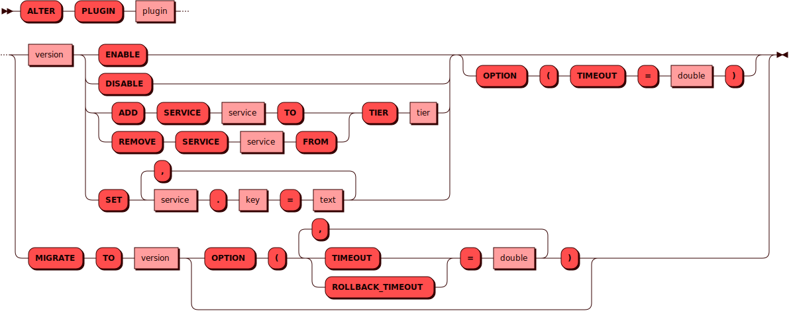

# ALTER PLUGIN

[DDL](ddl.md)-команда `ALTER PLUGIN` используется для изменения
конфигурации [плагина](../../overview/glossary.md#plugin).

## Синтаксис {: #syntax }



## Параметры {: #params }

* **ENABLE** — включение плагина.
* **DISABLE** — отключение плагина.
* **ADD SERVICE TO TIER** — добавление сервиса плагина к [тиру][tiers].
* **REMOVE SERVICE FROM TIER** — удаление сервиса плагина из [тира][tiers].
* **SET** — установка значения отдельных параметров сервиса в формате `<service_name.property_key> = ‘<value>’`.
* **MIGRATE TO** — объявление версии плагина и запуск [миграции]. Версия плагина указывается в формате semver.

[tiers]: ../../overview/glossary.md#tier
[миграции]: ../../overview/glossary.md#migration

## Примеры {: #examples }

```sql title="Запуск миграции"
ALTER PLUGIN weather_cache MIGRATE TO 0.1.0;
```

```sql title="Изменение параметра"
ALTER PLUGIN weather_cache 0.1.0 SET weather_service.openweather_timeout='7';
```
