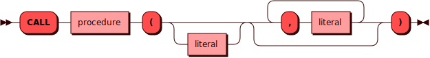

# CALL 

[DML](dml.md) команда `CALL` используется для вызова существующей процедуры.

## Синтаксис {: #syntax }



### Литерал  {: #literal }

<details><summary>Диаграмма</summary><p>

</p></details>

## Параметры {: #params }

* **PROCEDURE** — имя процедуры. Соответствует правилам имен для всех [объектов](object.md)
  в кластере.

* **LITERAL** - переданное в процедуру значение аргумента.

## Примеры  {: #examples }

```sql
CALL proc(11, 'Pez Cat', 2013) OPTION (
    VTABLE_MAX_ROWS = 100,
    SQL_VDBE_MAX_STEPS = 15000
);
```
