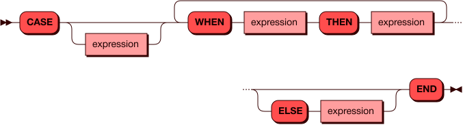

# CASE

`CASE` является общим условным выражением и строится по схеме,
похожей на if/else в других языках программирования:

## Синтаксис {: #syntax }



### Выражение {: #expression }

??? note "Диаграмма"
    

### Литерал {: #literal }

??? note "Диаграмма"
    

## Выражение CASE с условиями {: #case_searched }

В данной форме `CASE` выражение после `WHEN` является условием, которое
возвращает результат типа boolean. Если условие выполняется, то
значением `CASE` становится результат, указанный после `THEN`. Если
условие не выполняется, то `CASE` приобретает значение, указанно после
`ELSE`, или, если такого нет, `NULL`.

Пример:

```sql
SELECT
  CASE
    WHEN stock > 1000
    THEN 'many'
    ELSE 'few'
  END
FROM items

```

??? note "Результат"
    ```sql
    +--------+
    | COL_1  |
    +========+
    | "many" |
    |--------|
    | "few"  |
    |--------|
    | "few"  |
    |--------|
    | "many" |
    |--------|
    | "few"  |
    +--------+
    (5 rows)
    ```

## Простое выражение CASE {: #case_simple }

В простой форме `CASE` для срабатывания условия необходимо, чтобы
выражение после `CASE` было равно значению после `WHEN`.

Пример:


```sql
SELECT
  CASE TYPE
    WHEN 'heavy'
    THEN '1'
  END
FROM warehouse
```

??? note "Результат"
    ```sql
    +-------+
    | COL_1 |
    +=======+
    | "1"   |
    |-------|
    | nil   |
    |-------|
    | "1"   |
    |-------|
    | nil   |
    |-------|
    | nil   |
    +-------+
    (5 rows)
    ```

## Дополнительные примеры {: #examples }

Добавление к результирующей таблице колонки с результатами проверки
условия:

```sql
SELECT *,
  CASE
    WHEN stock > 200
    THEN 'many'
    ELSE 'few'
  END
FROM items
```

??? note "Результат"
    ```sql
    +----+----------+-------+--------+
    | ID | NAME     | STOCK | COL_1  |
    +================================+
    | 1  | "bricks" | 1123  | "many" |
    |----+----------+-------+--------|
    | 2  | "panels" | 998   | "many" |
    |----+----------+-------+--------|
    | 3  | "piles"  | 177   | "few"  |
    |----+----------+-------+--------|
    | 4  | "bars"   | 90211 | "many" |
    |----+----------+-------+--------|
    | 5  | "blocks" | 16    | "few"  |
    +----+----------+-------+--------+
    (5 rows)
    ```

Явное указание имен для всех колонок:

```sql
SELECT id,name,stock,
  CASE
    WHEN stock > 200
    THEN 'many'
    ELSE 'few'
  END AS stock_eval
FROM items
```

??? note "Результат"
    ```sql
    +----+----------+-------+------------+
    | ID | NAME     | STOCK | STOCK_EVAL |
    +====================================+
    | 1  | "bricks" | 1123  | "many"     |
    |----+----------+-------+------------|
    | 2  | "panels" | 998   | "many"     |
    |----+----------+-------+------------|
    | 3  | "piles"  | 177   | "few"      |
    |----+----------+-------+------------|
    | 4  | "bars"   | 90211 | "many"     |
    |----+----------+-------+------------|
    | 5  | "blocks" | 16    | "few"      |
    +----+----------+-------+------------+
    (5 rows)
    ```
