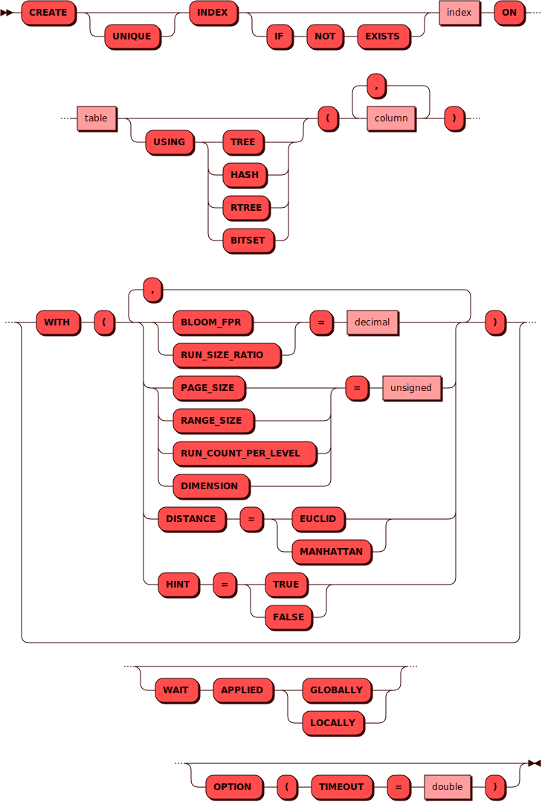

# CREATE INDEX

[DDL](ddl.md)-команда `CREATE INDEX` используется для создания индекса.

## Синтаксис {: #syntax }



## Параметры {: #params }

* **UNIQUE** — ограничение для создания уникального индекса

!!! note "Примечание"
    Это ограничение доступно только для индекса TREE по колонкам
    [ключа шардирования](../../overview/glossary.md#sharding_key).

* **INDEX** — имя индекса; соответствует правилам имен для всех
[объектов](object.md) в кластере

!!! info "Имя индекса должно быть уникальным в рамках кластера!"

* **TABLE** — имя таблицы; соответствует правилам имен для всех
[объектов](object.md) в кластере
* **USING** — применяемый тип индекса: `TREE`, `HASH`, `RTREE`, `BITSET`

!!! abstract "Типы индексов"
    * TREE (`vinyl`, `memtx`) — универсальный и наиболее предпочтительный тип индекса. Поддерживает поиск по компонентам ключа. Характеристики:
        * уникальный
        * неуникальный
        * первичный
    * HASH (`memtx`) — присутствует для обратной совместимости. Характеристики:
        * уникальный
        * первичный
    * RTREE (`memtx`) — многомерный индекс, который поддерживает до 20 измерений. Используется в частности для индексирования пространственной информации. Характеристики:
        * неуникальный
    * BITSET (`memtx`) — используется для поиска по битовым маскам. Характеристики:
        * неуникальный

* **COLUMN** — имя колонки; соответствует правилам имен для всех
[объектов](object.md) в кластере
* **BLOOM_FPR** (`vinyl`) — вероятность ложноположительного срабатывания фильтра Блума
* **RUN_SIZE_RATIO** (`vinyl`) — соотношение между размерами разных уровней в LSM-дереве
* **PAGE_SIZE** (`vinyl`) — размер страницы в байтах, используемой для операций чтения и записи на диск
* **RANGE_SIZE** (`vinyl`) — максимальный размер LSM-поддерева по умолчанию в байтах
* **RUN_COUNT_PER_LEVEL** (`vinyl`) — максимальное количество файлов на уровне в LSM-дереве
* **DIMENSION** — размерность индекса RTREE
* **DISTANCE** — способ определения расстояния в индексе RTREE: `EUCLID`, `MANHATTAN`
* **HINT** — оптимизация для индекса TREE:
    * `TRUE` — индекс работает быстрее
    * `FALSE` — размер индекса уменьшается вдвое

См. также:

* [Движок хранения](../../overview/glossary.md#db_engine)

## Примеры {: #examples }

??? example "Тестовые таблицы"
    Примеры использования команд включают в себя запросы к [тестовым
    таблицам](../legend.md).

```sql
CREATE INDEX product_quantity
ON deliveries
USING TREE
(product, quantity)
WITH (
HINT = true,
BLOOM_FPR = 0.05,
RUN_SIZE_RATIO = 3.5,
PAGE_SIZE = 8192,
RANGE_SIZE = 1073741824,
RUN_COUNT_PER_LEVEL = 2
)
OPTION (
TIMEOUT = 3.0
);
```
