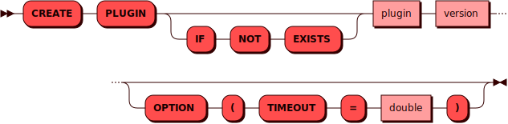

# CREATE PLUGIN

[DDL](ddl.md)-команда `CREATE PLUGIN` используется для регистрации
[плагина](../../overview/glossary.md#plugin) в кластере.

## Синтаксис {: #syntax }



## Параметры {: #params }

* **PLUGIN** — имя плагина. Соответствует правилам имен для всех
  [объектов](object.md) в кластере. Версия плагина указывается в формате
  semver
* **IF NOT EXISTS** — позволяет избежать ошибки в случае, если такой
  плагин в кластере уже есть

## Примеры {: #examples }

```sql
CREATE PLUGIN weather_cache 0.1.0
```
