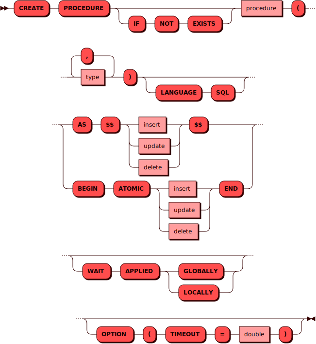

# CREATE PROCEDURE

[DDL](ddl.md)-команда `CREATE PROCEDURE` используется для создания новой
[процедуры](../../overview/glossary.md#stored_procedure).

!!! note "Примечание"
    Пользователь может создавать и затем управлять
    своими процедурами при наличии [соответствующей
    привилегии](../../tutorial/access_control.md#proc_access).

Созданная процедура хранится в системной таблице
[_pico_routine](../../architecture/system_tables.md#_pico_routine).

## Синтаксис {: #syntax }



### Тип {: #type }

<details><summary>Диаграмма</summary><p>

</p></details>

## Параметры {: #params }

* **PROCEDURE** — имя процедуры. Соответствует правилам имен для всех
  [объектов](object.md) в кластере.

## Ограничения {: #restrictions }

На текущий момент тело процедуры может содержать единственную
[DML](dml.md)-команду.


## Примеры {: #examples }

??? example "Тестовые таблицы"
    Примеры использования команд включают в себя запросы к [тестовым
    таблицам](../legend.md).

Процедура для добавления новых строк в таблицу `warehouse`:

```sql
CREATE PROCEDURE proc (int, text, text)
AS $$INSERT INTO warehouse VALUES($1, $2, $3)$$
OPTION (TIMEOUT = 5.0)
```

где:

- `proc` — название процедуры
- `int, text, text` — типы аргументов процедуры
- `$1, $2, $3` — позиции значений из аргументов процедуры
