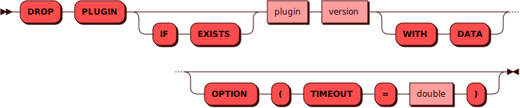

# DROP PLUGIN

[DCL](dcl.md)-команда `DROP PLUGIN` используется для удаления существующего
[плагина](../../tutorial/access_control.md#roles) из кластера.

## Синтаксис {: #syntax }



## Параметры {: #params }

* **PLUGIN** — имя роли. Соответствует правилам имен для всех
  [объектов](object.md) в кластере.
* **IF EXISTS** — проверка наличия плагина в кластере. Если плагина нет,
  то никакое действие не будет выполнено.
* **WITH DATA** — удаление плагина вместе с его данными (записи в
  системных таблицах плюс выполнение команд из раздела `pico.DOWN` файла
  [миграций])

[миграций]: ../../overview/glossary.md#migration

## Примеры {: #examples }

```sql
DROP PLUGIN weather_cache 0.1.0 WITH_DATA
```
