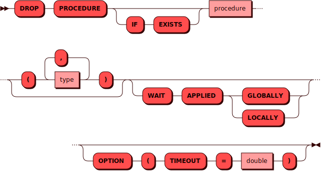

# DROP PROCEDURE

[DDL](ddl.md)-команда `DROP PROCEDURE` используется для удаления
существующей [процедуры](../../overview/glossary.md#stored_procedure).

## Синтаксис {: #syntax }



### Тип {: #type }

??? note "Диаграмма"
    

## Параметры {: #params }

* **PROCEDURE** — имя процедуры. Соответствует правилам имен для всех
  [объектов](object.md) в кластере. Опционально после имени процедуры
  можно указать список ее параметров (для совместимости со стандартом).

## Примеры {: #examples }

```sql
DROP PROCEDURE proc OPTION ( timeout = 4 )
```
