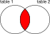

# Использование JOIN {: #join }

JOIN представляет собой параметр, используемый при SELECT-запросах с
целью получения данных из двух или более таблиц. Данный параметр
позволяет соединять колонки таблиц по заданному условию (оператор `ON`)
и тем самым создавать новую результирующую таблицу из указанных столбцов
изначальных таблиц. Соединение таблиц производится с использованием
перекрестного (декартова) произведения их кортежей (строк).

См. также:

- [SELECT](select.md)

## Расположение таблиц {: #join_tables }

Запрос с соединением всегда подразумевает наличие _внешней_ таблицы, а
также одной или нескольких _внутренних_ таблиц. Внешняя таблица
находится слева от параметра `JOIN`, а внутренние — справа.

Соединение таблиц всегда производится последовательно, в порядке,
указанном в запросе:

```sql
"table1" JOIN "table2" JOIN "table3" -> ("table1" JOIN "table2") JOIN "table3"
```

## Типы соединения {: #join_types }

Picodata поддерживает два типа соединения: `INNER JOIN` и `LEFT JOIN`.

### INNER JOIN {: #inner_join }

`INNER JOIN` — внутреннее соединение. Используется по умолчанию в тех
случаях, когда в запросе указан параметр `JOIN` без уточнения.



Данный тип означает, что к колонкам каждого кортежа из внутренней
(правой) части запроса присоединяются только колонки тех кортежей
внешней (левой) части, которые удовлетворяют условию соединения `ON`.
Если во внешней части не нашлось подходящего кортежа, то внутренний
кортеж не попадает в результат.

### LEFT JOIN {: #left_join }

`LEFT JOIN ` / `LEFT OUTER JOIN `— внешнее левое соединение.


Данный тип означает, что к колонкам каждого кортежа из внешней (левой)
части запроса присоединяются только колонки тех кортежей внутренней
(правой) части, которые удовлетворяют условию соединения `ON`. Если во
внутренней части не нашлось подходящего кортежа, то вместо значений
его колонок будет подставлен `NULL`.

## Условия соединения {: #join_condition }

Условие соединения позволяет сопоставить строки разных таблиц и является
обязательным для запросов со любым типом JOIN. Условие следует после
ключевого слова `ON` и, в большинстве случаев, соответствует одному из
следующих типов:

- равенство колонок (`items.id = orders.id`)
- математическое выражение (`items.id > 2`)
- литерал (`TRUE` / `FALSE`)

Любое соединение с JOIN является декартовым произведением кортежей из
внешней и внутренней таблицы с фильтрацией по условию соединения.
Поэтому результирующая таблица может быть как максимально возможного
размера (например, при условии `ON TRUE` будут взаимно перемножены _все_
кортежи), так и некоторого меньшего размера, в зависимости от заданного
условия.

См. также:

- [Выражение (expression)](select.md#expression)

## Примеры запросов {: #join_examples }

Разница между левым и внутренним соединением проявляется в случаях,
когда для части кортежей внешней таблицы отсутствуют подходящие под
условие соединения кортежи из внутренней таблицы. При внутреннем
соединении они будут отфильтрованы, при левом внешнем — оставлены, но на
месте отсутствующих значений будет `nil`.

Покажем это на примере соединения по равенству колонок для таблиц
`items` и `orders`.

??? example "Тестовые таблицы"
    Примеры использования команд включают в себя запросы к [тестовым
    таблицам](../legend.md).

Пример левого соединения:

```sql
SELECT items.name, items.stock, orders.amount
FROM  items
LEFT JOIN orders
ON items.name = orders.item
```

Результат:

```shell
+------------+-------------+---------------+
| ITEMS.NAME | ITEMS.STOCK | ORDERS.AMOUNT |
+==========================================+
| "bricks"   | 1123        | nil           |
|------------+-------------+---------------|
| "panels"   | 998         | nil           |
|------------+-------------+---------------|
| "piles"    | 177         | nil           |
|------------+-------------+---------------|
| "bars"     | 90211       | 100           |
|------------+-------------+---------------|
| "blocks"   | 16          | 20000         |
+------------+-------------+---------------+
(5 rows)
```

Пример внутреннего соединения:

```sql
SELECT items.name, items.stock, orders.amount
FROM  items
INNER JOIN orders
ON items.name = orders.item
```

Результат:

```shell
+------------+-------------+---------------+
| ITEMS.NAME | ITEMS.STOCK | ORDERS.AMOUNT |
+==========================================+
| "bars"     | 90211       | 100           |
|------------+-------------+---------------|
| "blocks"   | 16          | 20000         |
+------------+-------------+---------------+
(2 rows)
```

## Множественные соединения {: #multiple_joins }

Соединять можно не только две, но и большее число таблиц. В запросе с
несколькими соединениями могут быть использованы разные комбинации
левого и внутреннего соединения.

Сделаем соединение трех таблиц с тем, чтобы получить список всех позиций
на складе с указанием их типа и остатков независимо от того,
заказывались для них дополнительные поставки или нет.


Запрос:

```sql
SELECT warehouse.item, warehouse.type, items.stock, orders.amount
FROM warehouse
INNER JOIN items
ON warehouse.id = items.id
LEFT JOIN orders
ON items.name = orders.item
```

Результат:

```shell
+----------------+----------------+-------------+---------------+
| WAREHOUSE.ITEM | WAREHOUSE.TYPE | ITEMS.STOCK | ORDERS.AMOUNT |
+===============================================================+
| "bricks"       | "heavy"        | 1123        | nil           |
|----------------+----------------+-------------+---------------|
| "bars"         | "light"        | 998         | nil           |
|----------------+----------------+-------------+---------------|
| "blocks"       | "heavy"        | 177         | nil           |
|----------------+----------------+-------------+---------------|
| "piles"        | "light"        | 90211       | 100           |
|----------------+----------------+-------------+---------------|
| "panels"       | "light"        | 16          | 20000         |
+----------------+----------------+-------------+---------------+
(5 rows)
```

## Перемещение данных {: #join_motions }

При выполнении распределенного запроса, соединение таблиц может
сопровождаться полным или частичным перемещением данных, либо не
требовать перемещения данных совсем. Критерием здесь выступает условие
соединения (`ON`).

При необходимости перемещения данных, в план выполнения запроса перед
сканированием внутренней таблицы добавляется motion-узел, который
обеспечивает перекачку недостающих данных на бакеты, содержащие данные
внешней таблицы.

См. также:

- [EXPLAIN и варианты перемещения данных](explain.md#data_motion_types)

### Отсутствие перемещения {: #no_motion }

Перемещение данных не происходит, если в условии соединения использовано
равенство колонок, которые входят в ключи распределения соответствующих
таблиц.

К примеру, в условии соединения указано `ON "items"."id" =
"orders"."id"`, и таблицы "items" и "orders" обе распределены по
своим колонкам "id":

```sql
picodata> EXPLAIN SELECT items.name, items.stock, orders.amount
FROM  items
INNER JOIN orders
ON items.id = orders.id
projection ("ITEMS"."NAME"::string -> "NAME", "ITEMS"."STOCK"::integer -> "STOCK", "ORDERS"."AMOUNT"::integer -> "AMOUNT")
    join on ROW("ITEMS"."ID"::integer) = ROW("ORDERS"."ID"::integer)
        scan "ITEMS"
            projection ("ITEMS"."ID"::integer -> "ID", "ITEMS"."NAME"::string -> "NAME", "ITEMS"."STOCK"::integer -> "STOCK")
                scan "ITEMS"
        scan "ORDERS"
            projection ("ORDERS"."ID"::integer -> "ID", "ORDERS"."ITEM"::string -> "ITEM", "ORDERS"."AMOUNT"::integer -> "AMOUNT", "ORDERS"."SINCE"::datetime -> "SINCE")
                scan "ORDERS"
execution options:
sql_vdbe_max_steps = 45000
vtable_max_rows = 5000
```

### Частичное перемещение {: #segment_motion }

Частичное перемещение означает, что недостающая часть внутренней таблицы
должна быть скопирована на узлы, содержащие данные внешней таблицы.

К примеру, в условии соединения указано `ON "items"."id" =
"orders"."id"`, но таблица "items" распределена по колонке "id", а
"orders" — по какой-то другой колонке:

```sql
picodata> EXPLAIN SELECT items.name, items.stock, orders.amount
FROM  items
INNER JOIN orders
ON items.id = orders.id
projection ("ITEMS"."NAME"::string -> "NAME", "ITEMS"."STOCK"::integer -> "STOCK", "ORDERS"."AMOUNT"::integer -> "AMOUNT")
    join on ROW("ITEMS"."ID"::integer) = ROW("ORDERS"."ID"::integer)
        scan "ITEMS"
            projection ("ITEMS"."ID"::integer -> "ID", "ITEMS"."NAME"::string -> "NAME", "ITEMS"."STOCK"::integer -> "STOCK")
                scan "ITEMS"
        scan "ORDERS"
            projection ("ORDERS"."ID"::integer -> "ID", "ORDERS"."ITEM"::string -> "ITEM", "ORDERS"."AMOUNT"::integer -> "AMOUNT", "ORDERS"."SINCE"::datetime -> "SINCE")
                scan "ORDERS"
execution options:
sql_vdbe_max_steps = 45000
vtable_max_rows = 5000
```

### Полное перемещение {: #full_motion }

Полное перемещение означает, что вся внутренняя таблица
должна быть скопирована на узлы, содержащие данные внешней таблицы.

Такая ситуация возникает, если в условии соединения указана колонка
внешней таблицы, не входящая в ее ключ распределения.

таким примером может служить равенство `items.name` = `orders.item` при
том, что оеб таблицы распределены только по `id`:

```sql
picodata> EXPLAIN SELECT items.name, items.stock, orders.amount
FROM  items
INNER JOIN orders
ON items.name = orders.item
projection ("ITEMS"."NAME"::string -> "NAME", "ITEMS"."STOCK"::integer -> "STOCK", "ORDERS"."AMOUNT"::integer -> "AMOUNT")
    join on ROW("ITEMS"."NAME"::string) = ROW("ORDERS"."ITEM"::string)
        scan "ITEMS"
            projection ("ITEMS"."ID"::integer -> "ID", "ITEMS"."NAME"::string -> "NAME", "ITEMS"."STOCK"::integer -> "STOCK")
                scan "ITEMS"
        motion [policy: full]
            scan "ORDERS"
                projection ("ORDERS"."ID"::integer -> "ID", "ORDERS"."ITEM"::string -> "ITEM", "ORDERS"."AMOUNT"::integer -> "AMOUNT", "ORDERS"."SINCE"::datetime -> "SINCE")
                    scan "ORDERS"
execution options:
sql_vdbe_max_steps = 45000
vtable_max_rows = 5000
```

Также, при использовании математических выражений или литералов, перемещение всегда будет полным:

```sql
picodata> EXPLAIN SELECT items.name, items.stock, orders.amount
FROM  items
INNER JOIN orders
ON items.id > 2
projection ("ITEMS"."NAME"::string -> "NAME", "ITEMS"."STOCK"::integer -> "STOCK", "ORDERS"."AMOUNT"::integer -> "AMOUNT")
    join on ROW("ITEMS"."ID"::integer) > ROW(2::unsigned)
        scan "ITEMS"
            projection ("ITEMS"."ID"::integer -> "ID", "ITEMS"."NAME"::string -> "NAME", "ITEMS"."STOCK"::integer -> "STOCK")
                scan "ITEMS"
        motion [policy: full]
            scan "ORDERS"
                projection ("ORDERS"."ID"::integer -> "ID", "ORDERS"."ITEM"::string -> "ITEM", "ORDERS"."AMOUNT"::integer -> "AMOUNT", "ORDERS"."SINCE"::datetime -> "SINCE")
                    scan "ORDERS"
execution options:
sql_vdbe_max_steps = 45000
vtable_max_rows = 5000
```

```sql
picodata> EXPLAIN SELECT items.name, items.stock, orders.amount
FROM  items
INNER JOIN orders
ON TRUE
projection ("ITEMS"."NAME"::string -> "NAME", "ITEMS"."STOCK"::integer -> "STOCK", "ORDERS"."AMOUNT"::integer -> "AMOUNT")
    join on true::boolean
        scan "ITEMS"
            projection ("ITEMS"."ID"::integer -> "ID", "ITEMS"."NAME"::string -> "NAME", "ITEMS"."STOCK"::integer -> "STOCK")
                scan "ITEMS"
        motion [policy: full]
            scan "ORDERS"
                projection ("ORDERS"."ID"::integer -> "ID", "ORDERS"."ITEM"::string -> "ITEM", "ORDERS"."AMOUNT"::integer -> "AMOUNT", "ORDERS"."SINCE"::datetime -> "SINCE")
                    scan "ORDERS"
execution options:
sql_vdbe_max_steps = 45000
vtable_max_rows = 5000
```
