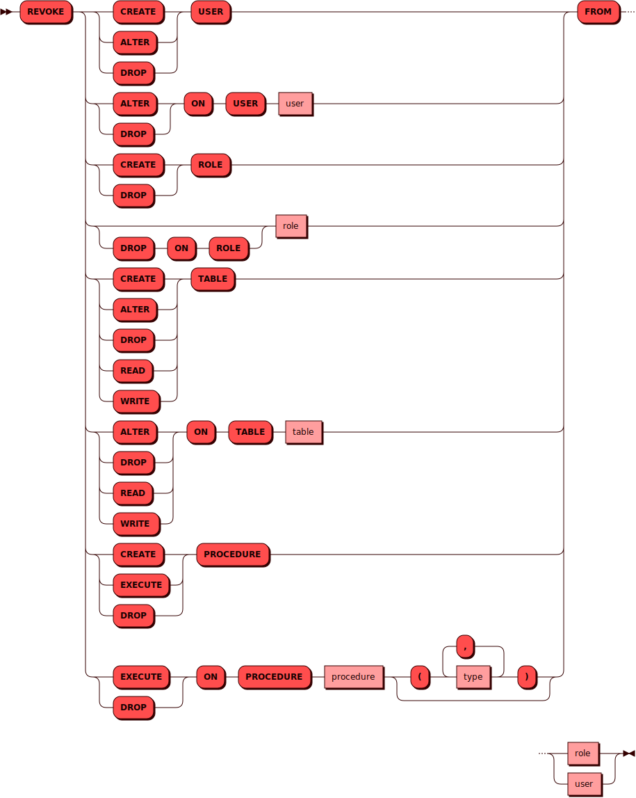

# REVOKE 

[DCL](dcl.md) команда `REVOKE` используется для изъятия
[привилегий](../../tutorial/access_control.md#privileges) у пользователя или группы.

## Синтаксис {: #syntax }



### Тип {: #type }

<details><summary>Диаграмма</summary><p>

</p></details>

## Параметры {: #params }

* **ROLE** — имя роли. Соответствует правилам имен для всех [объектов](object.md)
  в кластере.

* **USER** — имя пользователя. Соответствует правилам имен для всех
  [объектов](object.md) в кластере.

## Примеры {: #examples }

Изъятие права чтения таблиц у пользователя `woody`:

```sql
REVOKE READ TABLE FROM woody;
```
