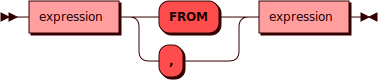

# SUBSTRING {: #substring }

Функция `SUBSTRING` извлекает подстроку из строки *string* подобно тому,
как это делает функция [SUBSTR](substr.md), однако предоставляет
дополнительные возможности поиска символов.

## Синтаксис {: #syntax }

### Основная функция {: #main_function }


### Варианты поиска подстроки {: #substringVariant }


Доступны несколько вариантов поиска подстроки:

- `For` — искать слева направо _по_ указанный номера символа
- `From` — искать слева направо _с_ указанного номера символа, а также
  извлечь первую подстроку, соответствующую регулярному выражению в
  стиле POSIX
- `FromFor` — сочетание обоих вариантов выше, указание полных границ поиска
- `Regular` — традиционный поиск по номерам символов, как в [SUBSTR](substr.md)
- `Similar` — поиск по схожести c использованием регулярного выражения и
  экранирования специальных символов в нем

Отличие варианта `FromFor` от `Regular` также состоит в том, что поиск
может происходить не только по позициям символом (их номерах), но и по
вхождению подстроки с помощью регулярных выражений, см. [примеры](#examples).

#### substringFor {: #substringFor }


#### substringFrom {: #substringFrom }



#### substringFromFor {: #substringFromFor }


#### substringRegular {: #substringRegular }


#### substringSimilar {: #substringSimilar }


### Выражение {: #expression }

??? note "Диаграмма"
    

### Литерал {: #literal }

??? note "Диаграмма"
    

## Примеры {: #examples }

```sql title="Указание только начального отступа"
sql> SELECT SUBSTRING('(select 1)', 3);
+----------+
| col_1    |
+==========+
| elect 1) |
+----------+
(1 rows)
```

```sql title="Указание обеих границ"
sql> SELECT SUBSTRING('1234567890' FROM 4 FOR 3);
+-------+
| col_1 |
+=======+
| 456   |
+-------+
(1 rows)
```

```sql title="Поиск первой подстроки, удовлетворяющей регулярному выражению в стиле SQL"
sql> SELECT SUBSTRING('abcdefg' FROM 'a#"(b_d)#"%' FOR '#');
+-------+
| col_1 |
+=======+
| bcd   |
+-------+
(1 rows)
```

```sql title="Поиск первой подстроки, удовлетворяющей регулярному выражению в стиле POSIX"
sql> SELECT substring('Thomas' FROM '...$') ;
+-------+
| col_1 |
+=======+
| mas   |
+-------+
(1 rows)
```

```sql title="Поиск первой подстроки, удовлетворяющей регулярному выражению в стиле SQL"
sql>  SELECT SUBSTRING('abcdefg' SIMILAR 'a#"%#"x|g' ESCAPE '#');
+-------+
| col_1 |
+=======+
| bcdef |
+-------+
(1 rows)
```
