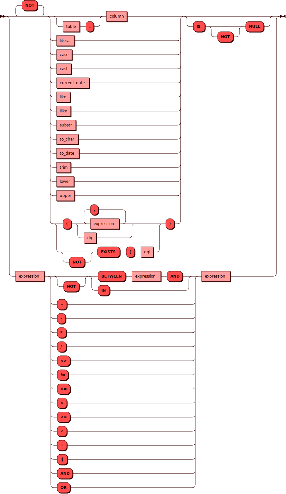
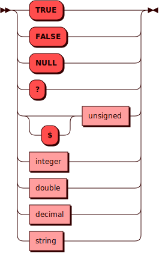

# TO_DATE {: #to_date }

Функция `TO_DATE` преобразует строку *expression* типа [TEXT] в объект
типа [DATETIME] согласно формату *format*.

Значение *format* должно соответствовать спецификации [strftime]. Если в
качестве *format* передана пустая строка `''`, используется формат `%F`,
он же `%Y-%m-%d`.

!!! note "Примечания"
    Функция `TO_DATE` всегда возвращает начало дня — `00:00:00`, даже если
    в строке *expression* указано время с точностью до секунд.

[TEXT]: ../sql_types.md#text
[DATETIME]: ../sql_types.md#datetime
[strftime]: https://man.freebsd.org/cgi/man.cgi?query=strftime

## Синтаксис {: #syntax }


### Выражение {: #expression }

<details><summary>Диаграмма</summary><p>

</p></details>

### Литерал {: #literal }

<details><summary>Диаграмма</summary><p>

</p></details>

## Примеры {: #examples }

```sql title="Преобразование строковых литералов в объекты DATETIME"
picodata> VALUES
    (to_date('2024-02-13 12:43:24', '%F')),
    (to_date('29.01.2024 15:41:22', '%d.%m.%Y')),
    (to_date('2023/11/11 13:01:56', '%Y/%m/%d')),
    (to_date('2024 05 11 18:59:01', '%Y %m %d')),
    (to_date('2024-04-01 00:00:01', ''));
+------------------------+
| COLUMN_5               |
+========================+
| "2024-02-13T00:00:00Z" |
|------------------------|
| "2024-01-29T00:00:00Z" |
|------------------------|
| "2023-11-11T00:00:00Z" |
|------------------------|
| "2024-05-11T00:00:00Z" |
|------------------------|
| "2024-04-01T00:00:00Z" |
+------------------------+
(5 rows)
```
