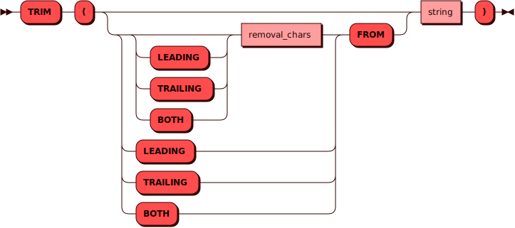

# TRIM

Функция `TRIM` удаляет наибольшую подстроку, содержащую символы строки *removal_chars*, в начале, в конце или с обеих сторон строки *string*.

!!! note "Примечание"
    *removal_chars* и *string* — результаты [выражений](#expression) типа [TEXT](../sql_types.md#text).

## Синтаксис {: #syntax }



### Выражение {: #expression }

??? note "Диаграмма"
    

### Литерал {: #literal }

??? note "Диаграмма"
    

## Параметры {: #params }

* **LEADING** — удаляет в начале строки *string* наибольшую подстроку, содержащую символы строки *removal_chars*
* **TRAILING** — удаляет в конце строки *string* наибольшую подстроку, содержащую символы строки *removal_chars*
* **BOTH** — удаляет с обеих сторон строки *string* наибольшую подстроку, содержащую символы строки *removal_chars*

!!! info "BOTH — параметр по умолчанию, если указана только строка *removal_chars*"

* **LEADING FROM** — удаляет пробелы в начале строки *string*
* **TRAILING FROM** — удаляет пробелы в конце строки *string*
* **BOTH FROM** — удаляет пробелы с обеих сторон строки *string*

## Примеры {: #examples }

```sql title="Запрос SELECT"
picodata> SELECT item FROM warehouse;
+----------+
| ITEM     |
+==========+
| "bricks" |
|----------|
| "bars"   |
|----------|
| "blocks" |
|----------|
| "piles"  |
|----------|
| "panels" |
+----------+
```

```sql title="Запрос SELECT с функцией TRIM"
picodata> SELECT TRIM(TRAILING 's' FROM item) FROM warehouse;
+---------+
| COL_1   |
+=========+
| "brick" |
|---------|
| "bar"   |
|---------|
| "block" |
|---------|
| "pile"  |
|---------|
| "panel" |
+---------+
```
