# Команды SQL

Данный справочник предоставляет основные варианты использования команд SQL в
Picodata при работе с распределенной СУБД.

## Поддерживаемые функции {: #supported_features }

Возможности SQL в Picodata включают следующие функции:

- Data Definition Language (`DDL`): команды для
  [создания](#create_table) и [удаления](#drop_table)
  [таблиц](../overview/glossary.md#table);
- Data Modification Language (`DML`): команды [`INSERT`](#query_insert) для
  добавления данных в таблицы, [`UPDATE`](#query_update) для обновления данных
  и [`DELETE`](#query_delete) для удаления данных;
- Data Query Language (`DQL`): команда [`SELECT`](#query_select) для получения
  данных из таблиц;
- Access Control Lists (`ACL`): команды для [управления пользователями](#users) и ролями;
- команда [`EXPLAIN`](#query_explain) для отображения планов запросов `DML` и
  `DQL`.

Схемы этих функций на верхнем уровне показаны ниже:

### **STATEMENT** {: #statement }

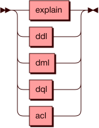

#### **DML** {: #dml }

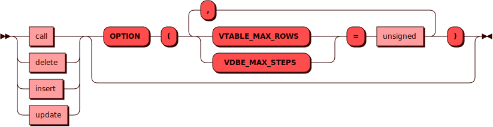

#### **DQL** {: #dql }

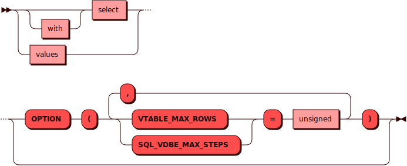

#### **DDL** {: #ddl }

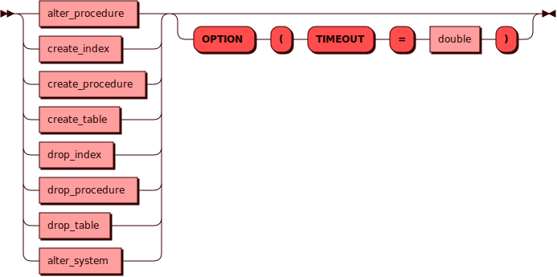

Ниже приведены особенности синтаксиса команд и дано описание часто используемых
команд с примерами их выполнения.

## Начало работы {: #getting_started }

Для ввода команд SQL требуется доступ к [консоли Picodata](../tutorial/connecting.md).
Поддерживается ввод на следующих языках:

- `sql` позволяет писать запросы непосредственно на языке SQL;
- `lua` предполагает, что SQL-запрос будет находиться внутри дополнительных элементов Lua-обертки.

Дополнительно стоит отметить, что для использования [параметризированных
запросов](#parametric_queries) подойдет только язык Lua.

### Ввод команд {: #query_input }

Оформление SQL-команд зависит от выбранного языка ввода. При
использовании языка SQL дополнительных правил форматирования
нет, команда передается "как есть".

При использовании языка Lua команда должна передаваться в качестве
содержимого функции `pico.sql()`, внутри скобок. Внутри фигурных скобок
опционально указываются параметры значений:

```
"запрос", {значения передаваемых параметров}
```

Дополнительно, как показано в примерах данного раздела, можно заключить
запрос в парные квадратные скобки с тем, чтобы не использовать
экранирование кавычек:

```
[[запрос]], {значения передаваемых параметров}
```

Если передаваемых параметров нет, блок фигурных скобок можно оставить
пустым или не указывать его совсем. Пример команды:

```lua
pico.sql([[SELECT * FROM "characters"]]);
```

Далее приведены команды с объяснением их действия. Для большинства
примеров используется язык консоли SQL кроме тех случаев, когда
использование ввода на Lua предпочтительнее. Для обоих языков
поддерживается [многострочный
ввод](../tutorial/connecting.md#special_commands).

## Управление пользователями {: #users }

Ниже показаны схемы для создания и удаления пользователей и ролей.

### **ACL (Access Control Lists)** {: #acl }

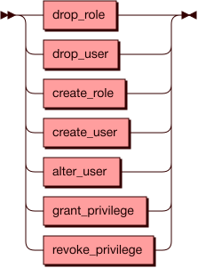

### **CREATE USER** {: #create_user }

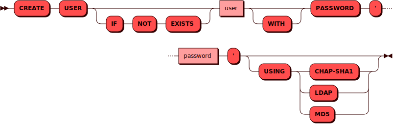

### **DROP USER** {: #drop_user }


### **CREATE ROLE** {: #create_role }

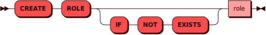

### **DROP ROLE** {: #drop_role }

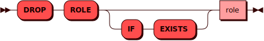

Пример команды для создания пользователя:

```sql
CREATE USER "andy" WITH PASSWORD 'P@ssw0rd' USING md5 OPTION (TIMEOUT = 3.0);
```

Удаление пользователя:

```sql
DROP USER ANDY;
```

См. также:

 - [Управление доступом](../tutorial/access_control.md)

### **ALTER USER** {: #alter_user }

Команда `ALTER USER` предназначена для изменения данных/параметров уже
существующих в системе пользователей:

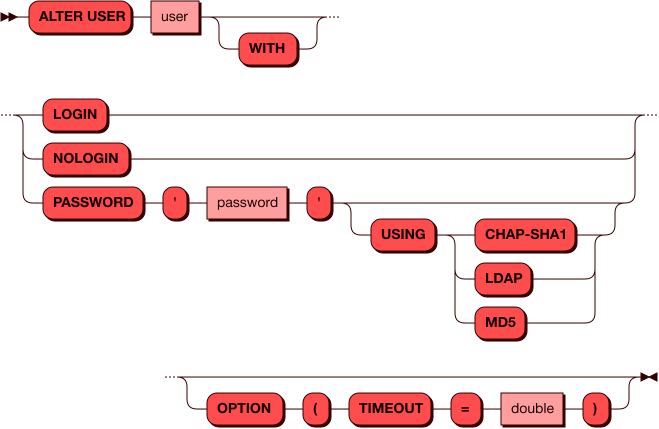

Изменение может состоять в:

- разрешении/запрете подключаться к системе (`login`/`nologin`)
- снятие автоматической блокировки пользователя в связи с превышением
  макcимального количества неудачных попыток аутентификации (`login`)
- изменении пароля пользователя и метода аутентификации

Пароль и метод аутентификации меняются только вместе. Соответственно,
если нужно поменять только один из этих параметров, потребуется указать
и текущее значение второго.

Примеры изменения пароля и метода аутентификации:

```sql
ALTER USER "andy" WITH PASSWORD 'Str0ng_P@ssw0rd' USING chap-sha1 OPTION (TIMEOUT = 3.0);
```

Блокировка пользователя:

```sql
ALTER USER "andy" WITH NOLOGIN;
```

Разблокировка пользователя (в том числе и автоматически заблокированного):

```sql
ALTER USER "andy" WITH LOGIN;
```

См. также:

- [Блокировка пользователя](../security/integrity.md#user_blocking)

## Управление привилегиями {: #privileges }

В Picodata применяется ролевая модель, в которой можно назначать
привилегии как напрямую пользователям, так через роли (группы
привилегий). Более подробно это описано в руководстве [Управление
доступом](../tutorial/access_control.md/).

Ниже показаны схемы запросов для назначения (`GRANT`) и изъятия
(`REVOKE`) привилегий.

### **GRANT privilege** {: #grant_privilege }

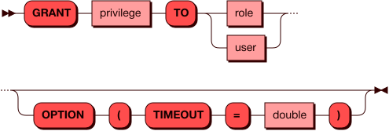

### **REVOKE privilege** {: #revoke_privilege }

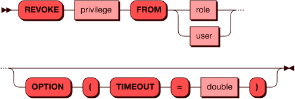

### **privilege** {: #privilege }

Привилегия может представлять собой роль, либо возможность какого-либо
действия по отношению к конкретному объекту или ко всем объектам указанного
типа.

Для того, чтобы выдать кому-либо привилегию, нужно самому ею обладать.

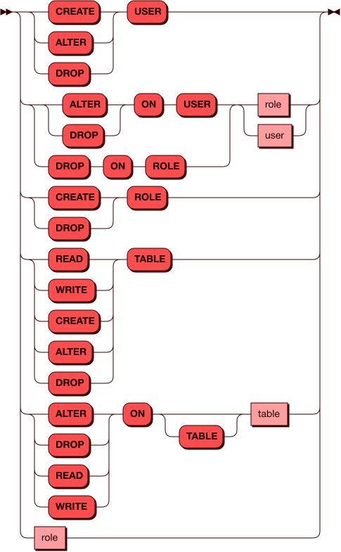

Пример выдачи права изменять данные пользователя `woody` пользователю `andy`:

```sql
GRANT ALTER ON USER "woody" TO "andy";
```

Пример выдачи права записи в таблицу `characters` для пользователя `woody`:

```sql
GRANT WRITE ON TABLE "characters" to "woody";
```

Пример изъятия права чтения таблиц у пользователя `woody`:

```sql
REVOKE READ TABLE FROM "woody";
```

## Создание таблицы {: #create_table }

Схема запроса для создания шардированной таблицы показана ниже.

### **CREATE TABLE** {: #CreateTable }

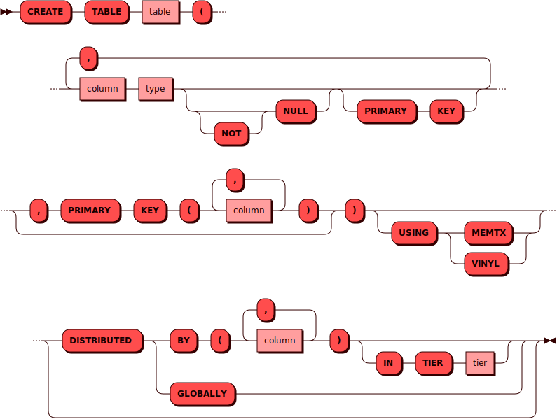

#### **column** {: #Column }

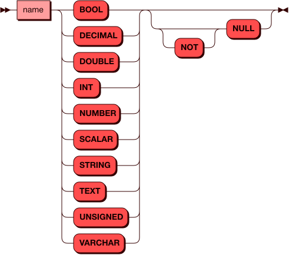

#### **primary_key** {: #PrimaryKey }

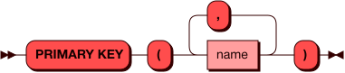

#### **distribution** {: #Distribution }

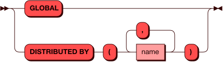

Для примера в этом разделе будем использовать две тестовых таблицы для учета
персонажей из "Истории игрушек":

- `characters` — список персонажей с указанием года выхода на экран;
- `assets` — список соответствующих игрушек с указанием их остатков на складе.


Таблицы с пользовательскими данными в Picodata могут быть двух типов:

- _глобальными_, т.е. полностью доступными на каждом из инстансов
  кластера. Для создания глобальной таблицы следует использовать
  параметр `distributed globally`.
- _шардированными_, т.е. распределенные по шардам кластера. Для создания
  шардированной таблицы следует использовать параметр `distributed by
  ()`, указав в скобках название колонки, по которой такая таблица будет
  распределена. См. [подробнее](../overview/glossary.md#table).

Для демонстрации работы распределенного SQL будем создавать шардированные таблицы.
Создадим первую таблицу следующей командой:

```sql
CREATE TABLE "characters" (
            "id" INTEGER NOT NULL,
            "name" TEXT NOT NULL,
            "year" INTEGER,
            PRIMARY KEY ("id")
)
USING MEMTX DISTRIBUTED BY ("id")
OPTION (TIMEOUT = 3.0);
```

Для второй таблицы команда будет отличаться только именем третьей колонки.

При создании таблицы также можно выбрать один из доступных движков хранения данных:

  - `MEMTX` — [движок хранения данных](../overview/glossary.md#db_engine) в ОЗУ (in-memory);
  - `VINYL` — дисковый движок хранения данных, использующий LSM-деревья
    (Log Structured Merge Tree).

## Удаление таблицы {: #drop_table }

Cхема запроса для удаления таблицы показана ниже:

### **DROP TABLE** {: #DropTable }

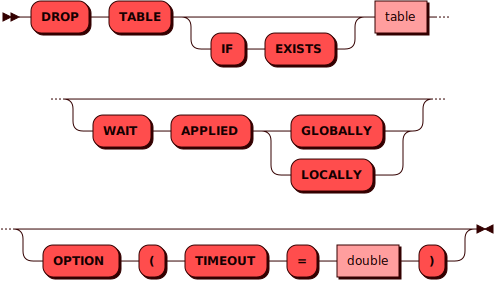

Пример удаления таблицы:

```sql
DROP TABLE "characters";
```

## Запрос SELECT {: #query_select }

Запрос `SELECT` используется для получения информации из указанной
таблицы в базе данных. Он возвращает 0 или более строк из таблицы
согласно поисковому запросу. В контексте распределенной системы, запрос
`SELECT` в Picodata получает информацию из всех сегментов таблицы,
которая может храниться на нескольких узлах кластера. В Picodata
источником данных для запроса `SELECT` может выступать таблица, строка
значений или другой подзапрос. Также можно соединять несколько запросов
одного уровня вместе.

Cхема возможных распределенных запросов `SELECT` показана ниже.

### **SELECT** {: #select }

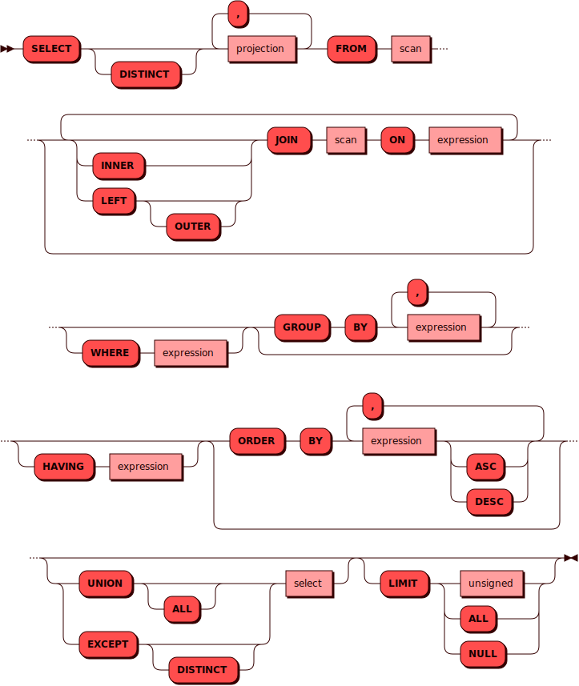

### Примеры запросов {: #select_examples }

Пример получения данных всей таблицы:

```sql
SELECT * FROM "characters";
```

Вывод в консоль:

```
---
- metadata:
  - {'name': 'id', 'type': 'integer'}
  - {'name': 'name', 'type': 'string'}
  - {'name': 'year', 'type': 'integer'}
  rows:
  - [1, 'Woody', 1995]
  - [2, 'Buzz Lightyear', 1995]
  - [3, 'Bo Peep', 1995]
  - [4, 'Mr. Potato Head', 1995]
  - [5, 'Slinky Dog', 1995]
  - [6, 'Barbie', 2010]
  - [7, 'Daisy', 2010]
  - [8, 'Forky', 2019]
  - [9, 'Dragon', 2019]
  - [10, 'The Dummies', 2019]
...
```

NOTE: **Примечание**
Строки в выводе идут в том порядке, в каком их отдают узлы
хранения Picodata.

### Параметризированные запросы {: #parametric_queries }

В читающих запросах с условиями можно использовать как обычный вид, так и
параметризированный. В последнем случае потребуется сначала переключить язык
консоли на Lua. Так, следующие две команды дадут одинаковый результат (вывод
строки по известному `id`). :

```sql
SELECT "name" FROM "characters" WHERE "id" = 1;
```

```lua
pico.sql([[SELECT "name" FROM "characters" WHERE "id" = ?]], {1});
```

Вывод в консоль:

```
---
- metadata:
  - {'name': 'name', 'type': 'string'}
  rows:
  - ['Woody']
...
```

Разница состоит в том, что при параметризации происходит кеширование
плана запроса по ключу от шаблона SQL (в данном случае `select "name"
from "characters" where "id" = ?`), и если подобных запросов несколько, то
они все смогут использовать кешированный план. Без параметризации у
каждого запроса будет свой отдельный план, и ускорения от кеша не
произойдет.

Пример вывода строк по нескольким условиям для разных столбцов (также
два варианта):

```sql
SELECT "name","year" FROM "characters" WHERE "id" > 3 AND "year" > 2000;
```

```lua
pico.sql([[SELECT "name","year" FROM "characters" WHERE "id" > ? AND "year" > ? ]], {3, 2000});
```

Вывод в консоль:

```
---
- metadata:
  - {'name': 'name', 'type': 'string'}
  - {'name': 'year', 'type': 'integer'}
  rows:
  - ['Barbie', 2010]
  - ['Daisy', 2010]
  - ['Forky', 2019]
  - ['Dragon', 2019]
  - ['The Dummies', 2019]
...
```

Структурно SQL-запрос состоит из трех частей:

1. То, что требуется получить
2. Разделяющий оператор `from`
3. Оставшаяся часть запроса, которая логически представляет собой одну
   сущность и может включать как простое указание на таблицу, так и
   конструкцию из разных условий.

### Имя объекта {: #name }

Имена объектов (таблиц, колонок, ролей, пользователей и т.д.) могут
содержать русские и английские буквы во всех регистрах, цифры (но не в
начале имени), а также символы дефиса (`-`, U+2010) и нижнего
подчеркивания (`_`, U+005F). Максимальная длина имени объекта ограничена
65000 байтов (не символов).

Если сами команды SQL нечувствительны к регистру
(`select` равнозначен `SELECT`), то регистр имен объектов имеет значение
при условии, что имена заключены в двойные кавычки. То есть, команды
`create table "characters"...` и `create table "Characters"...` создадут
две разные таблицы.

При разборе SQL содержимое двойных кавычек будет прочитано "как
написано". Как следствие, внутри двойных кавычек можно использовать
пробелы. В случае наименования без кавычек, имя объекта будет явно
приведено в верхний регистр. Например, команды `create table
characters...` и `create table "CHARACTERS"...` создадут одну и ту же
таблицу `CHARACTERS`.

### Запрос VALUES {: #values_usage }

Команда `VALUES` представляет собой конструктор строки значений для
использования в запросе `SELECT`.

#### VALUES {: #values }

На схеме показана структура использования элемента `VALUES`, который может
содержать одну или несколько строк ([кортежей](#row)):

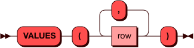

Пример:

```sql
VALUES (1, 'Woody', 2561),(2, "Buzz Lightyear", 4781);
```

В некотором смысле, передаваемые с `VALUES` значения являются временной
таблицей, которая существует только в рамках запроса. Использовать
`VALUES` имеет смысл тогда, когда требуется получить набор строк, для
которых известны значения одного или более столбцов. Например, с помощью
команды ниже можно выяснить название игрушки, зная ее количество на
складе:

```sql
SELECT "name" FROM "assets" WHERE ("stock") IN (VALUES (2561));
```

Вывод в консоль:

```
---
- metadata:
  - {'name': 'name', 'type': 'string'}
  rows:
  - ['Woody']
...
```

#### Кортеж (row) {: #row }

Каждый кортеж (`row`) может содержать одно или несколько значений в виде
перечисления через запятую:

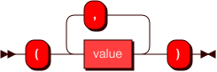

Пример:

```sql
(1, 'Woody', 2561)
```

### Псевдоним {: #alias }

Cхема использования [псевдонимов](#aliases):

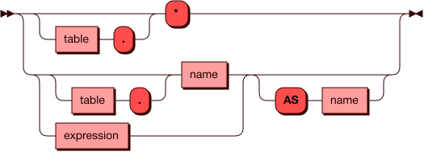

### Пароль {: #password }

Пароль пользователя может использовать русские и английские буквы во
всех регистрах, а так же цифры и основные знаки препинания из [таблицы
ASCII](https://ru.wikipedia.org/wiki/ASCII#Структурные_свойства_таблицы).
При использовании методов аутентификации `chap-sha1` и `md5` требуется
использовать пароль не короче 8 символов, для метода `ldap` длина пароля
не проверяется.

### Выражение {: #expression }

Схема использования элемента `expression`:


### Подзапрос {: #subquery }

Схема использования элемента `subquery`:

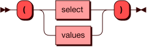

### Ссылка {: #reference }

Схема использования элемента `reference`:

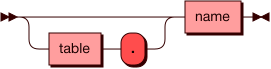

### Значение {: #value }

Схема использования элемента `value`:

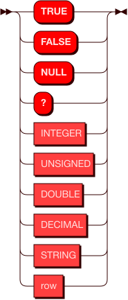

### Тип {: #type }

Схема использования элемента `type`:

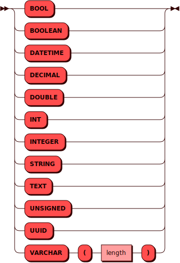

## Использование агрегатных функций {: #aggregate }

Поддерживаются следующие агрегатные функции для работы с колонками:

- `COUNT`, количество значений в колонке;
- `SUM`, сумма значений в колонке (если строк нет, возвращает `null`);
- `AVG`, среднее значение в колонке;
- `TOTAL`, сумма значений в колонке (если строк нет, возвращает `0`);
- `MIN`, минимальное значение в колонке;
- `MAX`, максимальное значение в колонке;
- `GROUP_CONCAT` [`"column_name"`, `'string'`], добавляет к каждому
  значению колонки `column_name` указанное значение `string`.

Пример подсчета общего числа товаров на складе:

```sql
SELECT SUM("stock") FROM "assets";
```

Вывод в консоль:

```
---
- metadata:
  - {'name': 'COL_1', 'type': 'decimal'}
  rows:
  - [10536]
...
```

Пример добавления текста к значениям в колонке:

```sql
SELECT GROUP_CONCAT("name",' character, ') FROM "characters";
```

Вывод в консоль:

```
---
- metadata:
  - {'name': 'COL_1', 'type': 'string'}
  rows:
  - ['Woody character, Buzz Lightyear character, Bo Peep character, Mr. Potato Head
      character, Slinky Dog character, Barbie character, Daisy character, Forky character,
      Dragon character, The Dummies']
...
```

## Использование UNION ALL {: #union_all }

Команда `UNION ALL` используется для соединения результатов нескольких
запросов. Это может быть полезно для объединения данных из нескольких
таблиц, или для удобного отображения разных вычислений или манипуляций
со строками таблицы. Результат запроса может содержать дублирующиеся строки.

Для примера предположим, что требуется получить список игрушек с
персонажами 1995 года, а также все игрушки, остатки которых на складе
превышают 1000 штук:

```sql
SELECT "name" FROM "characters"
WHERE "year" = 1995
UNION ALL
SELECT "name" FROM "assets"
WHERE "stock" > 1000;
```

Вывод в консоль:

```
---
- metadata:
  - {'name': 'name', 'type': 'string'}
  rows:
  - ['Woody']
  - ['Buzz Lightyear']
  - ['Bo Peep']
  - ['Mr. Potato Head']
  - ['Slinky Dog']
  - ['Woody']
  - ['Buzz Lightstock']
  - ['Slinky Dog']
...
```

## Использование EXCEPT {: #except }

Команда `EXCEPT` используется для соединения нескольких запросов
`SELECT` по принципу исключения. Это означает, к примеру, что из
результата первого запроса будут исключены результаты второго, если
между ними есть пересечение. `EXCEPT` может применяться при запросах из
разных таблиц, либо разных столбцов одной таблицы, когда нужный
результат нельзя получить лишь одним SELECT-запросом.

Используем команду, похожую на предыдущий пример, но с другим смыслом.
На этот раз нужно получить список игрушек с персонажами 1995 года, но
только если их запасы меньше 1000 штук:

```sql
SELECT "name" FROM "characters"
WHERE "year" = 1995
EXCEPT
SELECT "name" FROM "assets"
WHERE "stock" > 1000;
```

Вывод в консоль:

```
---
- metadata:
  - {'name': 'name', 'type': 'string'}
  rows:
  - ['Bo Peep']
  - ['Buzz Lightyear']
  - ['Mr. Potato Head']
...
```

## Использование псевдонимов {: #aliases }

Использование псевдонимов (aliases) позволяет переопределить названия
получаемых столбцов в SELECT-запросах. Псевдоним вставляется после
ключевого слова `AS` и может содержать произвольный текст со следующими
ограничениями: он не должен начинаться с цифры и не может содержать
пробелов и специальных служебных символов (кроме знака подчеркивания).

Пример для вывода столбцы таблицы:

```sql
SELECT "score" AS "Total_score" FROM "scoring";
---
- metadata:
  - {'name': 'Total_score', 'type': 'decimal'}
  rows:
  - [78.33]
  - [84.61]
  - [47.28]
...
```

Пример для функции `CAST()`:

```sql
SELECT SUM(CAST("score" AS INT)) AS "_Total_score_1" FROM "scoring";
---
- metadata:
  - {'name': '_Total_score_1', 'type': 'decimal'}
  rows:
  - [209]
...
```

## Использование JOIN {: #join }

Команда `JOIN` используется для комбинирования данных из нескольких
таблиц, что может быть полезно, если между этими данными есть связь. В
отличие от `UNION ALL`, результатом `JOIN` является объединение не строк, а
столбцов: если `UNION ALL` добавляет к строкам одной
таблицы строки другой (при условии совпадения типов данных в
соответствующих столбцах), то `JOIN` создает новую результирующую
таблицу из указанных столбцов этих таблиц. Результирующая таблица
представляет собой декартово произведение кортежей из внешней (левой) и
внутренней (правой) таблиц, удовлетворяющих условию соединения (требуется
оператор `ON`).

В Picodata поддерживаются два типа соединения: внутреннее (`INNER JOIN`)
и левое внешнее (`LEFT JOIN`). Различия между ними проявляются при
определенных условиях, когда некоторые строки внешней таблицы остаются
без подходящих под условие соединения строк внутренней таблицы. Если
нужно соединить две таблицы по равенству значений первого столбцы `id`,
то разница между типами `JOIN` будет заметна, если у таблиц разное число
строк: например, в `characters` их 10, а в `assets` — только 8:

```sql
picodata> pico.sql([[select * from "characters"]])
---
- metadata:
  - {'name': 'id', 'type': 'integer'}
  - {'name': 'name', 'type': 'string'}
  - {'name': 'year', 'type': 'integer'}
  rows:
  - [1, 'Woody', 1995]
  - [2, 'Buzz Lightyear', 1995]
  - [3, 'Bo Peep', 1995]
  - [4, 'Mr. Potato Head', 1995]
  - [5, 'Slinky Dog', 1995]
  - [6, 'Barbie', 2010]
  - [7, 'Daisy', 2010]
  - [8, 'Forky', 2019]
  - [9, 'Dragon', 2019]
  - [10, 'The Dummies', 2019]
...
```

```sql
picodata> pico.sql([[select * from "assets"]])
---
- metadata:
  - {'name': 'id', 'type': 'integer'}
  - {'name': 'name', 'type': 'string'}
  - {'name': 'stock', 'type': 'integer'}
  rows:
  - [1, 'Woody', 2561]
  - [2, 'Buzz Lightyear', 4781]
  - [3, 'Bo Peep', 255]
  - [4, 'Mr. Potato Head', 109]
  - [5, 'Slinky Dog', 1112]
  - [6, 'Barbie', 998]
  - [7, 'Daisy', 66]
  - [8, 'Forky', 341]
...
```

### INNER JOIN {: #inner-join }

Данный тип используется по умолчанию, когда в запросе использовано
просто ключевое слово `JOIN`, без явного указания типа.

Внутреннее соединение предполагает, что результирующая таблица будет
содержать только те строки, для которых было выполнено указанное
условие (`ON`).

Для примера создадим из двух таблиц выше с помощью `INNER JOIN` новую
результирующую таблицу, где будут одновременно и остатки игрушек на
складе, и годы выхода соответствующих персонажей.

Вариант с использованием подзапроса:

```sql
SELECT
    "id",
    "name",
    "stock",
    "year"
FROM "characters"
INNER JOIN (
  SELECT
      "id" AS "number",
      "stock" FROM "assets"
) AS stock
ON "characters"."id" = stock."number";
```

Вариант без использования подзапроса:

```sql
SELECT
    "characters"."id",
    "characters"."name",
    "assets"."stock",
    "characters"."year"
FROM "characters" AS "characters"
INNER JOIN "assets" AS "assets"
ON "characters"."id" = "assets"."id";
```

Оба варианта дадут одинаковый результат:

```sql
+---------------+-------------------+-------------+-----------------+
| characters.id | characters.name   | STOCK.stock | characters.year |
+===================================================================+
| 1             | "Woody"           | 2561        | 1995            |
|---------------+-------------------+-------------+-----------------|
| 2             | "Buzz Lightyear"  | 4781        | 1995            |
|---------------+-------------------+-------------+-----------------|
| 3             | "Bo Peep"         | 255         | 1995            |
|---------------+-------------------+-------------+-----------------|
| 4             | "Mr. Potato Head" | 109         | 1995            |
|---------------+-------------------+-------------+-----------------|
| 5             | "Slinky Dog"      | 1112        | 1995            |
|---------------+-------------------+-------------+-----------------|
| 6             | "Barbie"          | 998         | 2010            |
|---------------+-------------------+-------------+-----------------|
| 7             | "Daisy"           | 66          | 2010            |
|---------------+-------------------+-------------+-----------------|
| 8             | "Forky"           | 341         | 2019            |
+---------------+-------------------+-------------+-----------------+
(8 rows)
```

При использовании варианта с подзапросом (см. [схему](#select))
обязательно следует указывать после него псевдоним (`AS`).

Пример:

```sql
SELECT
  "id" AS "id1",
  "name" AS "name1",
  "stock" AS "stock1",
  "year" AS "year1"
FROM "characters"
INNER JOIN
(SELECT "id" AS "number", "stock" FROM "assets") AS stock
ON "characters"."id" = stock."number";
```

Здесь имена колонок в результирующей таблице были заменены
на собственные с помощью псевдонимов.

Результат:

```sql
+-----+-------------------+--------+-------+
| id1 | name1             | stock1 | year1 |
+==========================================+
| 1   | "Woody"           | 2561   | 1995  |
|-----+-------------------+--------+-------|
| 2   | "Buzz Lightyear"  | 4781   | 1995  |
|-----+-------------------+--------+-------|
| 3   | "Bo Peep"         | 255    | 1995  |
|-----+-------------------+--------+-------|
| 4   | "Mr. Potato Head" | 109    | 1995  |
|-----+-------------------+--------+-------|
| 5   | "Slinky Dog"      | 1112   | 1995  |
|-----+-------------------+--------+-------|
| 6   | "Barbie"          | 998    | 2010  |
|-----+-------------------+--------+-------|
| 7   | "Daisy"           | 66     | 2010  |
|-----+-------------------+--------+-------|
| 8   | "Forky"           | 341    | 2019  |
+-----+-------------------+--------+-------+
(8 rows)
```

### LEFT JOIN {: #left-join }

При использовании внешнего левого соединения (`LEFT OUTER JOIN` или
просто `LEFT JOIN`) формирование результирующей таблицы происходит
иначе: сначала выполняется `INNER JOIN`, и затем к результатам
добавляются оставшиеся строки из внешней таблицы, не вошедшие в
результат формирования таблицы внутренним соединением. Отсутствующие
значения в этих строках будут помечены как `nil`.

Пример:

```sql
SELECT
  "id" AS "id1",
  "name" AS "name1",
  "stock" AS "stock1",
  "year" AS "year1"
FROM "characters"
LEFT JOIN
(SELECT "id" AS "number", "stock" FROM "assets") AS stock
ON "characters"."id" = stock."number";
```

Результат:

```sql
+-----+-------------------+--------+-------+
| id1 | name1             | stock1 | year1 |
+==========================================+
| 1   | "Woody"           | 2561   | 1995  |
|-----+-------------------+--------+-------|
| 2   | "Buzz Lightyear"  | 4781   | 1995  |
|-----+-------------------+--------+-------|
| 3   | "Bo Peep"         | 255    | 1995  |
|-----+-------------------+--------+-------|
| 4   | "Mr. Potato Head" | 109    | 1995  |
|-----+-------------------+--------+-------|
| 5   | "Slinky Dog"      | 1112   | 1995  |
|-----+-------------------+--------+-------|
| 6   | "Barbie"          | 998    | 2010  |
|-----+-------------------+--------+-------|
| 7   | "Daisy"           | 66     | 2010  |
|-----+-------------------+--------+-------|
| 8   | "Forky"           | 341    | 2019  |
|-----+-------------------+--------+-------|
| 9   | "Dragon"          | nil    | 2019  |
|-----+-------------------+--------+-------|
| 10  | "The Dummies"     | nil    | 2019  |
+-----+-------------------+--------+-------+
(10 rows)
```

В обратном случае, если бы в `characters` было 8 строк, а в `assets` 10, оба
варианта соединения дали бы одинаковый результат (8 строк).

## Использование функции CAST() {: #cast }

Функция `CAST()` используется для изменения получаемого типа данных при
SELECT-запросах. С ее помощью можно преобразовать числа в текст, дробные
числа в целые и так далее согласно приведенной [выше](#type) схеме.
Поддерживаемые в Picodata типы данных приведены в [отдельном
документе](sql_types.md).

### Пример запроса {: #cast_example }

В качестве примера покажем преобразование дробных чисел в целые с
отбрасыванием дробной части. Используем следующую таблицу:


В обычном виде значения столбца `score` имеют дробную часть и определены
в схеме данных типом `decimal`:

```sql
SELECT "score" FROM "scoring";
---
  'metadata': [
   {'name': 'score', 'type': 'decimal'}],
  'rows': [
    [78.33],
    [84.61],
    [47.28]]
...
```

Преобразуем эти числа в `int`:

```sql
SELECT CAST("score" AS INT) FROM "scoring";
---
  'metadata': [
  {'name': 'COL_1', 'type': 'integer'}],
  'rows': [
  [78],
  [84],
  [47]]
...
```

## Использование опций неблокирующего SQL {: #tuple_limit }

При работе с распределенными SQL-запросами следует принимать в расчет
следующие факторы:

- SQL-запрос может вызывать значительные задержки и блокировать
  транзакционный поток, что будет мешать выполнению других запросов;
- SQL-запрос не должен приводить к исчерпанию памяти на отдельных узлах
  кластера;
- при объединении результатов локальных запросов в виртуальную таблицу
  на узле-маршрутизаторе, нужно следить, чтобы эта таблица не
  разрасталась бесконтрольно.

Для решения этих задач в DQL- и DML-запросах предусмотрены следующие
необязательные [опции](#options):

- `SQL_VDBE_MAX_STEPS`, ограничение на максимальное количество
  [opcode](https://www.sqlite.org/opcode.html) при
  работе [VDBE](https://www.sqlite.org/vdbe.html) на
  локальных узлах Picodata;
- `VTABLE_MAX_ROWS`, ограничение на максимальное число строк в
  результирующей виртуальной таблице, собирающей результаты отдельных
  локальных запросов.

#### Опции {: #options }

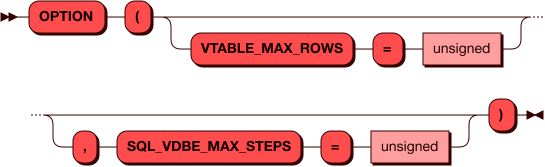

### Пример использования {: #tuple_limit_example }

```sql
SELECT * FROM "characters" OPTION(SQL_VDBE_MAX_STEPS = 55, VTABLE_MAX_ROWS = 10);
---
- metadata:
  - {'name': 'id', 'type': 'integer'}
  - {'name': 'name', 'type': 'string'}
  - {'name': 'year', 'type': 'integer'}
  rows:
  - [1, 'Woody', 1995]
  - [2, 'Buzz Lightyear', 1995]
  - [3, 'Bo Peep', 1995]
  - [4, 'Mr. Potato Head', 1995]
  - [5, 'Slinky Dog', 1995]
  - [6, 'Barbie', 2010]
  - [7, 'Daisy', 2010]
  - [8, 'Forky', 2019]
  - [9, 'Dragon', 2019]
  - [10, 'The Dummies', 2019]
...
```

Если ограничения не позволяют выполнить запрос, то будет возвращена
ошибка.

При слишком низком значении `SQL_VDBE_MAX_STEPS`:

```
---
- null
- ("Reached a limit on max executed vdbe opcodes. Limit: 54\")
...
```

При слишком низком значении `VTABLE_MAX_ROWS`:

```
---
- null
- (Exceeded maximum number of rows (9) in virtual table: 10\")
...
```

## Запрос INSERT {: #query_insert }

Команда `INSERT` используется для помещения (записи) строки данных в
таблицу. На данный момент атомарность записи гарантируется только для
одной строки в рамках одного запроса.

### **INSERT** {: #insert }

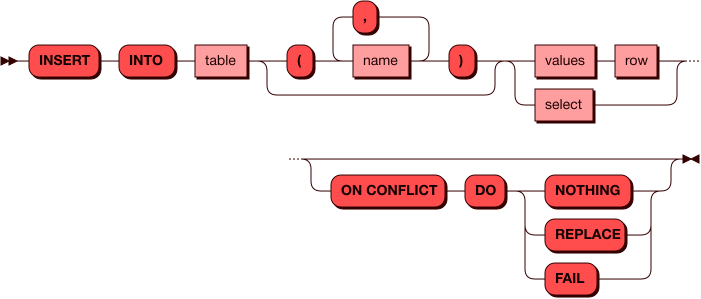

### Примеры запросов {: #insert_examples }

Запись строки данных в таблицу командой `INSERT` возможна как в обычном виде,
так и в параметризированном (потребуется переключить). Пример параметризированной
вставки строки значений в таблицу:

```lua
pico.sql([[INSERT INTO "assets" ("id", "name", "stock") VALUES (?, ?, ?)]], {1, "Woody", 2561});
```

Если вставляемая строка точно содержит значения для всех столбцов, то их
можно явно не указывать.

Пример для Lua:

```lua
pico.sql([[INSERT INTO "assets" VALUES (1, 'Woody', 2561)]], {});
```

Пример для SQL:

```sql
INSERT INTO "assets" VALUES (1, 'Woody', 2561);
```

Параметризация значений при `INSERT` влияет на тип данных при выполнении
запроса. Так, в обычном виде дробные числа конвертируются в числа с
фиксированной запятой (например, `values(2.5)` в `decimal 2.5`). В
параметризированном виде дробнному числу будет назначен типа с плавающей
запятой (например, `values(?), {2.5}` в `double 2.5`). См.
[подробнее](sql_types.md) о типах данных.

При использовании `INSERT` вместе с подзапросом (`SELECT`) происходит
кеширование подзапроса, поэтому его тоже имеет смысл параметризировать,
чтобы выиграть в скорости при выполнении последующих подобных запросов:

```lua
pico.sql([[INSERT INTO "assets" SELECT * FROM "assets2" WHERE "id2" = ?]], {11};
```

Результатом `INSERT` в приведенных примерах будет вывод в консоль
информации о количестве успешно вставленных строк:

```
---
- row_count: 1
...
```

### Обработка конфликтов {: #insert_conflicts }

В некоторых случаях вставка строки может вернуть ошибку, например, при
попытке вставить строку с уже существующим индексом:

```sql
INSERT INTO "characters" ("id", "name", "year") VALUES (10, 'Duke Caboom', 2019);
---
- null
- 'sbroad: Lua error (IR dispatch): LuaError(ExecutionError("sbroad: failed to create
  transaction: RolledBack(FailedTo(Insert, Some(Space), \"TupleFound: Duplicate key
  exists in unique index \\\"primary_key\\\" in space \\\"characters\\\" with old
  tuple - [10, 2695, \\\"The Dummies\\\", 2019] and new tuple - [10, 2695, \\\"Duke
  Caboom\\\", 2019]\"))"))'
...
```

Для обработки таких ситуаций можно использовать необязательный параметр
`ON CONFLICT`, который может принимать одно из трех значений:

- `FAIL`, вернуть ошибку в случае конфликта;
- `REPLACE`, затереть старую строку новой по первичному ключу;
- `NOTHING`, ничего не делать (оставить старую версию строки).

Вариант с `DO FAIL` предполагает, что запрос будет возвращать ошибку в
случае конфликта вставки. Может возникнуть ситуация, когда запрос успешно
вставит данные на части узлов хранения, но вернет ошибку на остальных
(данные на них откатятся), что приведет к неконсистентному состоянию
кластера.
Чтобы решить эту проблему, можно повторить вставку с другими параметрами
разрешения конфликта — например, `DO REPLACE` (замена кортежа на новый).

Вариант с `DO REPLACE` решает проблему конфликтов только в первичном
ключе. Если таблица содержит несколько уникальных индексов (помимо
первичного ключа) и конфликт произошел в одном из них, `DO REPLACE`
вернет ошибку. На узле хранения, где произошел конфликт, данные не будут
зафиксированы в таблице.

Вариант с `DO NOTHING` никогда не возвращает ошибку из-за конфликтов в
уникальных индексах, т.к. просто оставляет старую версию строки в
таблице. При такой вставке в результате вернется только количество
успешно вставленных новых строк (строки где был конфликт и остались
прежние данные в подсчет не попадают).

Если параметр `ON CONFLICT` не указан, то по умолчанию используется
поведение `DO FAIL`.

```sql
INSERT INTO "characters" ("id", "name", "year")
VALUES (10, 'Duke Caboom', 2019)
ON CONFLICT DO NOTHING;
---
- row_count: 0
...
```

Для успешной вставки (замены строки) следует использовать вариант `DO REPLACE`:

```sql
INSERT INTO "characters" ("id", "name", "year")
VALUES (10, 'Duke Caboom', 2019)
ON CONFLICT DO REPLACE ;
---
- row_count: 1
...
```

Ошибка вставки может также быть вызвана ограничениями [неблокирующего
SQL](#tuple_limit). Если речь идет о запросе на вставку более одной
строки, то для исправления неконсистентного состояния кластера следует
повторить запрос с другими [опциями](#options) и способом разрешения
конфликтов `DO NOTHING`.

## Запрос UPDATE {: #query_update }

Команда `UPDATE` используется для обновления данных в колонках таблицы.
При использовании фильтрующего условия (`WHERE`) можно применять ее
только к определенным строкам таблицы. В то время как для полной замены
строк можно использовать команду `INSERT` c параметром `on conflict do
replace`, команда `UPDATE` подойдет для выборочной замены значений
отдельных колонок в нужных строках. В качестве источника данных для
`UPDATE` можно использовать как непосредственно передаваемые значения,
так и результат подзапроса в конструкции `FROM (SELECT ...)`.

### **UPDATE** {: #update }

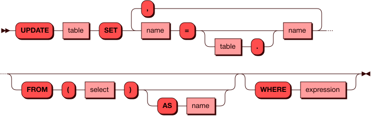

При использовании `UPDATE` следует учитывать следующие ограничения:

- нельзя обновить значение первичного ключа (например, `id`);
- нельзя указать одну и ту же колонку дважды (например, `name = 'Duke', name = 'Nukem'`);
- нельзя обновить значение в системной колонке `bucket_id` (оно вычисляется автоматически);
- передаваемое новое значение не должно противоречить [типу данных](#Column), присвоенному колонке.

### Примеры запросов {: #update_examples }

Обновление явно указанных данных в отдельной строке с использованием условия:

```sql
UPDATE "characters" SET "name" = 'Etch', "year" = 2010 WHERE "id" = 2;
```

Обновление всех значений в колонке:

```sql
UPDATE "characters" SET "year" = 2010;
```

Обновление с помощью ссылки на существующую колонку таблицы (без
необходимости использовать подзапрос):

```sql
UPDATE "characters" SET "year" = "year" + 1;
```

Обновление значений колонки на основе значений другой колонки (с
подзапросом):

```sql
UPDATE "characters" SET "name" = "item" FROM (SELECT "id" AS i, "name" AS "item" FROM "assets") WHERE "id" = i;
```

В данном случае использования подзапроса (`FROM (SELECT ...)`),
потребуется указать и фильтр (`WHERE`) для того, чтобы каждой строке
первой таблицы соответствовала ровно одна строка второй таблицы.

В каждом случае результатом успешного выполнения будет сообщение с
количеством обработанных строк. Например:

```lua
---
- row_count: 10
...
```

## Запрос DELETE {: #query_delete }

Команда `DELETE` используется для удаления данных из таблицы.

### **DELETE** {: #delete }

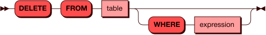

### Примеры запросов {: #delete_examples }

Простой запрос удаляет все данные из указанной таблицы:

```sql
DELETE FROM "characters";
```

Запрос с условием позволяет удалить только нужную строку:

```sql
DELETE FROM "characters" where "id" = 1;
```

Или несколько строк:

```sql
DELETE FROM "characters" WHERE "id" IN (1,2,3);
```

В всех случаях в выводе в консоль будет указано количество удаленных
строк. Например:

```lua
---
- row_count: 10
...
```

При выполнении запроса на удаление нескольких строк может возникнуть
ошибка [неблокирующего SQL](#tuple_limit). Если виртуальная таблица на роутере не может
вместить предварительный результат выполнения запроса (не хватает емкости виртуальной таблицы
`vtable_max_rows`) и/или задействовано слишком много операций с кортежами на
узле хранения (`sql_vdbe_max_steps`), то запроc будет отработан лишь частично. Следует
увеличить значения указанных параметров в [опциях](#options) запроса и
повторить его.

## Запрос EXPLAIN {: #query_explain }

Команда `EXPLAIN` добавляется перед DQL- и DML-запросами для
того чтобы показать как будет выглядеть план исполнения запроса, при этом не выполняя
сам запрос. План строится на узле-маршрутизаторе и
позволяет наглядно оценить структуру и последовательность действий при
выполнении запроса. `EXPLAIN` является инструментом для анализа и
оптимизации запросов.

Схема использования `EXPLAIN` показана ниже.

### **EXPLAIN** {: #explain }

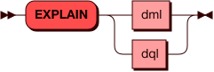

### Простые запросы {: #basic_explain }

Для начала рассмотрим план простого запроса на получение данных одного столбца таблицы:

```sql
EXPLAIN SELECT "score" FROM "scoring";
```

Вывод в консоль:

```
---
- - projection ("scoring"."score"::decimal -> "score")
  - '    scan "scoring"'
...
```

Обязательными элементами плана запроса являются `scan` и `projection`.
Первый узел отвечает за сканирование (получение данных) таблицы, второй
— за выборку нужных столбцов. Построение проекции (`projection`) всегда
происходит после сканирования. В рамках построения проекции планировщик
создает псевдоним для столбца: `"scoring"."score" -> "score"`.

Если в запросе есть условие (`where`), то в план добавляется узел `selection`:

```sql
EXPLAIN SELECT "score" FROM "scoring" WHERE "score" > 70;
```

Вывод в консоль:

```
---
- - projection ("scoring"."score"::decimal -> "score")
  - '    selection ROW("scoring"."score"::decimal) > ROW(70::unsigned)'
  - '        scan "scoring"'
...
```

Если `projection` выбирает столбцы (атрибуты таблицы), то `selection`
фильтрует данные по строкам (`ROW`).

Фраза `selection ROW("scoring"."score") > ROW(70)'` является результатом
трансформации фильтра `where "score" > 70` в `where ("score") > (70)`, т.е.
превращения значения в строку из одного столбца.

### Запрос с несколькими проекциями {: #multi_projection_explain }

Пример построения проекции из более сложного запроса:

```sql
EXPLAIN SELECT "id","name" FROM "characters"
EXCEPT
SELECT "id","name" FROM "assets"
WHERE "stock" > 1000;
```

Вывод в консоль:

```
---
- - except
  - '    projection ("characters"."id"::integer -> "id", "characters"."name"::string -> "name")'
  - '        scan "characters"'
  - '    projection ("assets"."id"::integer -> "id", "assets"."name"::string -> "name")'
  - '        selection ROW("assets"."stock"::integer) > ROW(1000::unsigned)'
  - '            scan "assets"'
...
```

В таком плане запроса присутствует два блока `projection`, перед
которыми стоит логическое условие (`EXCEPT`). В каждом блоке есть свое
сканирование таблицы и, опционально, дополнительный фильтр по строкам
(`selection`).

### Варианты перемещения данных {: #data_motion_types }

В плане запроса может быть указан параметр `motion`, который отражает
вариант перемещения данных между узлами хранения. Существуют следующие
четыре варианта:

1. **Локальная вставка**. Представляет собой локальную материализацию
   данных с подсчетом значений `bucket_id` для каждого кортежа
   (соответственно, кортежи будут сгруппированы по этим бакетам).
   Перемещения данных на другие узлы хранения через узел-маршрутизатор
   не происходит. На текущем узле хранения будет локально создана
   виртуальная таблица из результатов читающего запроса или из
   переданных `VALUES`, а потом данные из нее будут вставлены локально в
   целевую таблицу. Планировщик отобразит значение `motion [policy:
   local segment]`.
1. **Локальная материализация**. Данный вариант аналогичен предыдущему с
   той разницей, что при материализации данных не происходит вычисление
   `bucket_id`. При таком запросе планировщик отобразит значение `motion
   [policy:   local]`.
1. **Частичное перемещение**. При выполнении запроса на каждый узел
   кластера будет отправлена только востребованная часть данных (таблица
   перераспределяется по новому ключу). При таком запросе планировщик
   отобразит значение `motion [policy:   segment]`.
1. **Полное перемещение**. На каждый узел кластера будет отправлена вся
   таблица. Планировщик отобразит значение `motion [policy:   full]`.

Перемещение данных происходит в тех случаях, когда в запросе требуется
обработать данные из нескольких таблиц или несколько раз из одной
таблицы (`JOIN`, `EXCEPT`, подзапросы), а также при выполнении
[агрегатных функций](#aggregate) (`SUM`, `COUNT`...). Перемещение данных
происходит по следующей схеме:

- на узле-маршрутизаторе (`router`) собираются запрошенные данные со
  всех узлов хранения (`storage`);
- в случае частичного перемещения (`motion [policy: segment]`),
  собранные данные объединяются в виртуальную таблицу с новым ключом
  шардирования;
- узел-маршрутизатор отправляет на узлы хранения только нужные им строки
  из этой виртуальной таблицы.

Таким образом, перемещение обеспечивает корректность выполнения
локальных запросов за счет копирования недостающих данных на каждый узел
хранения в кластере.

Вариант перемещения данных (`motion policy`) зависит от того, какие
данные доступны на локальных узлах хранения. При простом чтении из одной
таблицы перемещения нет никогда. При работе с несколькими таблицами
перемещения также может не быть, если в каждой части запроса адресуются
те столбцы, по которым таблица распределена (указан ключ шардирования).
При этом, использование агрегатных функций и/или соединения при работе с
одной или несколькими таблицами может потребовать частичного или полного
перемещения данных.

Примеры разных вариантов `motion policy` приведены ниже.

**Локальная вставка** характерна для `INSERT` с передачей строки значений:

```sql
EXPLAIN INSERT INTO "assets" VALUES (1, 'Woody', 2561);
```

Вывод в консоль:

```
---
- - 'insert "assets" on conflict: fail'
  - '    motion [policy: local segment([ref("COLUMN_1")])]'
  - '        values'
  - '            value row (data=ROW(1::unsigned, ''Woody''::string, 2561::unsigned))'
...
```

**Локальная материализация** относится к тем случаям, когда требуется
положить в память прочитанные данные из локального запроса для их
дальнейшей обработки. Перемещения данных нет и вычисление `bucket_id` не
требуется (см. [подробнее](../architecture/distributed_sql.md#data_distribution)).
Примером может служить удаление данных из таблицы:

```sql
EXPLAIN DELETE FROM "characters" WHERE "id" = 1;
```

Вывод в консоль:

```
---
- - delete "characters"
  - '    motion [policy: local]'
  - '        projection ("characters"."id"::integer -> pk_col_0)'
  - '            selection ROW("characters"."id"::integer) = ROW(1::unsigned)'
  - '                scan "characters"'
...
```

Локальная материализация происходит и при обновлении данных в тех
случаях, если не затрагивается колонка, по которой таблица
шардирована. Например, если при создании таблицы было указано
шардирование по колонке `id` (`distributed by ("id")`), то обновление
данных в других колонках не приведет к их перемещению через
узел-маршрутизатор. Поскольку при `UPDATE` не происходит пересчет
`bucket_id`, то планировщик использует политику `local`:

```sql
EXPLAIN UPDATE "characters" SET "year" = 2010;
```

Вывод в консоль:

```
---
- - update "characters"
  - '"year" = COL_0'
  - '    motion [policy: local]'
  - '        projection (2010::unsigned -> COL_0, "characters"."id"::integer -> COL_1)'
  - '            scan "characters"'
  - 'execution options:'
  - sql_vdbe_max_steps = 45000
  - vtable_max_rows = 5000
...
```

**Частичное перемещение** происходит, когда требуется отправить на узлы
хранения недостающую часть таблицы.

Пример `INSERT` со вставкой из читающего запроса другой таблицы, у
которой отличается ключ шардирования:

```sql
EXPLAIN INSERT INTO "assets" SELECT * FROM "assets3" WHERE "id3" = 1;
```

Вывод в консоль:

```
---
- - 'insert "assets" on conflict: fail'
  - '    motion [policy: segment([ref("id3")])]'
  - '        projection ("assets3"."id3"::integer -> "id3", "assets3"."name3"::string ->
             "name3", "assets3"."stock3"::integer -> "stock3")'
  - '            selection ROW("assets3"."id3"::integer) = ROW(1::unsigned)'
  - '                scan "assets3"'
...
```

Пример `JOIN` двух таблиц с разными ключами шардирования:

```sql
EXPLAIN SELECT "id","name" FROM "assets"
JOIN
(SELECT "id3","name3" FROM "assets3") AS "new_assets"
ON "assets"."id" = "new_assets"."id3";
```

Вывод в консоль:

```
---
- - projection ("assets"."id"::integer -> "id", "assets"."name"::string -> "name")
  - '    join on ROW("assets"."id"::integer) = ROW("new_assets"."id3"::integer)'
  - '        scan "assets"'
  - '            projection ("assets"."id"::integer -> "id", "assets"."name"::string
    -> "name", "assets"."stock"::integer -> "stock")'
  - '                scan "assets"'
  - '        motion [policy: segment([ref("id3")])]'
  - '            scan "new_assets"'
  - '                projection ("assets3"."id3"::integer -> "id3", "assets3"."name3"::string -> "name3")'
  - '                    scan "assets3"'
...
```

Пример `UPDATE` с обновлением колонки, по которой шардирована таблица (например, `distributed by ("id", "name")`):

```sql
EXPLAIN UPDATE "characters" SET "name" = 'Etch', "year" = 2010 WHERE "id" = 2;
```

Вывод в консоль:

```
---
- - update "characters"
  - '"id" = COL_0'
  - '"name" = COL_1'
  - '"year" = COL_2'
  - '    motion [policy: segment([])]'
  - '        projection ("characters"."id"::integer -> COL_0, ''Etch''::string ->
    COL_1, 2010::unsigned -> COL_2, "characters"."id"::integer -> COL_3, "characters"."name"::string
    -> COL_4)'
  - '            selection ROW("characters"."id"::integer) = ROW(2::unsigned)'
  - '                scan "characters"'
  - 'execution options:'
  - sql_vdbe_max_steps = 45000
  - vtable_max_rows = 5000
...
```

**Полное перемещение** происходит, когда требуется скопировать всю
внутреннюю таблицу (в правой части запроса) на все узлы, содержащие
внешнюю таблицу (в левой части).

Пример `JOIN` с соединениям не по колонкам шардирования для обеих таблиц:

```sql
EXPLAIN SELECT "id","name","stock","year" FROM "characters"
JOIN
(SELECT "id" AS "number","stock" FROM "assets") AS stock
ON "characters"."id" = stock."number";
```

Вывод в консоль:

```
---
- - projection (
    - "characters"."id" -> "id",
    - "characters"."name" -> "name",
    - "STOCK"."stock" -> "stock",
    - "characters"."year" -> "year")',
    - '    join on ROW("characters"."id") = ROW("STOCK"."number")',
    - '        scan "characters"',
    - '            projection (
    -   "characters"."id" -> "id",
    -   "characters"."name" -> "name",
    -   "characters"."year" -> "year")',
    -   '                scan "characters"',
    -   '        motion [policy: full]',
    -   '            scan "STOCK"',
    -   '                projection (
    -     "assets"."id" -> "number",
    -     "assets"."stock" -> "stock")',
    -     '                    scan "assets"'
...
```

Пример выполнения агрегатной функции.

```sql
EXPLAIN SELECT COUNT("id") FROM "characters";
```

Вывод в консоль:

```
---
- - projection (sum(("8278664dae744882bfeec573f427fd0d_count_11"::integer))::decimal
    -> "COL_1")
  - '    motion [policy: full]'
  - '        scan'
  - '            projection (count(("characters"."id"::integer))::integer -> "8278664dae744882bfeec573f427fd0d_count_11")'
  - '                scan "characters"'
...
```

Читать далее: [Типы данных SQL](sql_types.md)
<!-- ebnf source: https://git.picodata.io/picodata/picodata/sbroad/-/blob/e2b6207d15aa8ec6eacbdeb25b5c53dde000a1e1/doc/sql/query.ebnf -->
