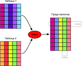

# Основы и базовые понятия SQL
Данный раздел содержит описание основных понятий и терминов, которые
понадобятся при взаимодействии с СУБД. Раздел ориентирован на
пользователей, не имеющих обширного опыта работы с реляционными СУБД.

## Что такое SQL

Picodata предоставляет интерфейс доступа к СУБД Tarantool — реляционной системе управления базами данных, которая реализует поддержку [стандарта SQL](../sql_reference) (_Structured Query Language_, язык структурированных запросов). Это означает, что это система управления данными, представленными в виде отношений (relation). Отношение — это математически точное обозначение таблицы. 
Реляционная база данных состоит из таблиц, и у нее есть две ключевые характеристики:

* Данные распределены по смыслу по таблицам
* Между таблицами есть отношения

Любая таблица представляет собой именованный набор строк. Все строки таблицы имеют одинаковый набор именованных столбцов, при этом каждому столбцу назначается определённый тип данных. Несмотря на то что порядок столбцов во всех строках фиксирован, важно помнить, что SQL не гарантирует какой-либо порядок строк в таблице (хотя их можно явно отсортировать при выводе).

## Что позволяет делать SQL

SQL позволяет работать с наборами данных и отношениями между ними. В общем случае, пользователю базы данных (БД) доступны следующие действия:

* Выполнение запросов к БД
* Получение данных из БД в виде представления (view)
* Сортировать полученные из БД данные
* Добавление таблиц в БД
* Запись данных в БД
* Обновление данных в БД
* Удаление данных из БД
* Управление правами доступа к данным в БД

## Применение SQL
SQL применяется практически везде, где требуется накопление и хранение важных бизнес-данных. Например, это может быть список клиентов, список их покупок, список их адресов и т.п. Каждый список будет отдельной таблицей в БД.

При запросе на получение данных из таблиц формируется представление (view) — результат запроса в виде объединенной таблицы, которая содержит в себе найденные вхождения из одной или нескольких исходных таблиц. Вариант представления показан на рисунке ниже.

Представление может содержать столбцы из разных таблиц, при этом количество строк будет соответствовать числу найденных вхождений согласно заданному запросу.

Более подробные сведения о работе SQL в Picodata приведены в разделе [Принцип работы распределенных запросов](../sql_review)

