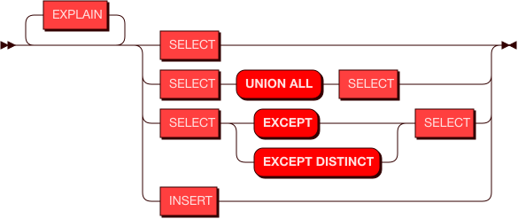
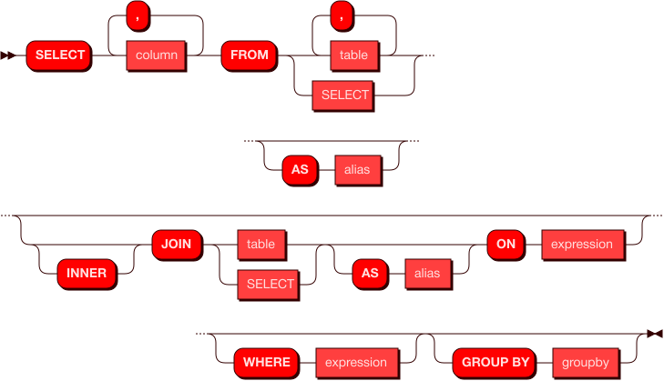
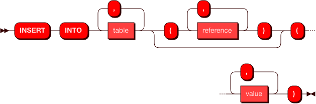

# Справочник команд SQL
Справочник команд предоставляет основные варианты использования команд SQL в Picodata при работе с распределенной СУБД.

Функциональность компонента Sbroad в Picodata обеспечивает поддержку распределенных запросов `SELECT` и `INSERT` c поддержкой анализатора запросов `EXPLAIN`. Ниже на схеме показаны базовые варианты этих запросов.




## Запрос SELECT

Запрос `SELECT` используется для получения информации из указанной таблицы в базе данных. Он возвращает 0 или более строк из таблицы согласно поисковому запросу. 
В контексте распределенной системы, запрос `SELECT` в Picodata получает информацию из всех сегментов таблицы, которая может храниться на нескольких узлах кластера.

Cхема возможных распределенных запросов `SELECT` показана ниже.




### Примеры запросов
Ниже показаны некоторые примеры работающих SQL-запросов.

Простой запрос строки из таблицы по известному ID:

```
SELECT "identification_number", "product_code" FROM "hash_testing"
        WHERE "identification_number" = 1"
```
Запрос с двумя вариантами условий, в каждом из которых используется оператор `AND`:
```
SELECT "identification_number", "product_code"
        FROM "hash_testing"
        WHERE "identification_number" = 1 AND "product_code" = '1'
        OR "identification_number" = 2 AND "product_code" = '2'
```

Пример запроса со вложенными подзапросами `SELECT`, объединенными оператором `UNION ALL`:

```
SELECT *
        FROM
            (SELECT "identification_number", "product_code"
            FROM "hash_testing"
            WHERE "sys_op" = 1
            UNION ALL
            SELECT "identification_number", "product_code"
            FROM "hash_testing_hist"
            WHERE "sys_op" > 1) AS "t3"
        WHERE "identification_number" = 1
```


Используется в:

* expression
* query
* select

### **values**


Используется в:
* select


### **row**


Используется в:
* insert
* value


### **column**


Используется в:

* select

### **expression**


Используется в:

* cast
* column
* expression
* select

### **group by**


Используется в:

* select

### **reference**


Используется в:

* expression
* groupby
* insert


### **value**


Используется в:

* expression
* values

### **cast**


Используется в:

* groupby

### **type**


Используется в:

* cast

## Использование VALUES
Команда `VALUES` представляет собой конструктор строки значений для
использования в запросе `SELECT`. В некотором смысле,
передаваемые с `VALUES` значения являются временной таблицей, которая
существует только в рамках запроса.

Пример использования:
```
SELECT id, id2 FROM hash_testing WHERE (id, id2) in (VALUES (1, 2), (2, 3))
```
Здесь в таблицу hash_testing будет вставлены две строки: (1, 2) и (2, 3).


### **values**


Используется в:

* insert
* query

## Запрос INSERT
Запрос `INSERT` используется для помещения (записи) строки данных в
таблицу. На данный момент доступна запись только одной строки в рамках
одного запроса.

Схема возможных запросов `INSERT` показана ниже.




### Пример запроса
Пример использования со вставкой строки значений в таблицу при помощи команды `INSERT`:

```
INSERT INTO "t" VALUES(1, 2, 3, 4)
```

Используется в:

* query


## Запрос EXPLAIN
Команда `EXPLAIN` добавляется перед командами `SELECT` и `INSERT` для того
чтобы показать план запроса, при том что сам запрос выполнен не будет.
`EXPLAIN` является инструментом для анализа и оптимизации запросов.

Схема использования `EXPLAIN` показана ниже.


### Пример запроса
Примером может служить любой поддерживаемый SQL-запрос:

```
EXPLAIN INSERT INTO "t" VALUES(1, 2, 3, 4)
```

Читать далее: [Перечень поддерживаемых типов данных](../sql_datatypes)
<!-- ebnf source: https://git.picodata.io/picodata/picodata/sbroad/-/blob/main/doc/sql/query.ebnf -->
