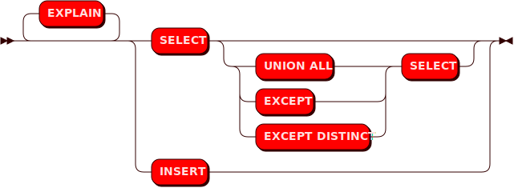
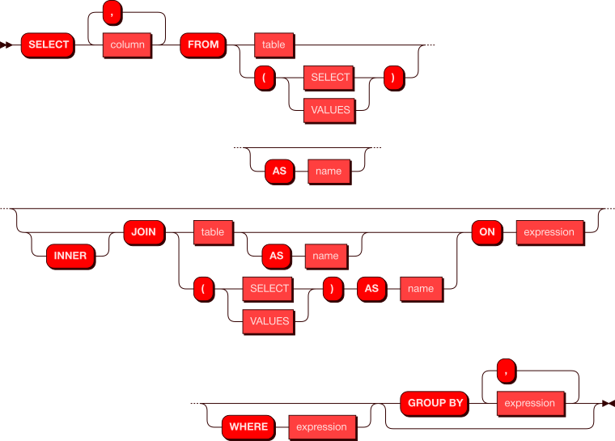
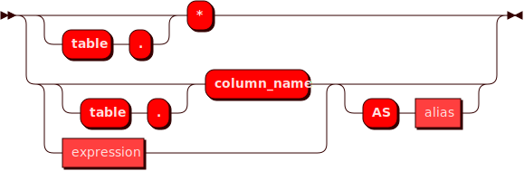
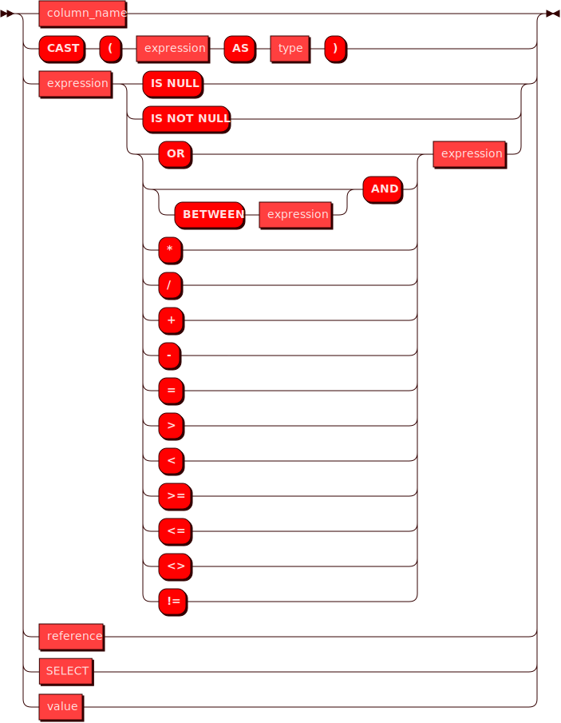
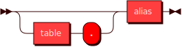
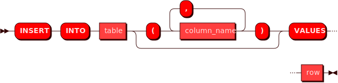

# Справочник команд SQL
Справочник команд предоставляет основные варианты использования команд SQL в Picodata при работе с распределенной СУБД.

Функциональность компонента Sbroad в Picodata обеспечивает поддержку распределенных запросов `SELECT` и `INSERT` c поддержкой анализатора запросов `EXPLAIN`. Ниже на схеме показаны базовые варианты этих запросов.




## Использование SQL-команд в консоли Picodata
После подключения в консоли к узлу-маршрутизатору (роль router), можно
выполнять SQL-команды, т.е. добавлять данные в таблицы (spaces) и
получать их. Синтаксис команд учитывает особенности Lua-интерпретатора в
консоли Picodata и предполагает, что любой SQL-запрос должен содержаться
в обертке следующего вида: 
```
sbroad.execute([[запрос]], {значения передаваемых параметров})
```
Команды Sbroad будут отличаться в зависимости от того, записываем ли мы в БД данные (`INSERT`) или считываем их (`SELECT`).
Так как при SELECT-запросах мы не передаем каких-либо параметров, то содержимое фигурных скобок будет пустым. Пример:
```
sbroad.execute([[select *  from "products"]], {})
```

Запись строки данных в таблицу командой `INSERT` требует указания как полей, так и их значений:
```
sbroad.execute([[insert into "products" ("id", "name") values (?, ?)]], {1, "Alice"})
```

Ниже приведены подробности использования SQL-команд в Picodata.

## Запрос SELECT

Запрос `SELECT` используется для получения информации из указанной таблицы в базе данных. Он возвращает 0 или более строк из таблицы согласно поисковому запросу. 
В контексте распределенной системы, запрос `SELECT` в Picodata получает информацию из всех сегментов таблицы, которая может храниться на нескольких узлах кластера.

Cхема возможных распределенных запросов `SELECT` показана ниже.




### Примеры запросов

Для примера используем две тестовые таблицы:
- `products` с данными об остатках игрушек на складе;
- `orders` с данными о заказах соответствующих позиций;


Ниже показаны некоторые примеры работающих SQL-запросов с использованием данных из этих таблиц.

Вывод всей таблицы:
```
sbroad.execute([[select * from "products"]], {})
```

Пример вывода в консоль:
```
---
- {'metadata': [{'name': 'id', 'type': 'integer'}, {'name': 'name', 'type': 'string'},
    {'name': 'product_units', 'type': 'integer'}], 'rows': [[1, 'Woody', 2561], [
      3, 'Bo Peep', 255], [6, 'Rex', 998], [7, 'Hamm', 66], [8, 'Mrs. Davis', 341],
    [2, 'Buzz Lightyear', 4781], [4, 'Mr. Potato Head', 109], [5, 'Slinky Dog', 1112],
    [9, 'Molly Davis', 235], [10, 'Sid Phillips', 78]]}
...
```
_Примечание_: строки в выводе идут в том порядке, в каком их отдают узлы хранения Picodata (с ролью `storage`).

Вывод строки по известному `id`:
```
sbroad.execute([[select "name" from "products" where "id"=1]], {})
```

Пример вывода в консоль:
```
---
- {'metadata': [{'name': 'name', 'type': 'string'}], 'rows': [['Woody']]}
...
```

Вывод строк по нескольким условиям для разных столбцов:
```
sbroad.execute([[select "name","product_units" from "products" where "id">3 and "product_units">200 ]], {})
```

Пример вывода в консоль:
```
---
- {'metadata': [{'name': 'name', 'type': 'string'}, {'name': 'product_units', 'type': 'integer'}],
  'rows': [['Rex', 998], ['Mrs. Davis', 341], ['Slinky Dog', 1112], ['Molly Davis',
      235]]}
...
```
Используется в:

* expression
* query
* select

### **values**


Используется в:
* select


### **row**


Используется в:
* insert
* value


### **column**




Используется в:

* select

### **expression**




Используется в:

* cast
* column
* expression
* select

### **group by**

<!--  -->


Используется в:

* select

### **reference**




Используется в:

* expression
* groupby
* insert


### **value**


Используется в:

* select
* expression
* values

### **cast**

<!--  -->


Используется в:

* groupby

### **type**


Используется в:

* cast

## Использование VALUES
Команда `VALUES` представляет собой конструктор строки значений для
использования в запросе `SELECT`. В некотором смысле, передаваемые с
`VALUES` значения являются временной таблицей, которая существует только
в рамках запроса. Использовать `VALUES` имеет смысл тогда, когда
требуется получить набор строк, для которых известны значения одного или
более столбцов. Например, с помощью команды ниже можно выяснить название
товара, зная количество сделанных по нему заказов:

```
sbroad.execute([[select "order" from "orders" where ("amount") in (values (109))]], {})
```
Пример вывода в консоль:
```
---
- {'metadata': [{'name': 'order', 'type': 'string'}], 'rows': [['Woody']]}
...

```


### **values**

<!--  -->

Используется в:

* insert
* query

## Использование UNION ALL
Команда `UNION ALL` используется для соединения результатов нескольких
запросов. Это может быть полезно для объединения данных из нескольких
таблиц, или для удобного отображения разных вычислений или манипуляций
со строками таблицы.

Для примера посчитаем общее количество товаров на складе и сравним его с общим числом заказов:
```
sbroad.execute([[select sum("product_units") from "products" union all select sum("amount") from "orders"]], {})
```

Пример вывода в консоль:
```
---
- {'metadata': [{'name': 'COL_1', 'type': 'decimal'}], 'rows': [[10536], [363]]}
...
```

## Использование EXCEPT
Команда `EXCEPT` используется для соединения нескольких запросов
`SELECT` по принципу исключения. Это означает, к примеру, что из
результата первого запроса будут исключены результаты второго, если
между ними есть пересечение. `EXCEPT` может применяться при запросах из
разных таблиц, либо разных столбцов одной таблицы, когда нужный
результат нельзя получить лишь одним SELECT-запросом.

Для более наглядной демонстрации предположим, что требуется получить
данные об остатках на складе каждого товара, который был заказан менее
50 раз. Для этого используем команду `EXCEPT`: 
```
sbroad.execute([[select "id","name" from "products" except select "id","order" from "orders" where "amount">50]], {})
```
Пример вывода в консоль:
```
---
- {'metadata': [{'name': 'id', 'type': 'integer'}, {'name': 'name', 'type': 'string'}],
  'rows': [[6, 'Rex'], [7, 'Hamm'], [8, 'Mrs. Davis'], [4, 'Mr. Potato Head'], [5,
      'Slinky Dog'], [9, 'Molly Davis'], [10, 'Sid Phillips']]}
...
```


## Запрос INSERT
Запрос `INSERT` используется для помещения (записи) строки данных в
таблицу. На данный момент доступна запись только одной строки в рамках
одного запроса.

Схема возможных запросов `INSERT` показана ниже.




### Пример запроса
Пример использования со вставкой строки значений в таблицу при помощи команды `INSERT`:

```
sbroad.execute([[insert into "products" ("id", "name", "product_units") values (?, ?, ?)]], {1, "Woody", 2561})
```

Вывод в консоль при успешной вставке:

```
---
- {'row_count': 1}

```

Используется в:

* query


## Запрос EXPLAIN
Команда `EXPLAIN` добавляется перед командами `SELECT` и `INSERT` для
того чтобы показать то как будет выглядеть запрос, при этом не выполняя
его. План запроса строится на узле-маршрутизаторе (роль `router`) и
позволяет наглядно оценить структуру и последовательность действий при
выполнении запроса. `EXPLAIN` является инструментом для анализа и
оптимизации запросов.

Схема использования `EXPLAIN` показана ниже.


### Пример запроса
Примером может служить любой поддерживаемый SQL-запрос:

```
sbroad.execute([[explain select "order" from "orders" where ("amount") in (values (109))]], {})
```

Пример вывода в консоль:
```
---
- ['projection ("orders"."order" -> "order")', '    selection ROW("orders"."amount")
    in ROW($0)', '        scan "orders"', 'subquery $0:', 'motion [policy: full]',
  '            scan', '                values', '                    value row (data=ROW(109))']
...
```

Грамматический разбор дерева запроса:
```
- Explain > Select
  - Projection > Column > Reference > ColumnName: "\"order\""
  - Scan > Table: "\"orders\""
  - Selection > In
    - Row > Reference > ColumnName: "\"amount\""
    - SubQuery > Values > ValuesRow > Row > Unsigned: "109"
- EOF > EOI: ""

```


Читать далее: [Перечень поддерживаемых типов данных](../sql_datatypes)
<!-- ebnf source: https://git.picodata.io/picodata/picodata/sbroad/-/blob/main/doc/sql/query.ebnf -->
