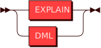
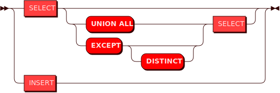
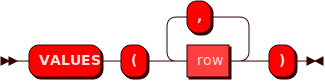

# Справочник команд SQL
Справочник команд предоставляет основные варианты использования команд SQL в Picodata при работе с распределенной СУБД.

Функциональность компонента Sbroad в Picodata обеспечивает поддержку
распределенных запросов для записи и чтения данных. На верхнем уровне
схема возможных SQL-запросов в Picodata включает команды для собственно
манипуляции данными (DML), к которым относятся `SELECT` и `INSERT`, а
также отдельную команду `EXPLAIN` для анализа и планирования DML-запросов ([подробнее](#explain)).

Это отражено на схеме ниже: 

### **STATEMENT**



В свою очередь, схема возможных DML-запросов имеет следующий вид:

### **DML**


Ниже приведены особенности синтаксиса команд и дано описание часто используемых команд с примерами их выполнения.

## Использование SQL-команд в консоли Picodata
После подключения в консоли к узлу-маршрутизатору (роль router), можно
выполнять SQL-команды, т.е. добавлять данные в таблицы (spaces) и
получать их. Синтаксис команд учитывает особенности Lua-интерпретатора в
консоли Picodata и предполагает, что любой SQL-запрос должен содержаться
в обертке следующего вида: 
```
sbroad.execute([[запрос]], {значения передаваемых параметров})
```
Команды Sbroad будут отличаться в зависимости от того, записываем ли мы в БД данные (`INSERT`) или считываем их (`SELECT`).
Так как при SELECT-запросах мы не передаем каких-либо параметров, то содержимое фигурных скобок будет пустым. Пример:
```
sbroad.execute([[select *  from "products"]], {})
```

Запись строки данных в таблицу командой `INSERT` возможна как в обычном виде:
```
sbroad.execute([[insert into "products" ("id", "name") values (1, 'Alice')]], {})
```
Так и параметризированном:
```
sbroad.execute([[insert into "products" ("id", "name") values (?, ?)]], {1, 'Alice'})
```

Ниже приведены подробности использования SQL-команд в Picodata.

## Запрос SELECT

Запрос `SELECT` используется для получения информации из указанной
таблицы в базе данных. Он возвращает 0 или более строк из таблицы
согласно поисковому запросу. В контексте распределенной системы, запрос
`SELECT` в Picodata получает информацию из всех сегментов таблицы,
которая может храниться на нескольких узлах кластера. В Picodata
источником данных для запроса `SELECT` может выступать таблица, строка
значений или другой подзапрос. Также можно соединять несколько запросов
одного уровня вместе.

Cхема возможных распределенных запросов `SELECT` показана ниже.

### **SELECT**


### Примеры запросов

Для примера используем две тестовые таблицы:
- `products` с данными об остатках игрушек на складе;
- `orders` с данными о заказах соответствующих позиций;


Ниже показаны некоторые примеры работающих SQL-запросов с использованием данных из этих таблиц.

Вывод всей таблицы:
```
sbroad.execute([[select * from "products"]], {})
```

Вывод в консоль:
```
---
- {
  'metadata': 
  [{'name': 'id', 'type': 'integer'}, 
   {'name': 'name', 'type': 'string'},
   {'name': 'product_units', 'type': 'integer'}],
  'rows': [
   [1, 'Woody', 2561], 
   [3, 'Bo Peep', 255], 
   [6, 'Rex', 998], 
   [7, 'Hamm', 66],
   [8, 'Mrs. Davis', 341],
   [2, 'Buzz Lightyear', 4781], 
   [4, 'Mr. Potato Head', 109],
   [5, 'Slinky Dog', 1112],
   [9, 'Molly Davis', 235],
   [10, 'Sid Phillips', 78]]
   }
...
```
_Примечание_: строки в выводе идут в том порядке, в каком их отдают узлы хранения Picodata (с ролью `storage`).

Вывод строки по известному `id`:
```
sbroad.execute([[select "name" from "products" where "id"=1]], {})
```

Вывод в консоль:
```
---
- {'metadata': [{'name': 'name', 'type': 'string'}], 'rows': [['Woody']]}
...
```

Вывод строк по нескольким условиям для разных столбцов:
```
sbroad.execute([[select "name","product_units" from "products" where "id">3 and "product_units">200 ]], {})
```

Вывод в консоль:
```
---
- {
  'metadata': 
  [{'name': 'name', 'type': 'string'},
   {'name': 'product_units', 'type': 'integer'}],
  'rows': [
   ['Rex', 998],
   ['Mrs. Davis', 341],
   ['Slinky Dog', 1112],
   ['Molly Davis', 235]]
   }
...
```

Структурно SQL-запрос состоит из трех частей:

1. То, что требуется получить
2. Разделяющий оператор `from`
3. Оставшаяся часть запроса, которая логически представляет собой одну
   сущность и может включать как простое указание на таблицу, так и
   конструкцию из разных условий.

### **values**




### **row**


### **column**


### **expression**


### **reference**


### **value**


### **type**


## Использование VALUES
Команда `VALUES` представляет собой конструктор строки значений для
использования в запросе `SELECT`. В некотором смысле, передаваемые с
`VALUES` значения являются временной таблицей, которая существует только
в рамках запроса. Использовать `VALUES` имеет смысл тогда, когда
требуется получить набор строк, для которых известны значения одного или
более столбцов. Например, с помощью команды ниже можно выяснить название
товара, зная количество сделанных по нему заказов:

```
sbroad.execute([[select "order" from "orders" where ("amount") in (values (109))]], {})
```
Вывод в консоль:
```
---
- {'metadata': [{'name': 'order', 'type': 'string'}], 'rows': [['Woody']]}
...

```


## Использование UNION ALL
Команда `UNION ALL` используется для соединения результатов нескольких
запросов. Это может быть полезно для объединения данных из нескольких
таблиц, или для удобного отображения разных вычислений или манипуляций
со строками таблицы. Результат запроса может содержать дублирующиеся строки.

Для примера посчитаем общее количество товаров на складе и сравним его с общим числом заказов:
```
sbroad.execute([[select sum("product_units") from "products" union all select sum("amount") from "orders"]], {})
```

Вывод в консоль:
```
---
- {'metadata': [{'name': 'COL_1', 'type': 'decimal'}], 'rows': [[10536], [363]]}
...
```

## Использование EXCEPT
Команда `EXCEPT` используется для соединения нескольких запросов
`SELECT` по принципу исключения. Это означает, к примеру, что из
результата первого запроса будут исключены результаты второго, если
между ними есть пересечение. `EXCEPT` может применяться при запросах из
разных таблиц, либо разных столбцов одной таблицы, когда нужный
результат нельзя получить лишь одним SELECT-запросом.

Для более наглядной демонстрации предположим, что требуется получить
данные об остатках на складе каждого товара, который был заказан менее
50 раз. Для этого используем команду `EXCEPT`: 
```
sbroad.execute([[select "id","name" from "products" except select "id","order" from "orders" where "amount">50]], {})
```
Вывод в консоль:
```
---
- {
  'metadata':
  [{'name': 'id', 'type': 'integer'},
   {'name': 'name', 'type': 'string'}],
  'rows': [
   [6, 'Rex'],
   [7, 'Hamm'],
   [8, 'Mrs. Davis'],
   [4, 'Mr. Potato Head'],
   [5, 'Slinky Dog'],
   [9, 'Molly Davis'],
   [10, 'Sid Phillips']]
   }
...
```
## Использование JOIN
Команда `JOIN` используется для комбинирования данных из нескольких
таблиц. Но, в отличие от `UNION ALL`, результатом будет объединение не
строк, а столбцов. Таким образом, если `UNION ALL` добавляет к строкам
одной таблицы строки другой (при условии совпадения типов данных в
соответствующих столбцах), то `JOIN` создает новую результирующую
таблицу из указанных столбцов этих таблиц. Использование `JOIN` полезно
для соединения связанных друг с другом данных из разных таблиц.
Склеивание столбцов требует указания условия (оператор `ON`). Для
примера создадим из двух таблицы выше новую результирующую таблицу, где
будут одновременно и остатки на складе, и заказы:


Команда:

```
sbroad.execute([[select "id","name","product_units","amount" as "orders" from "products" join (select "id" as "number","amount" from "orders") as orders on "products"."id"=orders."number"]], {})

```

Вывод в консоль:
```
---
- {
  'metadata': 
  [{'name': 'products.id', 'type': 'integer'}, 
   {'name': 'products.name', 'type': 'string'}, 
   {'name': 'products.product_units', 'type': 'integer'},
   {'name': 'orders', 'type': 'integer'}], 
  'rows': 
  [[1, 'Woody', 2561, 109], 
   [3, 'Bo Peep', 255, 65], 
   [6, 'Rex', 998, 29], 
   [7, 'Hamm', 66, 27], 
   [8, 'Mrs. Davis', 341, 15], 
   [2, 'Buzz Lightyear', 4781, 87], 
   [4, 'Mr. Potato Head', 109, 3], 
   [5, 'Slinky Dog', 1112, 14], 
   [9, 'Molly Davis', 235, 5], 
   [10, 'Sid Phillips', 78, 9],]
   }
...
```
Если после оператора `JOIN` следует подзапрос (как в примере выше), то обязательно использование псевдонима (`AS`).


## Использование функции CAST()
Функция `CAST()` используется для изменения получаемого типа данных при
SELECT-запросах. С ее помощью можно преобразовать числа в текст, дробные
числа в целые и так далее согласно приведённой [выше](#type) схеме. В
частности, поддерживаются следующие типы данных:

- `ANY`. Любой тип данных / тип данных не задан;
- `BOOL`, `BOOLEAN`. Логический тип данных, поддерживаемые значения: `FALSE`, `TRUE` и `NULL` (`UNKNOWN` в терминологии троичной логики). По правилам сравнения `FALSE` меньше `TRUE`.
- `DECIMAL`. Числа с фиксированной запятой, содержащие до 38 цифр;
- `DOUBLE` Числа с плавающей запятой стандарта IEEE 754. Помимо стандартной записи дробного числа (например, `0.5`) поддерживается и экспоненциальная форма (например, `5E-1`);
- `INT`, `INTEGER`. Целые числа в диапазоне от `-2^63` до `+2^64` или `NULL`;
- `NUMBER`. Универсальный числовой контейнер, в котором могут лежать как
  целые числа, так и числа с плавающей запятой;
- `SCALAR`. Скалярный тип данных, т.е содержащий только один элемент (_не_ кортеж и _не_ массив);
- `STRING`, `TEXT`. Текстовый тип данных. Позволяет хранить текстовую
  строку переменной длины. Максимальная длина составляет `2,147,483,647`
  байт;
- `UNSIGNED`. Тип целого беззнакового числа в диапазоне от `0` до `+2^64` или `NULL`.
- `VARCHAR`. Текстовый тип данных с явно заданной длиной строки.

### Пример запроса
В качестве примера покажем преобразование дробных чисел в целые с отбрасыванием дробной части.
Используем следующую таблицу:


В обычном виде значения столбца `score` имеют дробную часть и определены в схеме данных типом `decimal`:
```
sbroad.execute([[select "score" from "scoring"]], {})
---
- {
  'metadata': [
   {'name': 'score', 'type': 'decimal'}], 
  'rows': [
    [78.33],
    [84.61],
    [47.28]]
    }
...

```
Преобразуем эти числа в `int`:
```
sbroad.execute([[select cast("score" as int) from "scoring"]], {})
---
- {
  'metadata': [
  {'name': 'COL_1', 'type': 'integer'}],
  'rows': [
  [78],
  [84],
  [47]]
  }
...

```
## Использование псевдонимов
Использование псевдонимов (aliases) позволяет переопределить названия
получаемых столбцов в SELECT-запросах. Псевдоним вставляется после
ключевого слова `AS` и может содержать произвольный текст со следующими
ограничениями: он не должен начинаться с цифры и не может содержать
пробелов и специальных служебных символов (кроме знака подчеркивания).

Пример для вывода столбцы таблицы:
```
sbroad.execute([[select "score" as "Total_score" from "scoring"]], {})
---
- {
  'metadata': [
    {'name': 'Total_score', 'type': 'decimal'}], 
  'rows': [
    [78.33],
    [84.61],
    [47.28]]
    }
...
```

Пример для функции `CAST()`:
```
sbroad.execute([[select sum(cast("score" as int)) as "_Total_score_1" from "scoring"]], {})
---
- {
  'metadata': [
    {'name': '_Total_score_1', 'type': 'decimal'}], 
  'rows': 
  [[209]]}
...
```

## Запрос INSERT
Запрос `INSERT` используется для помещения (записи) строки данных в
таблицу. На данный момент доступна запись только одной строки в рамках
одного запроса.

Схема возможных запросов `INSERT` показана ниже.


### Пример запроса
Пример использования со вставкой строки значений в таблицу при помощи команды `INSERT`:

```
sbroad.execute([[insert into "products" ("id", "name", "product_units") values (?, ?, ?)]], {1, 'Woody', 2561})
```

В данном случае использовалась параметризированная вставка с явным
указанием столбцов таблицы. Если вставляемая строка точно содержит
значения для всех столбцов, то их можно явно не указывать:

```
sbroad.execute([[insert into "products" values (1, 'Woody', 2561)]], {})
```

Вывод в консоль при успешной вставке:

```
---
- {'row_count': 1}

```


## Запрос EXPLAIN
Команда `EXPLAIN` добавляется перед командами `SELECT` и `INSERT` для
того чтобы показать как будет выглядеть план исполнения запроса, при этом не выполняя
сам запрос. План строится на узле-маршрутизаторе (роль `router`) и
позволяет наглядно оценить структуру и последовательность действий при
выполнении запроса. `EXPLAIN` является инструментом для анализа и
оптимизации запросов.

Схема использования `EXPLAIN` показана ниже.


### **EXPLAIN**


### Простые запросы
Для начала рассмотрим план простого запроса на получение данных одного столбца таблицы:

```
sbroad.execute([[explain select "score" from "scoring"]], {})
```

Вывод в консоль:
```
---
- [
  'projection ("scoring"."score" -> "score")', 
  '    scan "scoring"']
...
```
Обязательными элементами плана запроса являются `scan` и `projection`.
Первый узел отвечает за сканирование (получение данных) таблицы, второй
— за выборку нужных столбцов. Построение проекции (`projection`) всегда
происходит после сканирования. В рамках построения проекции планировщик
создает псевдоним для столбца: `"scoring"."score" -> "score"`.

Если в запросе есть условие (`where`), то в план добавляется узел `selection`:

```
sbroad.execute([[explain select "score" from "scoring" where "score">70]], {})
```

Вывод в консоль:
```
---
- [
  'projection 
  ("scoring"."score" -> "score")', 
  '    selection ROW("scoring"."score") > ROW(70)', 
  '        scan "scoring"']
...
```
Если `projection` выбирает столбцы (атрибуты таблицы), то `selection`
фильтрует данные по строкам (`ROW`).

Фраза `selection ROW("scoring"."score") > ROW(70)'` является результатом
трансформации фильтра `where "score" > 70` в `where ("score") > (70)`, т.е.
превращения значения в строку из одного столбца. 

### Запрос с несколькими проекциями
Пример построения проекции из более сложного запроса:

```
sbroad.execute([[explain select "id","name" from "products" except select "id","order" from "orders" where "amount">50]], {})
```

Вывод в консоль:
```
---
- [
  'except', 
  '    projection ("products"."id" -> "id", "products"."name" -> "name")',
  '        scan "products"', 
  '    projection ("orders"."id" -> "id", "orders"."order" -> "order")', 
  '        selection ROW("orders"."amount") > ROW(50)', 
  '            scan  "orders"']
...

```
В таком плане запроса присутствует два блока `projection`, перед
которыми стоит логическое условие (`except`). В каждом блоке есть свое
сканирование таблицы и, опционально, дополнительный фильтр по строкам
(`selection`).

### Варианты перемещения данных
В плане запроса может быть указан параметр `motion`, который отражает тип перемещения данных между узлами хранения. Существуют следующие два типа:

1. **Частичный**. При выполнении запроса на каждый узел кластера будет
   отправлена только востребованная часть данных (таблица перераспределяется по новому ключу). При таком запросе планировщик отобразит значение `motion [policy:   segment]`.
1. **Полный**. На каждый узел кластера будет отправлена вся таблица. Планировщик отобразит значение `motion [policy:   full]`.

#### Пример `motion [policy:   segment]`.
```
sbroad.execute([[explain insert into "orders" ("id", "order", "amount") values (?, ?, ?)]], {12, "Sid Phillips", 98})
```
Вывод в консоль:
```
---
[
 'insert "orders"', 
 '    projection (COL_0 -> COL_0, COL_1 -> COL_1, COL_2 -> COL_2, bucket_id((coalesce((''NULL'', COL_0::string)) || coalesce((''NULL'', COL_1::string)))))',
 '        scan', 
 '            projection (COLUMN_1::int -> COL_0, COLUMN_2::string -> COL_1, COLUMN_3::int -> COL_2)', 
 '                scan', 
 '                    motion [policy: segment([ref(COLUMN_1), ref(COLUMN_2)])]', 
 '                        values',
 '                            value row (data=ROW(12, ''Sid Phillips'', 98))'
]
...
```

#### Пример `motion [policy:   full]`.
```
sbroad.execute([[explain select "id","name","product_units","amount" as "orders" from "products" join (select "id" as "number","amount" from "orders") as orders on "products"."id"=orders."number"]], {})
```

Вывод в консоль:
```
---
- [
  'projection 
  ("products"."id" -> "id", "products"."name" -> "name", "products"."product_units" -> "product_units", "ORDERS"."amount" -> "orders")', 
  '    join on ROW("products"."id") = ROW("ORDERS"."number")', 
  '        scan "products"', 
  '            projection
               ("products"."id" -> "id", "products"."name" -> "name", "products"."product_units" -> "product_units")', 
               '                scan "products"', 
               '        motion [policy:   full]', 
               '            scan "ORDERS"', 
               '                projection ("orders"."id" -> "number", "orders"."amount" -> "amount")', 
               '                    scan "orders"'
  ]
...
```
Читать далее: [Перечень
поддерживаемых типов данных](../sql_datatypes)
<!-- ebnf source: https://git.picodata.io/picodata/picodata/sbroad/-/blob/main/doc/sql/query.ebnf -->

---
[Исходный код страницы](https://git.picodata.io/picodata/picodata/docs/-/blob/main/docs/sbroad/sql_queries.md)
