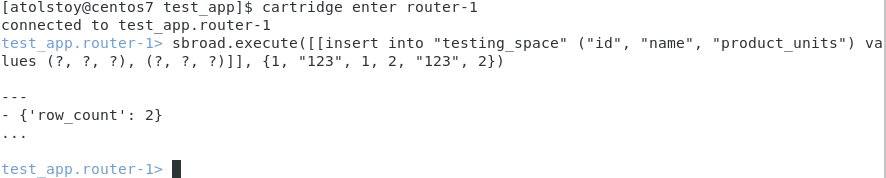
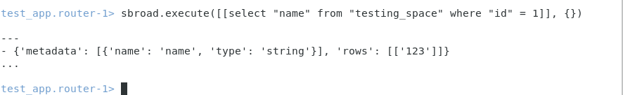

# Пример работы с приложением Picodata SQL
## Общие сведения для установки
На данный момент функциональность Picodata SQL обеспечивается только для приложений, использующих Tarantool Cartridge. Однако, при этом требуется использовать версию Tarantool, которая поставляется вместе с программным продуктом Picodata. Для использования Picodata SQL требуется установить компонент SQL Broadcaster согласно инструкциям в его [Git-репозитории](https://git.picodata.io/picodata/picodata/sbroad). Установка возможна либо путём компиляции исходного кода, либо посредством утилиты `tarantoolctl`. В обоих случаях требуется выполнять команды из директории Cartridge-приложения. Для ознакомления и тестирования удобно воспользоваться [тестовым приложением](https://git.picodata.io/picodata/picodata/sbroad/-/tree/main/sbroad-cartridge/test_app), поставляемым вместе с кодом SQL Broadcaster.

## Пример установки для CentOS 7
Ниже показан пример установки сборочных зависимостей и компиляции исходного кода SQL Broadcaster в операционной системе CentOS 7. Шаги для других дистрибутивов Linux могут отличаться. Для начала требуется подключить репозиторий с пакетами Picodata. Этот этап документирован для [страницы загрузки Picodata](https://picodata.io/download/). Далее предлагается выполнить в терминале следующие команды:

<style>
  code {
    white-space : pre-wrap !important;
    word-break: break-word;
  }
</style>

````bash
sudo yum --disablerepo="*" --enablerepo="picodata" install -y tarantool-picodata tarantool-picodata-devel
sudo yum install cartridge-cli
sudo yum groupinstall -y "Development Tools"
sudo yum install rust cargo cmake3
sudo ln -s /usr/bin/cmake3 /usr/local/bin/cmake
git clone https://git.picodata.io/picodata/picodata/sbroad.git
cd sbroad/sbroad-cartridge/test_app
````

Сборка SQL Broadcaster, запуск приложения, настройка тестового шардирования:
````bash
cd .. && make build_integration
cd test_app
cartridge start -d
cartridge replicasets setup --bootstrap-vshard
````
## Пример использования
Перед тем как применять команды SQL Broadcaster, требуется загрузить в тестовое приложение корректную схему данных. Для этого откройте веб-страницу Cartridge (`localhost:8081`), перейдите в раздел Code и вставьте в поле файла `schema.yml` следующее содержимое:
<details>
  <summary>Показать:</summary>

````bash
spaces:
    testing_space:
      format:
      - type: integer
        name: id
        is_nullable: false
      - type: string
        name: name
        is_nullable: false
      - type: integer
        name: product_units
        is_nullable: false
      - type: unsigned
        name: bucket_id
        is_nullable: true
      temporary: false
      engine: memtx
      is_local: false
      sharding_key:
      - id
      - name
      indexes:
      - unique: true
        parts:
        - path: id
          type: integer
          is_nullable: false
        name: id
        type: TREE
      - unique: false
        parts:
        - path: bucket_id
          type: unsigned
          is_nullable: true
        name: bucket_id
        type: TREE
        testing_space:
      format:
      - type: integer
        name: id
        is_nullable: false
      - type: string
        name: name
        is_nullable: false
      - type: integer
        name: product_units
        is_nullable: false
      - type: unsigned
        name: bucket_id
        is_nullable: true
      temporary: false
      engine: memtx
      is_local: false
      sharding_key:
      - id
      - name
      indexes:
      - unique: true
        parts:
        - path: id
          type: integer
          is_nullable: false
        name: id
        type: TREE
      - unique: false
        parts:
        - path: bucket_id
          type: unsigned
          is_nullable: true
        name: bucket_id
        type: TREE
        
````
</details>

Не забудьте нажать кнопку `Apply`.

## Запись и чтение данных
Запросы на запись или чтение данных следует выполнять из консоли после
подключения к инстансу Tarantool. В данном тестовом примере для этого
достаточно подключиться к первому маршрутизатору:

````bash
cartridge enter router-1
````

После этого в строке приглашения можно вставить кортеж данных в таблицу посредством SQL Broadcaster:
```
sbroad.execute([[insert into "testing_space" ("id", "name", "product_units") values (?, ?, ?), (?, ?, ?)]], {1, "123", 1, 2, "123", 2})
```
Внешний вид консоли с образцом вывода команды показан на рисунке ниже.



После того как данные записаны в таблицу, их можно прочитать. Пример чтения данных посредством SQL Broadcaster:

```
sbroad.execute([[select "name" from "testing_space" where "id" = 1]], {})
```

Внешний вид консоли с образцом вывода команды показан на рисунке ниже.



См. также: [Поддерживаемые функции стандарта SQL](../sql_reference)

---
[Исходный код страницы](https://git.picodata.io/picodata/picodata/docs/-/blob/main/docs/sbroad/sql_tutorial.md)
