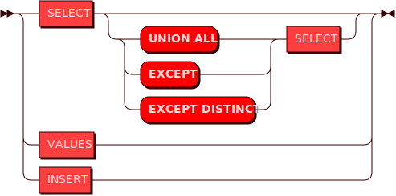
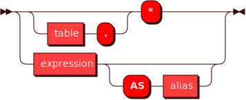
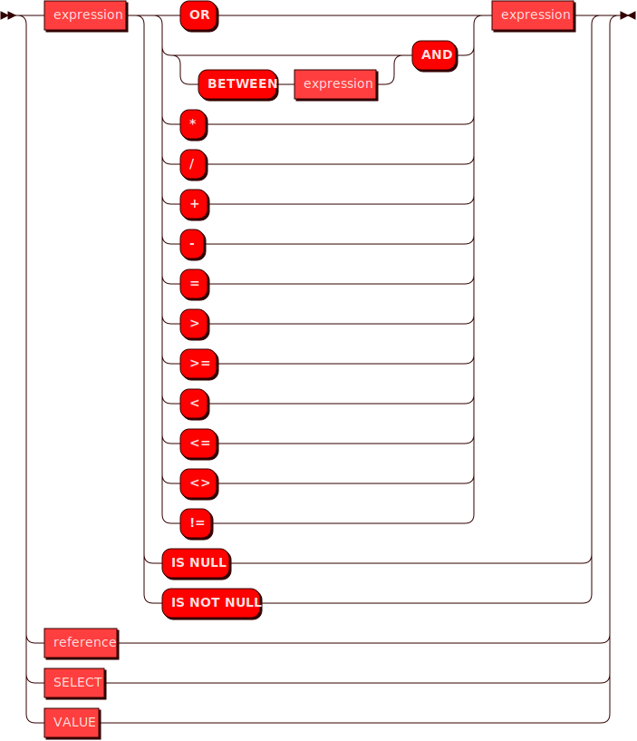
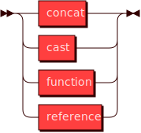
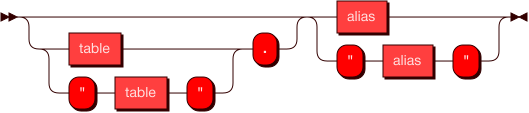
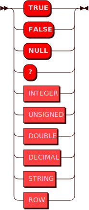
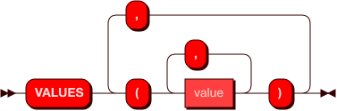

# Поддерживаемые запросы и их синтаксис
Функциональность компонента SQL Broadcaster обеспечивает поддержку распределенных запросов SELECT и INSERT. Ниже на схеме показаны базовые варианты этих запросов.




## Запрос SELECT

Cхема возможных запросов SELECT показана ниже


### Примеры запросов
```
SELECT "identification_number", "product_code" FROM "hash_testing"
        WHERE "identification_number" = 1"
```

```
SELECT "identification_number", "product_code"
        FROM "hash_testing"
        WHERE "identification_number" = 1 AND "product_code" = '1'
        OR "identification_number" = 2 AND "product_code" = '2'
```

```
SELECT *
        FROM
            (SELECT "identification_number", "product_code"
            FROM "hash_testing"
            WHERE "sys_op" = 1
            UNION ALL
            SELECT "identification_number", "product_code"
            FROM "hash_testing_hist"
            WHERE "sys_op" > 1) AS "t3"
        WHERE "identification_number" = 1
```


Используется в:

* EXPRESSION
* INSERT
* QUERY
* SELECT

### **COLUMN**




Используется в:

* Select

### **EXPRESSION**




Используется в:

* Cast
* Column
* Expression
* Select

### **GROUP BY**




Используется в:

* Select

### **REFERENCE**




Используется в:

* Expression
* GroupBy
* Insert

### **VALUE**




Используется в:

* Expression
* Values

### **CAST**


Используется в:

* GroupBy

### **TYPE**


Используется в:

* Cast

## Запрос INSERT

**INSERT**


### Пример запроса
```
INSERT INTO "t" VALUES(1, 2, 3, 4)
```

Используется в:

* Query


### **VALUES**




Используется в:

* Insert
* Query

Читать далее: [Перечень поддерживаемых типов данных](../sql_datatypes)
