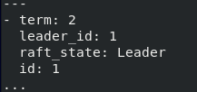
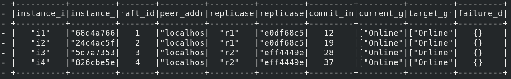
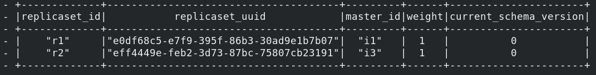
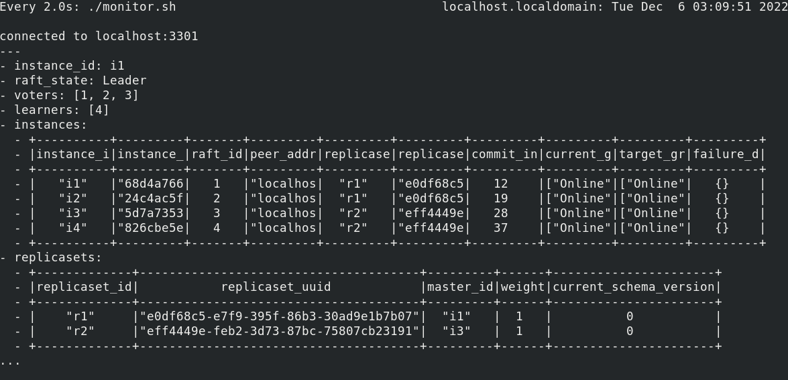

# Пример работы с кластером Picodata
В данном разделе приведены практические примеры команд, которые помогут
сделать первые шаги в управлении распределенным кластером Picodata. В
частности, в данном разделе рассмотрены следующие вопросы:

* Запуск кластера
* Мониторинг состояния кластера
* Первые действия в только что созданном кластере
* Запись и чтение данных в кластере
* Балансировка данных в кластере

## Запуск кластера
Запуск кластера сводится к выполнению команды `picodata run` с нужным
набором параметров для каждого инстанса (узла). Полный перечень
возможных параметров запуска и их описание содержатся в подразделе
[Описание параметров запуска](../cli), а также в выводе команды
`picodata run --help`. С точки зрения внутренней архитектуры, _кластер_
  корректно называть _Raft-группой_ — в дальнейшем при мониторинге и
управлении конфигурацией будет уместнее использовать именно этот термин.
Для данного примера допустим, что в локальном кластере
(127.0.0.1/localhost) будет 4 инстанса с фактором репликации равным 2,
что означает наличие 2-х репликасетов. Запустим первый инстанс, указав
необходимые параметры:
```bash
picodata run --init-replication-factor=2 --listen :3301 --data-dir=inst1
```
Следует обратить внимание на следующие моменты:

* Параметр `init-replication-factor` задается лишь один раз в момент
создания кластера и дальше не требуется. Перезапускать данный инстанс в
дальнейшем нужно без этого параметра. 
* Параметр `listen` может содержать только номер порта (по умолчанию для
первого инстанса используется 3301), что означает указание
использовать _текущий_ хост. В настоящем распределенном кластере
указывать IP-адрес в данном параметре обязательно.
* Параметр `data-dir` указывает на директорию, в которой будут храниться
персистентные данные инстансы (файлы `*.snap` и `*.xlog`). Если при
первом запуске задать несуществующую директорию, то она будет
автоматически создана. 
* Будет создан кластер со стандартным названием `demo`, т.к. явно не
указан параметр `cluster-id` (см. [подробнее](../cli)).

Аналогично следует запустить остальные 3 инстанса, указав им отличные от
3301 разные порты и другие рабочие директории. В случае с кластером на
удаленных узлах потребуется также указать данным инстансам параметр
`peer` (см. [подробнее](../cli)).

## Мониторинг состояния кластера
Для мониторинга состояния кластера удобно использовать команды,
показывающие состояние Raft-группы, отдельных инстансов и собранных из
них репликасетов. Для использования указанных комманд следует
сначала подключиться к какому-либо инстансу с помощью команды
`tarantoolctl connect`.
Примеры команд и их выводов приведены ниже.

Узнать лидера Raft-группы, а также ID и статус текущего инстанса:
```
pico.raft_status()
```

Пример вывода:



Просмотр состава Raft-группы и данных инстансов:
```
box.space.raft_group:fselect()
```
Пример вывода:




Просмотр списка репликасетов, их веса и версии схемы данных:
```
box.space.replicasets:fselect()
```
Пример вывода:



Эти и другие команды сведены в Bash-скрипт, который можно загрузить и
выполнить для более удобного мониторинга кластера Picodata. Это можно
сделать следующим образом:

```
curl -sSf https://git.picodata.io/picodata/picodata/picodata/-/blob/master/docs/picodata-list.sh | watch
```

Внешний вид выполняющегося скрипта показан ниже.



Данный скрипт выполняет, в частности, следующие действия:

* При выполнении без аргументов подключается к первому локальному
инстансу localhost:3301 с помощью консоли `tarantoolctl`. В качестве
аргумента скрипту можно передать произвольное значение `<host:port>`.
* Выводит идентификатор (значение `instance_id`) текущего инстанса.
* Выводит статус текущего инстанса в Raft.
* Выводит количество голосующих/неголосующих узлов (`voters`/`learners`) в кластере.
* Выводит таблицы со списками инстансов и репликасетов.
* Позволяет узнать текущий и целевой уровень (`grade`) каждого инстанса,
а также вес (`weight`) репликасета. Уровни отражают конфигурацию
остальных инстансов относительно текущего, а вес репликасета — его
наполненность репликами согласно фактору репликации (см.
[подробнее](../clustering)).


## Создание схемы данных
Перед тем как начать пользоваться СУБД, необходимо создать таблицу,
которая в терминологии Tarantool называется `space`. Таблица является
необходимым элементом схемы данных, распространяемой на все узлы
кластера. Каждое действие по изменению схемы данных в Picodata
называется _миграцией_. Иными словами, миграция — это переход кластера
на использование более новой схемы данных. Любое действие по
созданию/изменению/удалению таблиц, работы с индексами хранения и т.д.
является изменением схемы данных. Каждое изменение инкрементирует версию
схемы данных в кластере.

После подключения к инстансу кластера посредством утилиты
`tarantoolctl`, начальным действием в пустом кластере будет добавление
первого `space`. Пусть в нем будет два поля: идентификатор записи и
идентификатор бакета, в которой эта запись хранится:

```bash
pico.add_migration(1, [[
CREATE TABLE "test" (
"id" int,
"bucket_id" unsigned,
PRIMARY KEY ("id")
);
]])
```

На данном этапе схема данных существует лишь локально, в коллекции
текущего инстанса. Посмотреть доступные инстансу схемы данных можно
командой `box.space.migrations:fselect()`. Результат будет выглядеть
следующим образом:

```bash
localhost:3301> box.space.migrations:fselect()
---
- - ​+-----+-------------------------------------------------------------------------------------------+
- ​| id  |                                           body                                            |
- ​+-----+-------------------------------------------------------------------------------------------+
- ​|  1  |"CREATE TABLE \"test\" (\n\"id\" int,\n\"bucket_id\" unsigned,\nPRIMARY KEY (\"id\")\n);\n"|
- ​+-----+-------------------------------------------------------------------------------------------+
...

```
Теперь можно применить схему в рамках кластера, введя команду
`pico.push_schema_version(1)`. Для того чтобы посмотреть параметры
созданного `space` следует использовать команду `box.space.test`, где
_test_ — название таблицы. Также следует обратить внимание, что в
скрипте мониторинга обновится номер текущей схемы в кластере:


В дальнейшем каждое изменение схемы данных в кластере будет приводить к увеличению этого номера.

## Вызов функций записи и чтения из БД
Для того, чтобы в таблицу/space можно было записывать данные, требуется
сначала создать индекс БД. Для этого создадим еще одну миграцию схемы
данных:

```bash
pico.add_migration(2, [[CREATE INDEX "bucket_id" on "test" ("bucket_id");]])
pico.push_schema_version(2)
```
После этого в таблицу можно вставлять строки, используя функцию записи из состава библиотеки `vshard`:

```bash
vshard.router.callrw (1, "box.space.test:insert", {{1, 1}})
```
Здесь первая и третья 1 — номер бакета, вторая — номер записи. Можно
делать множество записей с разными номерами в один и тот же бакет.
Пример для 4-й записи в 2000-м бакете:

```bash
vshard.router.callrw (2000, "box.space.test:insert", {{4, 2000}})
```
Просмотр сделанной записи:

```bash
vshard.router.callro (2000, "box.space.test:select")
```

## Запись и чтение данных
Для того чтобы записать в БД какие-либо настоящие данные (например,
текстовую строку), нам потребуется создать новый `space` с еще одним
полем для хранения такого текста, а также новым индексом. Это означает
проведение еще двух миграций схемы данных.

Добавим `space` с названием `test1`:

```bash
pico.add_migration(3, [[
CREATE TABLE "test1" (
"id" int,
"bucket_id" unsigned,
"text" string,
PRIMARY KEY ("id")
);
]])
pico.push_schema_version(3)
```

Создадим на нем индекс:
```bash
pico.add_migration(4, [[CREATE INDEX "bucket_id" on "test1" ("bucket_id");]])
pico.push_schema_version(4)
```

Для просмотра всех полей таблицы, включая текстовые, подойдет следующая
команда:
```bash
box.space.test1:format()
```

Пример записи текстовой строки:
```bash
vshard.router.callrw (1, "box.space.test1:insert", {{1, 1, "Sample text"}})
```

Проверка:
```bash
vshard.router.callro (1, "box.space.test1:select")
```

## Балансировка данных
Относительно бакетов в Picodata используются умолчания, принятые в СУБД
Tarantool, согласно которым в кластере всегда доступны 3000 бакетов.
Размер бакета динамичен: он определяется размером хранимых в нем данных.
Бакеты равномерно распределяются между репликасетами. В приведенном
здесь примере кластера из двух репликасетов, один из них хранит
диапазон бакетов от 0 до 1500, а второй — от 1501 до 3000.

Для того чтобы просмотреть хранящиеся в текущем репликасете бакеты,
используйте следующую команду:

```bash
box.space.test1:fselect()
```

Соответственно, если нужного бакета в списке нет, то он хранится в
другом репликасете, и данную команду нужно выполнять на нем. Просмотреть
список бакетов на текущем инстансе можно так:
```bash
box.space._bucket:fselect()
```
Балансировка данных в Picodata происходит автоматически при изменении
конфигурации кластера, например при добавлении новых инстансов. Во время
балансировки изменяется распределение бакетов между репликасетами. К
примеру, если в кластере добавится новый полный (с весом 1) репликасет,
то часть бакетов автоматически переедет на него. Это можно будет
заметить при выполнении команды `box.space._bucket:fselect()`.


Подробнее о внутренней архитектуре кластера Picodata см. в разделе [Общая схема инициализации кластера](../clustering). Параметры запуска из командной строки описаны в разделе [Описание параметров запуска](../cli).

