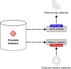

# Интеграция с внешними системами

В данном разделе приведена информация по интеграции Picodata с внешними
системами сбора информации и аналитики.

В составе Picodata поставляются следующие интеграционные модули:

- `gostech-audit-log` — экспорт событий журнала аудита в Logstash
- `gostech-metrics` — экспорт метрик Picodata

!!! tip "Picodata Enterprise"
    Функциональность интеграционных модулей доступна только в коммерческой версии Picodata.

Схема взаимодействия интеграционных модулей с внешними системами показана ниже.

<div align="center">

</div>

Модуль `gostech-audit-log` отправляет журнал аудита Picodata в Logstash.

Модуль `gostech-metrics` получает данные из инстанса Picodata и предоставляет
доступ к ним для внешних систем в формате Prometheus.

## Модуль gostech-audit-log {: #gostech_audit_log }

Задача модуля — разбор [журнала аудита](audit_log.md) Picodata и
отправка его на указанный пользователем адрес.

### Запуск модуля gostech-audit-log {: #external_audit_run }

Модуль `gostech-audit-log` запускается как еще один [способ
вывода журнала](audit_log.md#enable_audit_log).

Пример команды запуска:

```shell
picodata run --audit='| gostech-audit-log --url https://example.com'
```

В качестве `url` следует указать адрес внешнего сервера, принимающего
данные аудита.

## Модуль gostech-metrics {: #gostech-metrics }

Задача модуля — собирать и предоставлять для внешних систем параметры
работы СУБД Picodata. Для этого модуль предоставляет встроенный
HTTP-сервер.

### Запуск модуля gostech-metrics {: #external_metrics_run }

Пример команды запуска модуля:

```shell
gostech-metrics --host localhost --port 3301 --username pico_service --password 'T0psecret' --addr localhost:4401
```

Описание параметров:

- `host`, `port` — адрес инстанса Picodata для сбора метрик
- `username` — пользователь, под которым происходит подключение к
  инстансу Picodata
- `password` — пароль для указанного выше пользователя
- `addr` — адрес веб-сервера, который будет предоставлять метрики

### Получение метрик {: #external_metrics_retrieve }

Метрики, предоставляемые внешним модулем, можно получить в консоли, используя `curl`:

```shell
curl --location 'http://localhost:4401/metrics'
```

Также, возможна интеграция данного HTTP-сервера с
[Prometheus](https://prometheus.io). Пример настройки новой цели
(target) для Prometheus в файле `/etc/prometheus/prometheus.yml`:

```yaml
global:
  scrape_interval: 10s

scrape_configs:
  - job_name: 'prometheus'
    scrape_interval: 5s
    static_configs:
      - targets: ['localhost:9090']

  - job_name: 'picodata'
    scrape_interval: 5s
    metrics_path: /metrics
    static_configs:
      - targets: ['localhost:4401']
```


