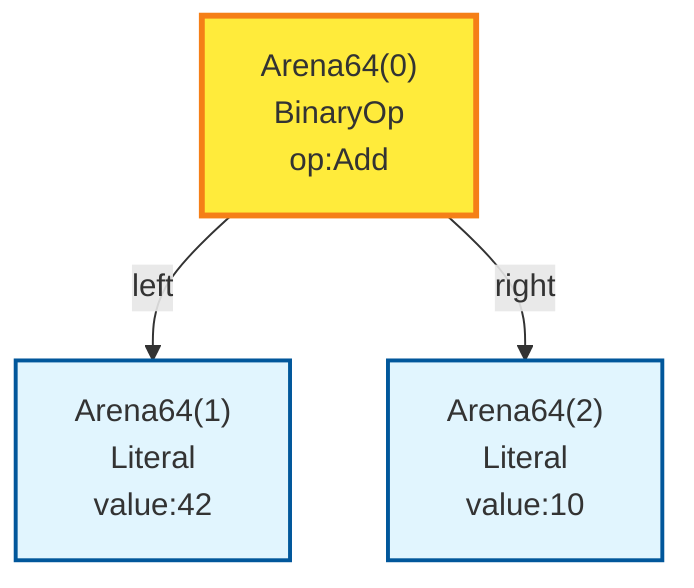

# Mermaid Diagram Generator

A Python tool that parses Rust object string representations and generates Mermaid diagrams for visualizing hierarchical node structures with arena-based memory management.

## Overview

This tool is designed to work with Rust objects that use arena-based memory allocation across different arena types (Arena32, Arena64, Arena96, Arena136, Arena232). It parses the Rust object string representation, analyzes the node relationships, and generates beautiful Mermaid diagrams showing the structure and connections.

## Features

- **Rust Object Parsing**: Converts Rust object string representations to JSON-like Python dictionaries
- **Arena Memory Support**: Handles multiple arena types with different node capacities
- **Node Reference Analysis**: Identifies and tracks relationships between nodes across arenas
- **Mermaid Diagram Generation**: Creates professional flowcharts with proper styling and connections
- **Flexible Input/Output**: Supports both file input and stdin, with customizable output filenames

## Installation

No external dependencies required beyond Python's standard library.

```bash
# Clone or download the script
python draw.py --help
```

## Usage

### Command Line Interface

```bash
# Parse from file and output to default file (output.mmd)
python draw.py input.txt

# Parse from file with custom output name
python draw.py input.txt -o my_diagram.mmd

# Parse from stdin
python draw.py -o diagram.mmd
# Then enter your Rust object string and press Ctrl+D (Unix) or Ctrl+Z (Windows)

# Parse from stdin with default output
python draw.py
```

### Input Format

The tool expects Rust object string representations, typically in formats like:

```rust
Plan {
    top: Some(NodeId { offset: 0, arena_type: Arena64 }),
    nodes: Nodes {
        arena32: [],
        arena64: [
            BinaryOp {
                op: Add,
                left: NodeId { offset: 1, arena_type: Arena64 },
                right: NodeId { offset: 2, arena_type: Arena64 }
            }
        ],
        arena96: [],
        arena136: [],
        arena232: []
    }
}
```

It can be retrieved by:
```rust
println!("{:?}", plan);
```


## Architecture

### Core Components

#### 1. RustParser
Converts Rust object strings to Python dictionaries:
- Handles various Rust syntax patterns (structs, enums, functions, collections)
- Supports nested structures and references
- Processes `Some()`/`None` optionals
- Parses arrays, sets, and maps

#### 2. PlanAnalyzer
Analyzes parsed plan data:
- Maps arena types to their storage locations
- Resolves node references across arenas
- Extracts node information and relationships
- Formats node data for display

#### 3. MermaidGenerator
Creates Mermaid diagram files:
- Generates flowchart syntax
- Applies arena-specific styling
- Creates reference connections with labels
- Highlights top nodes

### Arena Types

| Arena Type | Short Name | Styling Color |
|------------|------------|---------------|
| Arena32    | A32        | Purple        |
| Arena64    | A64        | Blue          |
| Arena96    | A96        | Green         |
| Arena136   | A136       | Orange        |
| Arena232   | A232       | Pink          |

## Output Format

The tool generates Mermaid flowchart diagrams with:

- **Nodes**: Displayed as rectangles with arena type, offset, and node information
- **Connections**: Arrows showing references between nodes with path labels
- **Styling**: Color-coded by arena type with special highlighting for top nodes
- **Layout**: Organized by arena sections for clarity

### Example Output



## Examples

### Basic Usage

```bash
# Create a simple input file
echo 'NodeId { offset: 0, arena_type: Arena64 }' > simple.txt

# Parse and generate diagram
python draw.py simple.txt -o simple.mmd

# View the generated Mermaid diagram in any Mermaid-compatible viewer
```

### Complex Structure

For complex nested structures with multiple arenas and references:

```bash
# Input: Complex plan with multiple nodes and references
python draw.py complex_plan.txt -o complex_diagram.mmd
```

## Advanced Features

### Custom Node Types

The parser automatically handles custom Rust struct types and will preserve their names and field information in the generated diagrams.

### Reference Path Tracking

The tool tracks complex reference paths like:
- `left.operand`
- `children[0].value`
- `metadata.source`

### Styling Customization

The generated Mermaid diagrams include CSS classes that can be customized:
- `arena32`, `arena64`, `arena96`, `arena136`, `arena232`: Arena-specific styling
- `topNode`: Special styling for the root node

## Contributing

To extend the tool:

1. **Add new Rust syntax support**: Extend the `RustParser._try_parse_*` methods
2. **Customize diagram styling**: Modify the `MermaidGenerator._write_styles` method
3. **Add new arena types**: Update the `ArenaType` enum and `ARENA_MAPPINGS`
